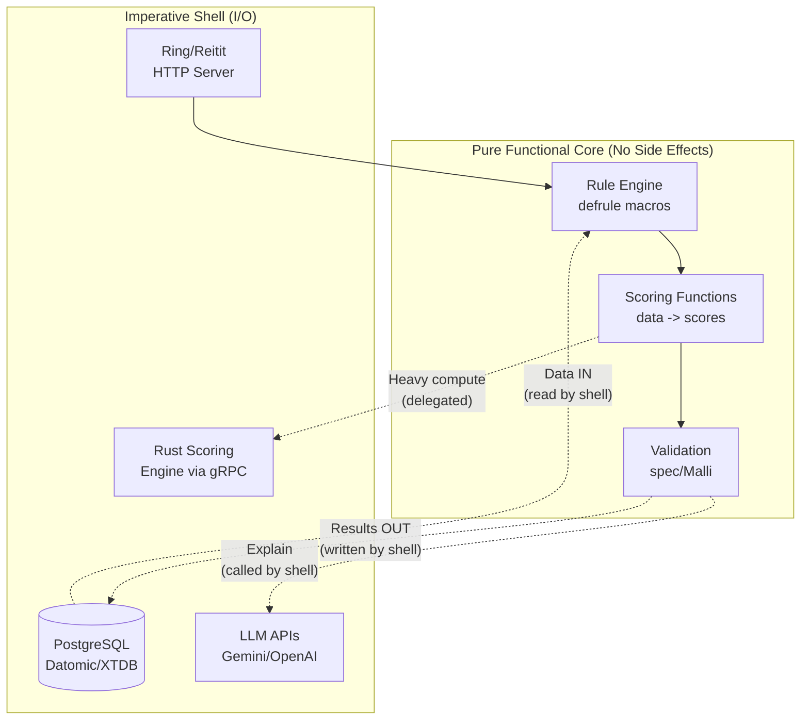
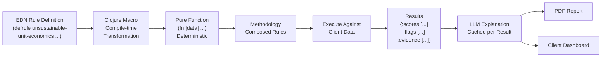
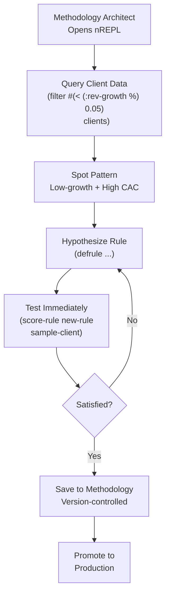
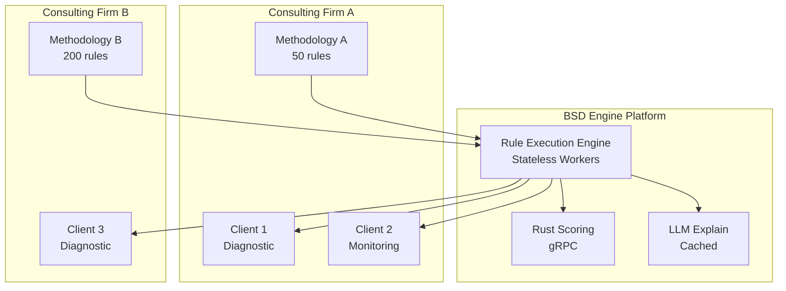

# BSD Engine v2


---

## Overview

BSD Engine v2 transforms the existing proprietary BSD decision-support system into a **white-label diagnostic platform** for African consulting firms, sector regulators, and corporate strategy teams. A business-readable **rules DSL** written in Clojure compiles to deterministic scoring functions, while the existing Rust scoring engine handles numeric hot paths and an LLM layer generates human-readable explanations. Consultants encode their diagnostic methodology as data (EDN-based rules); the platform executes, scores, explains, and visualizes.

---

## Architecture / Patterns

### Functional Core / Imperative Shell

**Definition:** An architectural pattern that divides a system into two distinct layers based on purity. The innermost layer -- the "functional core" -- is composed entirely of pure functions: functions that take inputs and return outputs with no side effects, no I/O operations, no mutation of external state, and fully deterministic behavior. Given the same arguments, a pure function always returns the same result. The outer layer -- the "imperative shell" -- handles all impure operations: reading from and writing to databases, making HTTP requests, calling external APIs (including LLM providers), managing user sessions, and serving responses. The shell orchestrates the core -- it gathers inputs from the outside world, passes them into pure functions, receives results, and performs the necessary I/O to persist or communicate those results. The core never imports or depends on any I/O library; the shell never contains business logic. This separation is enforced by module boundaries and namespace discipline, not by developer convention alone.

**Why it fits BSD Engine v2:** Diagnostic scoring MUST be deterministic -- same client data combined with the same methodology MUST produce the same scores, every single time, without exception. This is not a nice-to-have; it is a regulatory and legal requirement. When a consulting firm delivers a diagnostic to a client CEO, that CEO may challenge the findings. The firm must be able to re-run the exact same diagnostic six months later and produce identical results for legal defensibility. Regulators like the Central Bank of Kenya (CBK) require auditable, reproducible assessments when overseeing licensed entities such as digital credit providers and microfinance institutions. If the scoring function accidentally reads from a database (which may have been updated), calls an external API (which may return different data), or uses a random number generator, the result could vary between runs -- destroying reproducibility and audit credibility. By making the core pure, determinism is guaranteed by construction (the type system, namespace isolation, and architecture prevent impurity from leaking in), not by developer discipline (which fails under deadline pressure, staff turnover, and late-night debugging). Clojure's emphasis on immutable data structures and its convention of isolating side effects to explicit boundaries make this pattern natural to implement -- the language's design philosophy aligns with the architectural requirement.

**Application in BSD Engine v2:**

- **Functional Core (`engine.core` namespace):** Contains ONLY pure functions. The primary entry point is `(score-methodology rules data) -> {:scores [...] :flags [...] :evidence [...]}`. Every function in this namespace takes data in and returns data out. No `def` mutations, no I/O calls, no `println`, no database reads, no HTTP requests. Each `defrule` macro compiles to a pure function `(fn [data] -> result)`. Methodologies are composed as sequences of pure rule functions applied to client data via `reduce`. Validation functions (`validate-rule`, `validate-methodology`) are also pure -- they take rule definitions and return validation results without touching any external system.
- **Imperative Shell (`engine.infra` namespace):** Handles all I/O operations. Reads client data from PostgreSQL via JDBC. Calls the LLM API (Gemini, OpenAI, or Anthropic) for generating human-readable explanations of flagged issues. Writes diagnostic results and events to the event store (Datomic/XTDB). Serves HTTP responses via Ring/Reitit. Manages authentication and authorization via OIDC/SAML. The shell calls into the core: `(let [results (engine.core/score-methodology rules client-data)] (persist-results! db results) (generate-explanations! llm-client results))`.
- **Testing Advantage:** The core can be tested with simple equality assertions: `(= (score-methodology rules test-data) expected-output)` -- no mocks, no test fixtures, no database setup, no teardown, no flaky tests. The shell is tested separately with integration tests that verify I/O behavior.



### Macro DSLs (Domain-Specific Languages via Clojure Macros)

**Definition:** A Domain-Specific Language (DSL) is a programming language designed for a specific problem domain -- in this case, business diagnostics and scoring methodology. Unlike general-purpose languages (Java, Python, JavaScript), a DSL provides constructs that map directly to the domain's concepts: rules, conditions, severity levels, evidence, flags, and remediation hints. Clojure macros are compile-time code transformations: they receive code as data (because Clojure code is represented as Clojure data structures -- lists, vectors, maps), manipulate that data, and return new code as data. The compiler then compiles the macro's output as standard Clojure. This property -- called homoiconicity (from Greek: "same representation") -- means that code and data share the same structure. A Clojure list `(+ 1 2)` is simultaneously executable code and a data structure (a list of three elements). Macros exploit this duality to create new syntax without building a separate parser, lexer, tokenizer, or interpreter -- the entire Clojure compiler infrastructure is reused. This is the same approach used by production rule engines like Clara Rules (Clojure), Drools (Java), and RETE-based systems, adapted here for LLM-assisted diagnostic workflows.

**Why it fits BSD Engine v2:** Consultants write diagnostic methodology, not software. The target user -- a senior consultant at a Nairobi strategy boutique -- thinks in terms like "when revenue growth is below 5% AND customer acquisition cost exceeds 3x lifetime value, flag unsustainable unit economics with severity high." This mental model must map directly to the authoring experience. Without macros, building a business-readable rule language would require constructing an entirely separate toolchain: a parser to tokenize input, a lexer to identify tokens, an Abstract Syntax Tree (AST) builder, a semantic analyzer, and an interpreter or compiler backend. This is months of work and a maintenance burden. Clojure's homoiconicity eliminates all of this -- the DSL IS valid Clojure, so the existing Clojure compiler handles parsing, syntax checking, and compilation. The `defrule` macro transforms business-readable rule definitions into executable pure scoring functions at compile time, with zero runtime overhead from the macro expansion itself. Rules are stored as EDN (Extensible Data Notation) -- Clojure's native data serialization format -- making them version-controllable in Git, diffable in code review, composable into full methodologies, and transferable between environments without serialization/deserialization complexity.

**Application in BSD Engine v2:**

```clojure
(defrule unsustainable-unit-economics
  {:severity :high
   :category :financial-health
   :description "Customer acquisition cost exceeds sustainable multiple of customer lifetime value"}
  [:when
   (< (:revenue-growth data) 0.05)
   (> (:cac data) (* 3.0 (:ltv data)))]
  [:then
   {:flag :unsustainable-unit-economics
    :evidence [(:cac data) (:ltv data) (:revenue-growth data)]
    :severity :high
    :remediation-hints [:review-acquisition-channels :improve-retention :increase-pricing]}])
```

The macro compiles this to a function that takes `data` and returns a score. Rules are stored as EDN (Extensible Data Notation) -- version-controlled, diffable, composable into full methodologies.



### Clean Architecture

**Definition:** Clean Architecture, introduced by Robert C. Martin ("Uncle Bob"), organizes a system as concentric circles of dependencies with a strict dependency rule: dependencies point inward only. The innermost circle contains Entities -- the core domain objects that encapsulate enterprise-wide business rules and are the least likely to change when something external changes. The next circle contains Use Cases (also called Application Services or Interactors) -- these implement application-specific business rules by orchestrating entities. The next circle contains Interface Adapters -- components that convert data between the format most convenient for use cases and the format required by external agencies (web frameworks, databases, external APIs). The outermost circle contains Frameworks and Drivers -- the concrete implementations of databases, web servers, UI frameworks, and external services. The critical rule: inner circles never import, reference, or depend on outer circles. An entity never imports an HTTP library. A use case never directly calls a database driver. This is enforced through dependency inversion: inner circles define interfaces (ports) that outer circles implement (adapters). The result is a system where the core business logic can be tested, deployed, and evolved independently of any framework, database, or delivery mechanism.

**Why it fits BSD Engine v2:** BSD Engine v2 serves four fundamentally different interfaces, each with distinct protocols, data formats, and interaction patterns: (1) a REPL (Read-Eval-Print Loop) for methodology architects who explore client data interactively and build rules incrementally -- this is a stateful, conversational interface running on the JVM, (2) a web dashboard for consulting firm clients who view diagnostic results, track progress, and download PDF reports -- this is a stateless HTTP interface with server-side rendering or API calls from a ClojureScript/Re-frame single-page application, (3) PDF reports for executive stakeholders who receive board-ready diagnostic summaries -- this is a batch rendering interface, (4) gRPC for the Rust scoring engine that handles numeric-heavy computation -- this is a binary protocol interface with Protocol Buffer serialization. Without Clean Architecture, adding a fifth interface (e.g., a mobile client dashboard app planned for v1.5, a Slack bot for diagnostic alerts, or an API for client ERP system integration) would require duplicating or rewriting business logic in each adapter. With Clean Architecture, each interface is merely an adapter that translates between its protocol and the use case layer -- the diagnostic scoring logic, rule validation logic, and methodology composition logic remain identical regardless of how they are accessed.

**Application in BSD Engine v2:**

- **Entities (innermost circle):** `Rule` (a single diagnostic predicate with metadata: severity, category, description, remediation hints), `Methodology` (an ordered composition of rules forming a complete diagnostic framework, e.g., "Business Sustainability Diagnostic"), `Diagnostic` (the result of running a methodology against client data: scores, flags, evidence), `Score` (a numeric assessment of a specific dimension with associated confidence and evidence trail).
- **Use Cases (application services):** `RunDiagnostic` (accepts a methodology ID and client data, retrieves the methodology's rules, executes them deterministically via the functional core, collects results, delegates numeric scoring to Rust via gRPC, triggers LLM explanation generation, persists the diagnostic event, and returns the complete result), `AuthorRule` (validates a rule definition against syntax and semantic constraints, checks for circular dependencies with existing rules, persists as an event, and returns validation results), `GenerateReport` (accepts a diagnostic result, renders it as PDF using the firm's white-label template, and stores in S3).
- **Adapters (interface layer):** Ring/Reitit (HTTP adapter for all three BFFs -- Analyst, Client Dashboard, Consultant), ClojureScript/Re-frame (web UI adapter rendering diagnostic results in the browser), PDF generator (batch rendering adapter using firm-specific templates), gRPC client (Rust scoring engine adapter serializing rule execution plans as Protocol Buffers), nREPL server (REPL adapter exposing sandboxed evaluation for methodology architects).
- **Drivers (outermost circle):** PostgreSQL (tenant data, client engagements, denormalized read projections), Datomic/XTDB (event-sourced rule version history), Redis (session management, LLM explanation caching), S3 (PDF report storage, exported data), LLM APIs (Gemini, OpenAI, Anthropic for explanation generation).

### REPL-Driven Development

**Definition:** REPL stands for Read-Eval-Print Loop -- an interactive programming environment that continuously cycles through three steps: (1) Read: accept user input (a code expression), (2) Eval: evaluate that expression in the current runtime environment, (3) Print: display the result to the user. Unlike a traditional compile-deploy-test workflow where the developer writes code in a file, compiles the entire project, deploys it (potentially to a server), runs a test, and inspects the output -- a cycle that can take minutes per iteration -- the REPL provides immediate feedback. The developer types an expression, presses Enter, and sees the result in milliseconds. Critically, state is preserved between evaluations: variables defined in one REPL interaction remain available in the next, enabling incremental, exploratory programming. Clojure's nREPL (network REPL) protocol extends this further by allowing a REPL session to be hosted on a remote server and accessed from an IDE, a web browser, or a custom client -- enabling REPL-driven development in production-adjacent environments, not just local development.

**Why it fits BSD Engine v2:** Diagnostic methodology development is inherently exploratory and iterative. A senior consultant examining a new client's financial data does not know upfront which rules will be relevant, which thresholds are appropriate, or which combinations of indicators signal a genuine issue versus a false positive. The development workflow is: (a) query the client's data to understand its shape and distributions, (b) spot a pattern ("many clients with high customer acquisition cost and low lifetime value"), (c) hypothesize a rule ("if CAC exceeds 3x LTV, flag as unsustainable"), (d) test that rule against sample data to see how many clients it flags and whether the flags seem reasonable, (e) refine the thresholds or conditions based on results, (f) repeat until the rule captures the pattern accurately. A traditional compile-deploy-test cycle would take 2-5 minutes per iteration (edit file, save, compile project, deploy to staging, run diagnostic, inspect output). With a REPL, each iteration takes 1-3 seconds. For a methodology architect developing 50+ rules, this difference -- seconds versus minutes per iteration -- is the difference between completing a methodology in a day versus a week. The REPL also enables a "show, don't tell" workflow: the architect can demonstrate a rule to a partner in real time, tweaking thresholds while the partner watches results change, instead of sending screenshots and waiting for email feedback.

**Application in BSD Engine v2:**

- **Analyst BFF REPL:** The Analyst BFF provides a sandboxed nREPL session accessible through the web-based rule editor. The methodology architect connects and has read-only access to the current client dataset. They type `(filter #(< (:revenue-growth %) 0.05) clients)` to instantly see all low-growth clients, then develop a rule with `(defrule ...)`, test it with `(score-rule new-rule sample-client)`, inspect the result, refine the thresholds, and iterate until satisfied.
- **Sandbox constraints:** The REPL environment is sandboxed for security and resource isolation. No filesystem access (prevents reading server files or writing malicious payloads). No network access (prevents calling external services or exfiltrating data). CPU-limited (prevents infinite loops or resource exhaustion). Memory-bounded (prevents heap overflow). The sandbox is implemented via Clojure's `clojail` or equivalent library, restricting available namespaces to the diagnostic engine core plus read-only data access functions.
- **Rule promotion workflow:** Rules developed in the REPL can be saved (persisted as events in the event store), versioned (each edit creates a new event, preserving full history), and promoted to the main methodology (moved from draft to active status after peer review by a senior consultant or partner).



### Inherited: Hexagonal Architecture, Event Sourcing, CQRS from Tiers 2-4

**Definition:** Three complementary architectural patterns inherited from earlier tiers in the project portfolio:

*Hexagonal Architecture* (also called Ports and Adapters, introduced by Alistair Cockburn) organizes a system so that the core domain logic sits at the center, surrounded by "ports" -- abstract interfaces that define how the domain communicates with the outside world -- and "adapters" -- concrete implementations of those interfaces for specific technologies. A port might define "I need to persist a diagnostic result"; an adapter implements that port for PostgreSQL, another for Datomic, another for an in-memory store used in tests. The domain never knows or cares which adapter is active.

*Event Sourcing* replaces traditional mutable database rows with an append-only log of immutable events. Instead of storing "Rule X currently has threshold 0.05," the system stores the sequence of events: "RuleCreated(threshold=0.10)", "RuleUpdated(threshold=0.07)", "RuleUpdated(threshold=0.05)". The current state is derived by replaying the event log. This provides a complete audit trail by construction, enables point-in-time reconstruction of any past state, and supports regulatory compliance without additional logging infrastructure.

*CQRS (Command Query Responsibility Segregation)* separates the write model (commands that change state -- creating rules, running diagnostics, editing methodologies) from the read model (queries optimized for display -- dashboard views, report generation, client score summaries). The write side validates, enforces business rules, and emits events. The read side consumes events and projects them into denormalized views optimized for specific query patterns.

**Why it fits BSD Engine v2:** Every rule edit and every diagnostic run is an immutable event. When a consulting firm's partner asks "what changed in this methodology between March and June?", the event log provides a precise, auditable answer -- not a diff of two database snapshots, but the exact sequence of edits with timestamps, author IDs, and change descriptions. When a regulator (e.g., CBK) asks a consulting firm to demonstrate that a diagnostic result is reproducible, the system can replay the event log to the exact point in time, reconstruct the methodology as it existed then, and re-run the diagnostic with identical results. CQRS is critical because the rule authoring path and the dashboard query path have fundamentally different performance profiles: rule authoring is write-heavy (many small edits, validations, and version events) and requires strong consistency (a rule edit must be immediately visible to the author), while the dashboard path is read-heavy (thousands of client users viewing diagnostic results) and can tolerate slight staleness (a few seconds of projection lag is acceptable). Optimizing both paths with a single data model would force compromises on both. Hexagonal ports ensure that the same diagnostic scoring logic -- the functional core -- can be accessed from Ring/Reitit (HTTP for BFFs), gRPC (Rust scoring engine), nREPL (methodology architect REPL), and PDF rendering (batch report generation) without any modification to the core.

**Application in BSD Engine v2:**

- **Event Sourcing:** Rule lifecycle events (`RuleCreated`, `RuleUpdated`, `RuleDeprecated`, `RulePromoted`) and diagnostic execution events (`DiagnosticRequested`, `DiagnosticCompleted`, `ExplanationGenerated`) are persisted to Datomic/XTDB -- a database designed for immutable, temporal data. Every event includes a tenant ID (consulting firm), author ID, timestamp, and the full event payload. Past methodology states can be reconstructed by replaying events up to any given timestamp.
- **CQRS Write Side:** The command path validates rule definitions (syntax via Malli schemas, semantic via dependency graph analysis), persists events to the event store, and triggers projections. Commands include `CreateRule`, `UpdateRule`, `RunDiagnostic`, `ProvisionClient`.
- **CQRS Read Side:** Event projections are written to denormalized PostgreSQL views optimized for specific query patterns: `client_scores_latest` (client dashboard), `methodology_rule_summary` (analyst BFF), `firm_engagement_overview` (consultant BFF). Projections are eventually consistent with the event log, with typical lag under 500ms.
- **Hexagonal Ports and Adapters:** The domain defines ports as Clojure protocols: `ScoringPort` (execute numeric scoring), `ExplanationPort` (generate human-readable explanations), `PersistencePort` (store events and projections), `NotificationPort` (send email summaries). Adapters implement these protocols for specific technologies: `RustGrpcAdapter` (implements `ScoringPort` by calling the Rust engine via gRPC), `GeminiLlmAdapter` (implements `ExplanationPort` by calling Google's Gemini API), `PostgresAdapter` (implements `PersistencePort` for read projections), `DatomicAdapter` (implements `PersistencePort` for event sourcing), `SendGridAdapter` (implements `NotificationPort` for email delivery).

### Pattern Lineage

- **Inherits:** All T1-T4 patterns.
- **Introduces:** Functional Core / Imperative Shell + Macro DSLs + Clean Architecture + REPL-Driven Development.
- **Carries forward:** Functional Core / Imperative Shell reappears in T6 as F# modules (pure tariff calculation, pure ROP validation) surrounded by C# I/O shell. Macro DSLs inspire F# computation expressions for tariff rules in PayGoHub.



### Three BFFs

| BFF | Client | Technology | Responsibilities |
|-----|--------|------------|------------------|
| Analyst BFF | Web app with REPL | ClojureScript + Re-frame | Rule authoring, REPL, methodology management |
| Client Dashboard BFF | Web app (client-facing) | ClojureScript + Re-frame | View diagnostics, track progress, download reports |
| Consultant BFF | Web app (firm admin) | Clojure Ring + Reitit | Firm management, client provisioning, billing, white-label config |

### Rust Scoring Engine Integration

The existing Rust/PyO3 scoring engine from BSD v1 is preserved and exposed as a gRPC service. Clojure orchestrates rule execution and delegates heavy numeric computation (time series, statistical tests), ML-based scoring (XGBoost, random forests), and large dataset transformations to Rust.

### LLM Explanation Layer

LLM calls are adapter implementations behind a hexagonal `ExplanationService` port. Inputs include the flagged rule, evidence data, severity, and methodology context. Outputs are human-readable explanations calibrated to the consultant's voice. Explanations are cached per `(rule, evidence-hash)` to ensure deterministic stability. Providers: Gemini (default, cost), OpenAI (fallback), Anthropic (enterprise tier).

### Technology Stack

| Layer | Technologies |
|-------|-------------|
| Backend | Clojure 1.12, Reitit, Malli, core.async |
| Frontend | ClojureScript, Re-frame |
| Scoring | Rust (gRPC service, unchanged from v1) |
| Data | PostgreSQL, Datomic/XTDB (event-sourced rules), Redis (cache), S3 (reports) |
| Integrations | Gemini/OpenAI/Anthropic (LLM), Stripe/Paystack (billing), SendGrid (email) |
| Infrastructure | AWS (us-east-1), Kubernetes (EKS), JVM-optimized nodes |

---

## Requirements

| ID | Requirement | Priority | Status |
|----|-------------|----------|--------|
| REQ-001 | Senior consultants can write diagnostic methodology as executable rules in a Clojure-based DSL (EDN) via the Analyst BFF rule editor | P0 | Not Started |
| REQ-002 | Rules validate immediately on definition (syntax, semantic, and dependency checks) | P0 | Not Started |
| REQ-003 | Rules are testable against sample data in the integrated REPL | P0 | Not Started |
| REQ-004 | Rules are version-controlled with every edit persisted as an event in the event log | P0 | Not Started |
| REQ-005 | Rules compose into full methodologies (e.g., "Business Sustainability Diagnostic") | P0 | Not Started |
| REQ-006 | Diagnostic runs execute all applicable rules deterministically (same input produces same output, always) | P0 | Not Started |
| REQ-007 | LLM-generated explanation accompanies each flagged issue (why it matters, typical remediation) | P1 | Not Started |
| REQ-008 | Full diagnostic report generated as PDF and interactive dashboard | P0 | Not Started |
| REQ-009 | Total diagnostic runtime under 2 minutes for a methodology of 200+ rules against 1,000 data points | P0 | Not Started |
| REQ-010 | Client accounts provisioned by the consulting firm with appropriate access controls | P0 | Not Started |
| REQ-011 | Diagnostic re-runs automatically when new monthly data is uploaded (manual or via API/ERP integration) | P1 | Not Started |
| REQ-012 | Client dashboard shows score changes versus prior period | P0 | Not Started |
| REQ-013 | Recommendations marked "addressed" are tracked for effectiveness | P1 | Not Started |
| REQ-014 | Client receives email summary with changes highlighted after each diagnostic re-run | P2 | Not Started |
| REQ-015 | Client can drill into scores but cannot see raw rule logic (IP protection for consulting firm) | P0 | Not Started |
| REQ-016 | White-label configuration: logo, color palette, domain name (CNAME), PDF report template, email templates | P1 | Not Started |
| REQ-017 | Clients see the consulting firm's branding throughout -- not "BSD Engine" | P1 | Not Started |
| REQ-018 | "Powered by BSD Engine" footer removable at Enterprise tier | P2 | Not Started |
| REQ-019 | Firm's name appears as methodology author on all outputs | P1 | Not Started |
| REQ-020 | Live Clojure REPL with read-only access to current client data for methodology architects | P0 | Not Started |
| REQ-021 | REPL runs in sandboxed environment (no filesystem, no network, CPU-limited, memory-bounded) | P0 | Not Started |
| REQ-022 | Rules developed in REPL can be saved, versioned, and promoted to main methodology | P0 | Not Started |
| REQ-023 | Clojure compiles rules to a deterministic execution plan | P0 | Not Started |
| REQ-024 | Numeric-heavy scoring delegated to existing Rust scoring engine via gRPC | P0 | Not Started |
| REQ-025 | Rust/Clojure split is invisible to the end user | P1 | Not Started |
| REQ-026 | Rule compilation (DSL to execution plan) completes in under 30 seconds | P0 | Not Started |
| REQ-027 | REPL evaluation of simple queries completes in under 500ms | P0 | Not Started |
| REQ-028 | PDF report generation completes in under 30 seconds | P1 | Not Started |
| REQ-029 | Dashboard page load under 2 seconds | P0 | Not Started |
| REQ-030 | Full audit trail: every diagnostic run logs methodology version, input data version, computed scores, and timestamp | P0 | Not Started |
| REQ-031 | Any past diagnostic can be re-run with identical results (reproducibility) | P0 | Not Started |
| REQ-032 | LLM explanations cached per (rule, evidence-hash) to ensure stability across views | P1 | Not Started |
| REQ-033 | Authentication via OIDC (Auth0 or Keycloak); SAML for enterprise regulators | P0 | Not Started |
| REQ-034 | Multi-tenant authorization with methodology IP isolated per firm and client data isolated per engagement | P0 | Not Started |
| REQ-035 | Rules encrypted at rest; executed in sandbox; rule text never returned to client dashboard | P0 | Not Started |
| REQ-036 | Every rule edit, diagnostic run, and client data upload logged for audit | P0 | Not Started |
| REQ-037 | Compliance with Kenya Data Protection Act; GDPR-equivalent for EU clients; SOC 2 Type I by end of Year 1 | P1 | Not Started |
| REQ-038 | Support 50+ consulting firms on shared multi-tenant infrastructure | P1 | Not Started |
| REQ-039 | Each firm can have 100+ methodologies and 1,000+ client engagements | P1 | Not Started |
| REQ-040 | Rule execution horizontally scalable via stateless workers | P0 | Not Started |
| REQ-041 | Event store partitioned by tenant | P1 | Not Started |
| REQ-042 | Per-tenant observability dashboards for consulting firms | P2 | Not Started |
| REQ-043 | Platform-wide observability dashboards for operators | P1 | Not Started |
| REQ-044 | Anomaly detection on diagnostic runs (drastic score shifts flagged for review) | P2 | Not Started |
| REQ-045 | Rule execution performance monitoring (slow rules highlighted for optimization) | P2 | Not Started |
| REQ-046 | Visual rule-builder UI layered on top of DSL for junior analysts ("no-code" wraps the code) | P2 | Not Started |

---

## Acceptance Criteria

### Epic: Methodology Authoring

- [ ] AC-001: Given access to the Analyst BFF rule editor, rules are written in a Clojure-based DSL (EDN) with business-readable syntax (e.g., `(defrule unsustainable-unit-economics ...)`)
- [ ] AC-002: Validation runs immediately on rule definition -- syntax errors, semantic errors, and rule dependency conflicts are surfaced before saving
- [ ] AC-003: Rules can be tested against sample client data in the integrated REPL with immediate result display
- [ ] AC-004: Every rule edit is persisted as an immutable event in the event log (`RuleCreated`, `RuleUpdated`, `RuleDeprecated`) with author ID and timestamp
- [ ] AC-005: Rules compose into full methodologies (e.g., "Business Sustainability Diagnostic") via methodology composition functions
- [ ] AC-006: Diagnostic runs execute all applicable rules deterministically -- same input data and same methodology version produce identical output every time
- [ ] AC-007: An LLM-generated explanation accompanies each flagged issue, including why it matters and typical remediation approaches, calibrated to the consultant's voice
- [ ] AC-008: Full diagnostic report generated as both downloadable PDF (using firm's white-label template) and interactive dashboard view
- [ ] AC-009: Total runtime for a diagnostic run is under 2 minutes for a methodology of 200+ rules against 1,000+ data points

### Epic: Client Dashboard (Ongoing Monitoring)

- [ ] AC-010: Client accounts are provisioned by the consulting firm via the Consultant BFF with appropriate role-based access controls
- [ ] AC-011: Diagnostic re-runs automatically when new monthly data is uploaded (either manually by the client or via API integration with their ERP system)
- [ ] AC-012: Client dashboard displays score changes versus the prior period with clear directional indicators (improved, declined, unchanged)
- [ ] AC-013: Recommendations marked "addressed" by the client are tracked for effectiveness -- the system measures whether the corresponding score improved after the recommendation was acted upon
- [ ] AC-014: Client receives an email summary with changes highlighted after each diagnostic re-run, delivered via SendGrid
- [ ] AC-015: Client can drill into any score to see the underlying evidence and explanation but cannot see the raw rule logic (methodology IP is protected from the client)

### Epic: Methodology Library and White-Labeling

- [ ] AC-016: Consulting firm can configure white-label settings: logo upload, color palette (primary, secondary, accent), custom domain name (CNAME), PDF report template, and email templates
- [ ] AC-017: Clients see the consulting firm's branding on all surfaces -- dashboard, PDF reports, emails, login screen
- [ ] AC-018: "Powered by BSD Engine" footer is removable at Enterprise tier ($4,999+/mo)
- [ ] AC-019: Firm's name appears as methodology author on all diagnostic outputs and reports

### Epic: REPL-Driven Methodology Development

- [ ] AC-020: Authenticated methodology architects have access to a live Clojure REPL with read-only access to current client data
- [ ] AC-021: Architects can query data, develop rules interactively, and see results immediately -- feedback loop under 500ms for simple queries
- [ ] AC-022: Rules developed in the REPL can be saved as drafts, versioned with full history, and promoted to the main methodology after review
- [ ] AC-023: REPL runs in a sandboxed environment: no filesystem access, no network access, CPU-limited (prevents infinite loops), memory-bounded (prevents heap overflow)

### Epic: Rust Scoring Engine Integration

- [ ] AC-024: Clojure compiles rules to a deterministic execution plan that identifies which scoring steps require Rust delegation
- [ ] AC-025: Numeric-heavy scoring (time series analysis, statistical tests, ML inference via XGBoost/random forests) is delegated to the existing Rust scoring engine via gRPC with Protocol Buffer serialization
- [ ] AC-026: The Clojure/Rust split is invisible to the end user -- results appear as a unified diagnostic output regardless of which engine executed which computation
- [ ] AC-027: Total diagnostic runtime benefits measurably from Rust's speed on numeric hot paths versus pure-Clojure execution

### Epic: Security and Compliance

- [ ] AC-028: Authentication via OIDC (Auth0 or Keycloak) for standard users; SAML federation for enterprise regulator clients (e.g., CBK)
- [ ] AC-029: Multi-tenant authorization enforced: methodology IP isolated per consulting firm, client data isolated per engagement, no cross-tenant data leakage
- [ ] AC-030: Rules encrypted at rest (AES-256 or equivalent); rule text never returned to client-facing dashboard endpoints
- [ ] AC-031: Every rule edit, diagnostic run, client data upload, and user login is logged in an immutable audit trail
- [ ] AC-032: Platform compliant with Kenya Data Protection Act (DPA); GDPR-equivalent controls for EU regulator clients

### Epic: Scalability and Observability

- [ ] AC-033: Platform supports 50+ consulting firms on shared multi-tenant infrastructure without performance degradation
- [ ] AC-034: Each consulting firm can manage 100+ methodologies and 1,000+ client engagements
- [ ] AC-035: Rule execution workers are stateless and horizontally scalable -- adding workers linearly increases diagnostic throughput
- [ ] AC-036: Event store partitioned by tenant to ensure isolation and query performance
- [ ] AC-037: Per-tenant observability dashboards available for consulting firms showing diagnostic run history, performance, and usage
- [ ] AC-038: Platform-wide observability dashboards available for operators showing system health, tenant activity, and resource utilization
- [ ] AC-039: Anomaly detection flags drastic score shifts (e.g., score changed by more than 30% between periods) for human review
- [ ] AC-040: Slow rules (execution time exceeding 2x the methodology average) highlighted in performance monitoring for optimization

---

## Non-Functional Requirements

### Performance

| Metric | Target |
|--------|--------|
| Diagnostic run (200 rules, 1,000 data points) | < 2 minutes |
| Rule compilation (DSL to execution plan) | < 30 seconds |
| REPL evaluation (simple query) | < 500ms |
| PDF report generation | < 30 seconds |
| Dashboard page load | < 2 seconds |

### Determinism and Reproducibility

| Requirement | Detail |
|-------------|--------|
| Deterministic output | Same input produces same output, always. No randomness, no external state. |
| Audit trail | Every run logs methodology version, input data version, computed scores, timestamp. |
| Reproducibility | Any past diagnostic can be re-run with identical results. |
| LLM stability | Explanations cached per-result to ensure stability across views. |

### Availability

| Component | Target |
|-----------|--------|
| Analyst BFF (methodology authoring) | 99.5% (business hours) |
| Client Dashboard | 99.9% |
| Consultant BFF | 99.9% |
| Rule execution engine | 99.99% |

### Security

| Requirement | Detail |
|-------------|--------|
| Authentication | OIDC (Auth0 or Keycloak); SAML for enterprise regulators |
| Authorization | Multi-tenant; methodology IP isolated per firm; client data isolated per engagement |
| IP protection | Rules encrypted at rest; executed in sandbox; rule text never returned to client dashboard |
| Audit logging | Every rule edit, diagnostic run, and client data upload logged |
| Compliance | Kenya DPA; GDPR-equivalent for EU clients; SOC 2 Type I by end of Year 1 |

### Scalability

| Requirement | Detail |
|-------------|--------|
| Multi-tenant capacity | Support 50+ consulting firms on shared infrastructure |
| Per-tenant scale | Each firm can have 100+ methodologies and 1,000+ client engagements |
| Horizontal scaling | Rule execution via stateless workers; adding workers linearly increases throughput |
| Data partitioning | Event store partitioned by tenant for isolation and query performance |

### Observability

| Requirement | Detail |
|-------------|--------|
| Tenant dashboards | Per-tenant dashboards for consulting firms showing diagnostic run history, performance, and usage |
| Platform dashboards | Platform-wide dashboards for operators showing system health, tenant activity, and resource utilization |
| Anomaly detection | Drastic score shifts between diagnostic runs flagged for human review |
| Performance monitoring | Slow rules highlighted for optimization (execution time exceeding 2x methodology average) |

---

## Success Metrics

### Business Metrics (End of Week 15)

| Metric | Target |
|--------|--------|
| Paying consulting firms | 2 |
| Active methodologies in production | 5+ |
| Total client engagements monitored | 20+ |
| Monthly Recurring Revenue | $400+ |

### Product Metrics

| Metric | Target |
|--------|--------|
| Time from signup to first diagnostic | < 5 business days |
| Methodology authoring time (20-rule methodology) | < 10 hours |
| Client dashboard MAU per client | > 40% |
| LLM explanation quality (thumbs-up rate) | > 70% |

### Technical Metrics

| Metric | Target |
|--------|--------|
| Diagnostic execution reliability | > 99.9% |
| Determinism verification | 100% (automated tests) |
| Rule DSL expressiveness (rules written vs attempted) | > 95% |

---

## Definition of Done

- [ ] All user stories in Section 4 have passing acceptance tests
- [ ] DSL compiler handles 95%+ of real methodology cases
- [ ] Determinism verified by automated regression tests (1,000+ runs)
- [ ] 2 consulting firms in production, $400+ MRR
- [ ] White-labeling works end-to-end (custom domain, branding, reports)
- [ ] LLM explanation quality > 70% thumbs-up rate
- [ ] Rust scoring engine integration live
- [ ] Security audit passed
- [ ] Documentation: DSL reference, methodology authoring guide, consultant guide
- [ ] On-call rotation active

---

## Commercial

| Tier | Price | Features | Target |
|------|-------|----------|--------|
| Starter | $199/mo | 1 methodology, 5 clients, basic explanations | Small boutiques |
| Professional | $999/mo | 5 methodologies, 50 clients, white-labeling, priority support | Mid consulting firms |
| Agency | $2,999/mo | Unlimited methodologies, 500 clients, API access, dedicated explanation models | Large consulting firms |
| Enterprise / Regulator | From $4,999/mo | Custom deployment, on-premises option, SLAs, custom DSL extensions | Regulators, pan-African corporates |
| Methodology license fee | 20% markup | Firms licensing methodologies to each other | Methodology marketplace |
