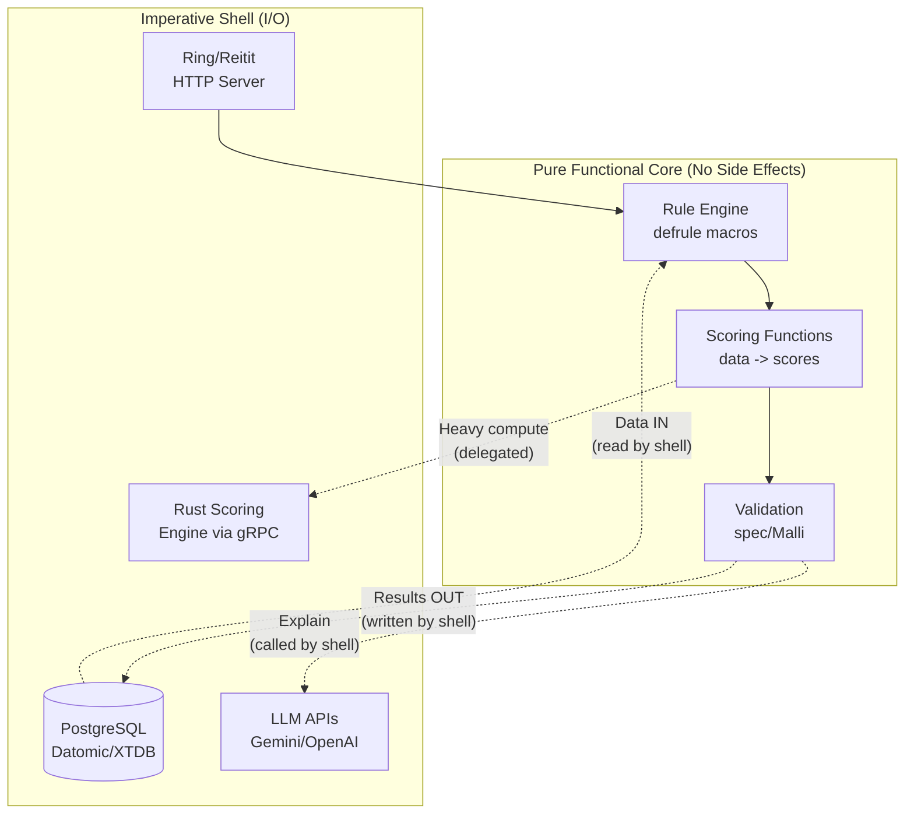
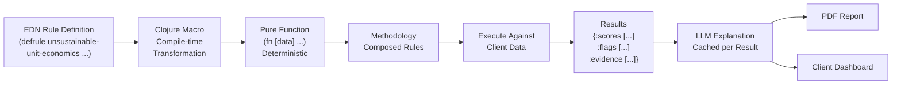
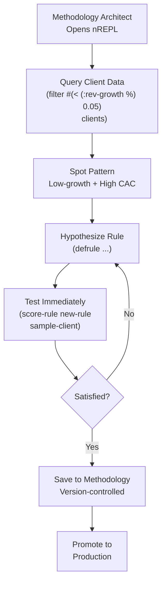
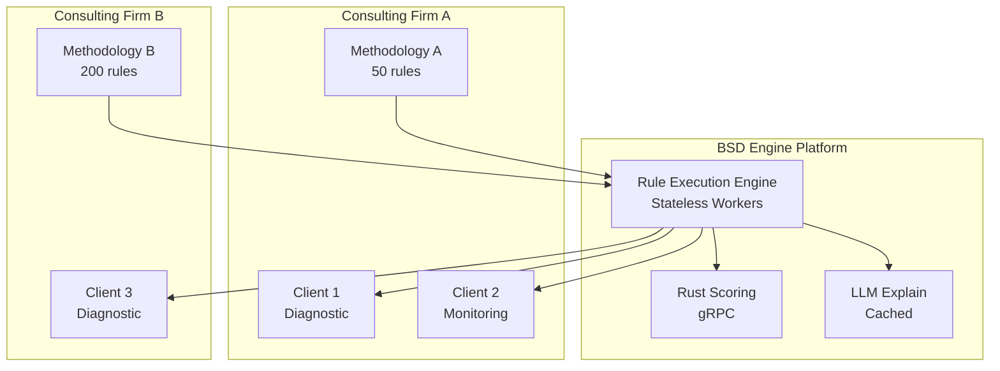

# BSD Engine v2


---

## Overview

BSD Engine v2 transforms the existing proprietary BSD decision-support system into a **white-label diagnostic platform** for African consulting firms, sector regulators, and corporate strategy teams. A business-readable **rules DSL** written in Clojure compiles to deterministic scoring functions, while the existing Rust scoring engine handles numeric hot paths and an LLM layer generates human-readable explanations. Consultants encode their diagnostic methodology as data (EDN-based rules); the platform executes, scores, explains, and visualizes.

---

## Architecture / Patterns

### Functional Core / Imperative Shell

**Acronym expansion:** N/A (descriptive name, not an acronym).

**Definition:** Architecture where the innermost layer is composed entirely of pure functions (no side effects, no I/O, deterministic). The outer "shell" handles all impure operations (database reads/writes, HTTP calls, LLM API calls). The core takes input and returns output -- nothing else.

**Justification -- why it fits BSD Engine v2:** Diagnostic scoring MUST be deterministic -- same client data + same methodology = same scores, every time. Regulators (CBK) and consulting firms need reproducibility for audit and legal purposes. If the scoring function accidentally reads from a database or calls an external API, the result could vary between runs. By making the core pure, determinism is guaranteed by construction (the type system and architecture prevent impurity), not by developer discipline (which fails under pressure).

**Concrete application:** The Clojure `engine.core` namespace contains ONLY pure functions: `(score-methodology rules data) -> {:scores [...] :flags [...] :evidence [...]}`. No `def` mutations, no I/O, no `println`. The shell (`engine.infra`) handles: reading client data from PostgreSQL, calling the LLM API for explanations, writing results to the event store, serving HTTP responses. The core can be tested with `(= (score-methodology rules test-data) expected-output)` -- no mocks, no setup, no teardown.



### Macro DSLs (Domain-Specific Languages via Clojure Macros)

**Acronym expansion:** DSL = Domain-Specific Language.

**Definition:** A domain-specific language is a programming language tailored to a specific problem domain (here: business diagnostics). Clojure macros transform code at compile time -- they receive code as data (AST) and return new code as data. This enables creating new syntax that compiles to standard Clojure.

**Justification -- why it fits BSD Engine v2:** Consultants write diagnostic methodology, not code. The DSL must read like English: "when revenue growth < 5% AND CAC > 3x LTV, flag unsustainable unit economics with severity high." Without macros, you'd need to build a parser, lexer, and interpreter from scratch. Clojure's homoiconicity (code IS data -- both are lists) means the DSL IS valid Clojure -- no separate toolchain needed. The `defrule` macro transforms business-readable rules into executable scoring functions at compile time.

**Concrete application:**

```clojure
(defrule unsustainable-unit-economics
  {:severity :high
   :category :financial-health
   :description "Customer acquisition cost exceeds sustainable multiple of customer lifetime value"}
  [:when
   (< (:revenue-growth data) 0.05)
   (> (:cac data) (* 3.0 (:ltv data)))]
  [:then
   {:flag :unsustainable-unit-economics
    :evidence [(:cac data) (:ltv data) (:revenue-growth data)]
    :severity :high
    :remediation-hints [:review-acquisition-channels :improve-retention :increase-pricing]}])
```

The macro compiles this to a function that takes `data` and returns a score. Rules are stored as EDN (Extensible Data Notation) -- version-controlled, diffable, composable into full methodologies.



### Clean Architecture

**Acronym expansion:** N/A (descriptive name, not an acronym).

**Definition:** Concentric circles of dependencies: innermost = entities (domain objects), next = use cases (application logic), next = interface adapters, outermost = frameworks and drivers. Dependencies point inward only -- the domain never depends on HTTP, databases, or UI frameworks.

**Justification -- why it fits BSD Engine v2:** BSD Engine serves multiple interfaces: (1) REPL for methodology architects exploring data interactively, (2) web dashboard for consulting firm clients viewing diagnostics, (3) PDF reports for executives, (4) gRPC for the Rust scoring engine integration. Without clean architecture, adding a new interface (e.g., mobile app, Slack bot) would require rewriting business logic. With it, each interface is an adapter -- the diagnostic logic is the same regardless of how it's accessed.

**Concrete application:**

- **Entities:** `Rule`, `Methodology`, `Diagnostic`, `Score`.
- **Use cases:** `RunDiagnostic`, `AuthorRule`, `GenerateReport`.
- **Adapters:** Ring/Reitit (HTTP), ClojureScript/Re-frame (web UI), PDF generator, gRPC client (Rust engine).
- **Drivers:** PostgreSQL, Datomic/XTDB, LLM APIs.

### REPL-Driven Development

**Acronym expansion:** REPL = Read-Eval-Print Loop.

**Definition:** Development workflow centered on a Read-Eval-Print Loop -- an interactive environment where code is written, evaluated, and results inspected incrementally. State is preserved between evaluations, enabling exploratory programming.

**Justification -- why it fits BSD Engine v2:** Diagnostic methodology development is inherently exploratory. A senior consultant examining a new client's data doesn't know upfront which rules will be relevant. They need to: query the data, spot patterns, hypothesize a rule, test it against sample data, refine it. A compile-deploy-test cycle (write code, compile, deploy, test, see result) would take minutes per iteration. The REPL enables "think, try, see result" in seconds -- the feedback loop that makes Clojure developers productive.

**Concrete application:** Analyst BFF provides a sandboxed nREPL session with read-only access to client data. Architect types `(filter #(< (:revenue-growth %) 0.05) clients)` to see all low-growth clients instantly, develops a rule, runs `(score-rule new-rule sample-client)` to see the result, refines, and saves to methodology.



### Inherited: Hexagonal, Event Sourcing, CQRS from Tiers 2-4

**Acronym expansion:** CQRS = Command Query Responsibility Segregation.

**Definition:** Hexagonal Architecture (Ports and Adapters) decouples domain logic from external systems via ports (interfaces) and adapters (implementations). Event Sourcing persists state as an append-only log of immutable events rather than mutable rows. CQRS separates the write model (commands that change state) from the read model (queries optimized for display).

**Justification -- why it fits BSD Engine v2:** Every rule edit and diagnostic run is an immutable event -- enabling full audit trails, point-in-time replay, and regulatory compliance without additional logging infrastructure. CQRS allows the rule authoring path (write-heavy, validated, event-sourced) to be optimized independently from the dashboard query path (read-heavy, denormalized for speed). Hexagonal ports let the same diagnostic logic plug into Ring/HTTP, gRPC/Rust, or nREPL without modification.

**Concrete application:** Rule edits emit events (`RuleCreated`, `RuleUpdated`, `RuleDeprecated`) to an event store (Datomic/XTDB). The write side validates and persists events. The read side projects events into a denormalized PostgreSQL view optimized for dashboard queries. Hexagonal ports (`ScoringPort`, `ExplanationPort`, `PersistencePort`) are implemented by adapters (`RustGrpcAdapter`, `GeminiLlmAdapter`, `PostgresAdapter`).

### Pattern Lineage

- **Inherits:** All T1-T4 patterns.
- **Introduces:** Functional Core / Imperative Shell + Macro DSLs + Clean Architecture + REPL-Driven Development.
- **Carries forward:** Functional Core / Imperative Shell reappears in T6 as F# modules (pure tariff calculation, pure ROP validation) surrounded by C# I/O shell. Macro DSLs inspire F# computation expressions for tariff rules in PayGoHub.



### Three BFFs

| BFF | Client | Technology | Responsibilities |
|-----|--------|------------|------------------|
| Analyst BFF | Web app with REPL | ClojureScript + Re-frame | Rule authoring, REPL, methodology management |
| Client Dashboard BFF | Web app (client-facing) | ClojureScript + Re-frame | View diagnostics, track progress, download reports |
| Consultant BFF | Web app (firm admin) | Clojure Ring + Reitit | Firm management, client provisioning, billing, white-label config |

### Rust Scoring Engine Integration

The existing Rust/PyO3 scoring engine from BSD v1 is preserved and exposed as a gRPC service. Clojure orchestrates rule execution and delegates heavy numeric computation (time series, statistical tests), ML-based scoring (XGBoost, random forests), and large dataset transformations to Rust.

### LLM Explanation Layer

LLM calls are adapter implementations behind a hexagonal `ExplanationService` port. Inputs include the flagged rule, evidence data, severity, and methodology context. Outputs are human-readable explanations calibrated to the consultant's voice. Explanations are cached per `(rule, evidence-hash)` to ensure deterministic stability. Providers: Gemini (default, cost), OpenAI (fallback), Anthropic (enterprise tier).

### Technology Stack

| Layer | Technologies |
|-------|-------------|
| Backend | Clojure 1.12, Reitit, Malli, core.async |
| Frontend | ClojureScript, Re-frame |
| Scoring | Rust (gRPC service, unchanged from v1) |
| Data | PostgreSQL, Datomic/XTDB (event-sourced rules), Redis (cache), S3 (reports) |
| Integrations | Gemini/OpenAI/Anthropic (LLM), Stripe/Paystack (billing), SendGrid (email) |
| Infrastructure | AWS (us-east-1), Kubernetes (EKS), JVM-optimized nodes |

---

## Requirements

| ID | User Story | Epic |
|----|-----------|------|
| 4.1.1 | As a senior consultant, I want to write my firm's diagnostic methodology as executable rules so that my expertise becomes durable infrastructure | Methodology Authoring |
| 4.1.2 | As an analyst, I want to run our methodology against client data and get a diagnostic report in under 2 minutes | Methodology Authoring |
| 4.2.1 | As a client CEO, I want to see diagnostic scores updated monthly without a new consulting engagement | Client Dashboard |
| 4.3.1 | As a consulting firm partner, I want to white-label the platform with our firm's branding | Methodology Library / White-Labeling |
| 4.4.1 | As a methodology architect, I want to explore client data interactively via REPL and build rules incrementally | REPL-Driven Development |
| 4.5.1 | As a system operator, I want Rust to remain the fast-path for numeric scoring while Clojure handles rules and interpretation | Rust Integration |

---

## Acceptance Criteria

### Epic: Methodology Authoring

- [ ] Rules are written in a Clojure-based DSL (EDN) via the Analyst BFF rule editor
- [ ] Validation runs immediately on rule definition (syntax, semantic, rule dependencies)
- [ ] Rules can be tested against sample data in the integrated REPL
- [ ] Rules are version-controlled (every edit is an event in the event log)
- [ ] Rules compose into full methodologies (e.g., "Business Sustainability Diagnostic")
- [ ] Diagnostic runs execute all applicable rules deterministically (same input, same output)
- [ ] LLM-generated explanations accompany each flagged issue
- [ ] Full report generated as PDF + interactive dashboard
- [ ] Total runtime under 2 minutes for 200+ rules

### Epic: Client Dashboard (Ongoing Monitoring)

- [ ] Client accounts provisioned by the consulting firm
- [ ] Diagnostic re-runs automatically on new monthly data upload (manual or API)
- [ ] Client dashboard shows score changes vs prior period
- [ ] Recommendations marked "addressed" are tracked for effectiveness
- [ ] Client receives email summary with changes highlighted
- [ ] Client can drill into scores but cannot see raw rule logic (IP protection)

### Epic: Methodology Library and White-Labeling

- [ ] Consulting firm configures: logo, color palette, domain (CNAME), PDF template, email templates
- [ ] Clients see the firm's branding throughout
- [ ] "Powered by BSD Engine" footer removable at Enterprise tier
- [ ] Firm's name appears as methodology author

### Epic: REPL-Driven Methodology Development

- [ ] Live Clojure REPL with read-only access to current client data
- [ ] Query data, develop rules interactively, see results immediately
- [ ] Rules saved, versioned, and promoted to main methodology
- [ ] REPL runs in sandboxed environment (no filesystem, no network, CPU-limited)

### Epic: Rust Scoring Engine Integration

- [ ] Clojure compiles rules to deterministic execution plan
- [ ] Numeric-heavy scoring delegated to Rust scoring engine via gRPC
- [ ] Split is invisible to the user
- [ ] Total runtime benefits from Rust's speed on hot paths

---

## Non-Functional Requirements

### Performance

| Metric | Target |
|--------|--------|
| Diagnostic run (200 rules, 1,000 data points) | < 2 minutes |
| Rule compilation (DSL to execution plan) | < 30 seconds |
| REPL evaluation (simple query) | < 500ms |
| PDF report generation | < 30 seconds |
| Dashboard page load | < 2 seconds |

### Determinism and Reproducibility

| Requirement | Detail |
|-------------|--------|
| Deterministic output | Same input produces same output, always. No randomness, no external state. |
| Audit trail | Every run logs methodology version, input data version, computed scores, timestamp. |
| Reproducibility | Any past diagnostic can be re-run with identical results. |
| LLM stability | Explanations cached per-result to ensure stability across views. |

### Availability

| Component | Target |
|-----------|--------|
| Analyst BFF (methodology authoring) | 99.5% (business hours) |
| Client Dashboard | 99.9% |
| Consultant BFF | 99.9% |
| Rule execution engine | 99.99% |

### Security

| Requirement | Detail |
|-------------|--------|
| Authentication | OIDC (Auth0 or Keycloak); SAML for enterprise regulators |
| Authorization | Multi-tenant; methodology IP isolated per firm; client data isolated per engagement |
| IP protection | Rules encrypted at rest; executed in sandbox; rule text never returned to client dashboard |
| Audit logging | Every rule edit, diagnostic run, and client data upload logged |
| Compliance | Kenya DPA; GDPR-equivalent for EU clients; SOC 2 Type I by end of Year 1 |

---

## Success Metrics

### Business Metrics (End of Week 15)

| Metric | Target |
|--------|--------|
| Paying consulting firms | 2 |
| Active methodologies in production | 5+ |
| Total client engagements monitored | 20+ |
| Monthly Recurring Revenue | $400+ |

### Product Metrics

| Metric | Target |
|--------|--------|
| Time from signup to first diagnostic | < 5 business days |
| Methodology authoring time (20-rule methodology) | < 10 hours |
| Client dashboard MAU per client | > 40% |
| LLM explanation quality (thumbs-up rate) | > 70% |

### Technical Metrics

| Metric | Target |
|--------|--------|
| Diagnostic execution reliability | > 99.9% |
| Determinism verification | 100% (automated tests) |
| Rule DSL expressiveness (rules written vs attempted) | > 95% |

---

## Definition of Done

- [ ] All user stories in Section 4 have passing acceptance tests
- [ ] DSL compiler handles 95%+ of real methodology cases
- [ ] Determinism verified by automated regression tests (1,000+ runs)
- [ ] 2 consulting firms in production, $400+ MRR
- [ ] White-labeling works end-to-end (custom domain, branding, reports)
- [ ] LLM explanation quality > 70% thumbs-up rate
- [ ] Rust scoring engine integration live
- [ ] Security audit passed
- [ ] Documentation: DSL reference, methodology authoring guide, consultant guide
- [ ] On-call rotation active

---

## Commercial

| Tier | Price | Features | Target |
|------|-------|----------|--------|
| Starter | $199/mo | 1 methodology, 5 clients, basic explanations | Small boutiques |
| Professional | $999/mo | 5 methodologies, 50 clients, white-labeling, priority support | Mid consulting firms |
| Agency | $2,999/mo | Unlimited methodologies, 500 clients, API access, dedicated explanation models | Large consulting firms |
| Enterprise / Regulator | From $4,999/mo | Custom deployment, on-premises option, SLAs, custom DSL extensions | Regulators, pan-African corporates |
| Methodology license fee | 20% markup | Firms licensing methodologies to each other | Methodology marketplace |
