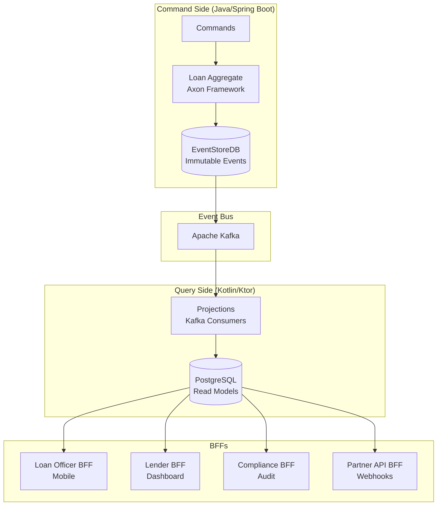
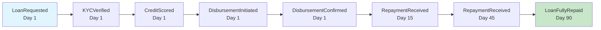
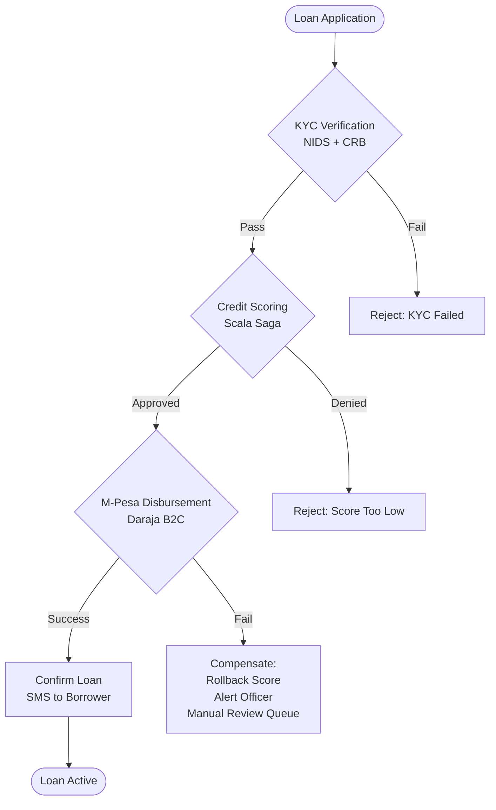

# LendStream v2

---

## Overview

LendStream v2 transforms the existing micro-lending platform into white-label lending infrastructure for Kenyan and East African microfinance institutions (MFIs). The architecture implements CQRS + Event Sourcing + Saga Orchestration -- the patterns used by Stripe, Adyen, and Wise for financial infrastructure -- adapted for M-Pesa-denominated, short-cycle, small-ticket lending. The v1 platform (Java/Spring Boot, Clojure scoring engine, Kafka-based CQRS) is extended into a multi-tenant, enterprise-grade core banking alternative purpose-built for the East African mobile money ecosystem.

---

## Architecture

### Key Patterns

#### CQRS (Command Query Responsibility Segregation)

**Definition:** Separate the write model (commands that change state) from the read model (queries that return data). Each side can be optimized independently -- strict transactional integrity on writes, denormalized speed on reads.

**Justification:** Loan origination writes must be strictly ordered, validated, and audited (CBK regulations). Portfolio dashboards need sub-second queries across 10,000+ loans with aggregations by branch, officer, cohort. A single model forces either write safety or read performance to suffer. CQRS lets Java/Spring Boot handle writes with Axon Framework while Kotlin/Ktor serves fast, pre-computed projections.

**Application:** Command side (Java): `OriginateLoanCommand` -> Loan aggregate validates -> `LoanOriginatedEvent` written to EventStoreDB. Query side (Kotlin): Kafka consumer projects events into PostgreSQL read models optimized per BFF (Loan Officer sees their portfolio; Operations sees all branches).

#### Event Sourcing

**Definition:** Store every state change as an immutable event, not a mutable row. Current state is derived by replaying events. The event log IS the source of truth -- no data is ever overwritten or deleted.

**Justification:** CBK (Central Bank of Kenya) Digital Credit Providers Regulations 2022 require 7-year audit trails for every loan decision. CRUD databases overwrite state -- if a loan officer changes a borrower's income field, the original value is gone. Event sourcing preserves every version: `IncomeRecorded{amount: 50000}`, `IncomeUpdated{amount: 65000, reason: "salary increase", updatedBy: "officer_123"}`. A compliance officer can reconstruct any loan's full history at any point in time.

**Application:** EventStoreDB stores all domain events. `LoanOriginatedEvent`, `KYCVerifiedEvent`, `CreditScoredEvent`, `DisbursementInitiatedEvent`, `RepaymentReceivedEvent` -- each immutable, timestamped, signed. Compliance BFF replays events to generate PDF audit reports in under 10 seconds.

#### Saga Orchestration

**Definition:** A saga is a sequence of local transactions across multiple services, with compensating actions for rollback. Unlike distributed transactions (2PC), sagas handle partial failure gracefully -- if step 3 fails, steps 1 and 2 are compensated (reversed).

**Justification:** Loan origination spans 4+ external systems: KYC verification (NIDS), credit scoring (CRB), M-Pesa disbursement (Safaricom Daraja), SMS notification (Africa's Talking). If M-Pesa disbursement fails after KYC and scoring pass, the system must: mark the loan as "disbursement_failed", alert the loan officer, queue for manual review -- NOT leave a half-originated loan in the system. Without sagas, partial failures corrupt financial state and create reconciliation nightmares.

**Application:** Scala 3 saga orchestrator using ADTs (Algebraic Data Types) to encode saga state machines. `SagaState = Initiated | KYCVerified | CreditScored | DisbursementRequested | DisbursementConfirmed | Failed(reason, compensations)`. The compiler prevents illegal state transitions -- you cannot disburse without scoring. Each state has defined compensating actions.

#### BFF (Backend For Frontend) -- inherited from Tier 1

**Definition:** Each frontend client type gets its own dedicated backend service that aggregates, transforms, and optimizes API responses for that specific client's needs. BFFs prevent a single monolithic API from becoming a lowest-common-denominator compromise across wildly different client requirements.

**Justification:** A field loan officer on a 3G Android phone in rural Nyeri needs a lightweight, offline-capable payload with only their portfolio. An operations manager on a desktop dashboard needs aggregated analytics across all branches with drill-down capability. A compliance officer needs full event replay and audit trails. A partner API consumer needs stable, versioned REST contracts. One API serving all four degrades every experience. BFFs let each client get exactly the data shape, caching strategy, and authentication model it needs.

**Application:** 4 BFFs: Loan Officer (mobile, Kotlin/Ktor), Lender/Operations (web dashboard, Kotlin/Ktor), Compliance (audit tools, Java/Spring Boot), Partner API (external integration, Kotlin/Ktor).

#### Event-Driven Architecture -- inherited from Tier 1

**Definition:** Services communicate by publishing and subscribing to domain events through a message broker rather than making direct synchronous calls. Each service reacts to events it cares about without the publisher needing to know who consumes them.

**Justification:** In a lending platform, a single business action (borrower repays a loan) triggers effects across multiple bounded contexts: the portfolio projection must update, the compliance audit log must record the event, the borrower must receive an SMS confirmation, and the lender dashboard must reflect the new collection rate. Synchronous orchestration creates tight coupling and cascading failures -- if the SMS service is down, the entire repayment flow breaks. Event-driven architecture decouples these concerns so each context processes events independently and at its own pace.

**Application:** Domain events flow through Apache Kafka between bounded contexts. `RepaymentReceivedEvent` published by Payments context -> consumed by Portfolio context (update projections), Compliance context (audit log), Notification context (SMS to borrower).

#### Pattern Lineage

- **Inherits:** BFF + Event-Driven from Tier 1
- **Introduces:** CQRS + Event Sourcing + Saga Orchestration
- **Carries forward:** CQRS appears in every subsequent tier. Event Sourcing used in Sherehe (event plan history), Unicorns (order history), Shamba (farmer delivery history), BSD Engine (methodology versioning), PayGoHub (all financial events). Sagas used wherever multi-step workflows exist.

### Bounded Contexts

| Context | Responsibility | Primary Language |
|---------|---------------|------------------|
| Customer | Borrower onboarding, KYC, identity | Java / Spring Boot |
| Loan | Loan lifecycle, state, terms | Java / Spring Boot (command side) |
| Scoring | Credit scoring, underwriting rules | Scala (saga orchestration) + Clojure rules engine |
| Disbursement | M-Pesa integration, fund movement | Java / Spring Boot |
| Repayment | Payment allocation, reconciliation | Java / Spring Boot + Kotlin / Ktor projections |
| Portfolio | Read models for analytics | Kotlin / Ktor (query side) |
| Audit | Compliance event store access, reports | Java / Spring Boot |

### Technology Stack

| Layer | Technologies |
|-------|-------------|
| Backend | Java 21 (Spring Boot 3.3, Axon Framework 4.x), Kotlin 2.x (Ktor 3.x), Scala 3 (cats-effect / ZIO 2), Clojure (scoring engine) |
| Data | EventStoreDB, Apache Kafka, PostgreSQL (projections), MongoDB (borrower profiles), Elasticsearch (loan search), Redis (saga state, distributed locks) |
| Integrations | M-Pesa Daraja APIs, NIDS (National ID), CRB (Credit Reference Bureau), Africa's Talking (SMS) |
| Infrastructure | AWS af-south-1 (Kenya data residency), Kubernetes (EKS), Istio service mesh, OpenTelemetry |

### BFFs

| BFF | Client | Language | Key Endpoints |
|-----|--------|----------|---------------|
| Loan Officer BFF | Mobile app (field loan officers) | Kotlin / Ktor | `POST /loans/originate`, `GET /loans/my-portfolio`, `POST /repayments/manual` |
| Lender BFF | Operations dashboard (web) | Kotlin / Ktor | `GET /portfolio/dashboard`, `GET /branches/performance`, `GET /cohorts/analysis` |
| Compliance BFF | Compliance officer tools (web) | Java / Spring Boot | `GET /audit/loan/{id}`, `GET /audit/reports/cbk-monthly`, `POST /audit/custom-query` |
| Partner API BFF | Integration partners (CRM, mobile banking) | Kotlin / Ktor | `POST /loans`, webhook deliveries, `POST /imports/bulk` |

---

## Requirements

| ID | Epic | Requirement | User |
|----|------|-------------|------|
| REQ-001 | Loan Origination | Originate a loan in under 10 minutes from the field with automated credit scoring and M-Pesa disbursement | Loan Officer |
| REQ-002 | Loan Origination | Every loan origination produces an immutable, CBK-auditable event trail | Compliance Officer |
| REQ-003 | Portfolio Management | Real-time portfolio analytics across all branches with data freshness under 30 seconds | Operations Manager |
| REQ-004 | Repayment and Collection | Borrower repays via M-Pesa with loan balance updated within 60 seconds | Borrower |
| REQ-005 | MFI Onboarding | Onboard a new MFI with existing loan data (up to 50,000 loans via CSV) within 7 days | MFI Partner |

---

## Acceptance Criteria

### Epic: Loan Origination

- [ ] **AC-001** -- KYC verification (NIDS + CRB) completes in under 30 seconds given borrower National ID and phone number
- [ ] **AC-002** -- Credit scoring via Scala saga orchestrator returns a decision in under 60 seconds
- [ ] **AC-003** -- On approval, M-Pesa disbursement saga executes (debit lender wallet, credit borrower phone, confirm receipt)
- [ ] **AC-004** -- Borrower receives SMS confirmation within 2 minutes of approval
- [ ] **AC-005** -- Failed saga steps trigger compensating actions automatically (refund, alerting, manual review queue)
- [ ] **AC-006** -- Every command and event is written to EventStoreDB with signed, immutable timestamps
- [ ] **AC-007** -- Compliance BFF produces a PDF audit report for any loan ID in under 10 seconds
- [ ] **AC-008** -- Audit report includes every decision point, every system that touched the loan, and every state change

### Epic: Portfolio Management

- [ ] **AC-009** -- Dashboard displays NPL ratio, PAR30/60/90, disbursement volume, and collection rate by branch, loan officer, product, and cohort
- [ ] **AC-010** -- Data freshness under 30 seconds via CQRS projections consuming the event stream
- [ ] **AC-011** -- Drill down to individual loan level in 2 clicks
- [ ] **AC-012** -- Export any view to Excel/CSV for board reports

### Epic: Repayment and Collection

- [ ] **AC-013** -- M-Pesa webhook reaches LendStream within 10 seconds
- [ ] **AC-014** -- Payment is idempotency-protected (webhook replay safe)
- [ ] **AC-015** -- Repayment saga allocates to principal, interest, fees, updates balance, and emits event
- [ ] **AC-016** -- Borrower balance updated in projection store within 60 seconds of webhook receipt
- [ ] **AC-017** -- Borrower receives SMS confirmation

### Epic: MFI Onboarding

- [ ] **AC-018** -- Bulk CSV upload supports up to 50,000 loans
- [ ] **AC-019** -- Validation via Scala ROP pipeline; each loan passes all checks or fails with a specific error
- [ ] **AC-020** -- Failed loans returned in downloadable error report with specific remediation steps
- [ ] **AC-021** -- Successful loans projected into event store as `HistoricalLoanImported` events
- [ ] **AC-022** -- MFI operational within 7 days of contract signing

---

## Non-Functional Requirements

### Performance

| ID | Metric | Target |
|----|--------|--------|
| NFR-P01 | Loan origination end-to-end (P95) | < 90 seconds |
| NFR-P02 | Portfolio dashboard query (P95) | < 2 seconds |
| NFR-P03 | Event store write latency (P99) | < 100 ms |
| NFR-P04 | Projection lag (events to read models) | < 30 seconds |
| NFR-P05 | Repayment webhook processing (P95) | < 5 seconds |
| NFR-P06 | System throughput | 1,000 loans/minute peak |

### Availability

| ID | Component | Target |
|----|-----------|--------|
| NFR-A01 | Loan Officer BFF | 99.95% |
| NFR-A02 | Lender BFF | 99.9% |
| NFR-A03 | Event store | 99.99% |
| NFR-A04 | Compliance BFF | 99.9% |
| NFR-A05 | Scoring engine (Scala sagas) | 99.9% |

---

## Success Metrics

### Business Metrics (End of Week 15)

| Metric | Target | Current |
|--------|--------|---------|
| Paying MFI customers | 1 | 0 |
| Pilot conversations in progress | 3 | 0 |
| Monthly Recurring Revenue | $500 | $0 |
| Loans originated through platform | 5,000+ | N/A |

### Technical Metrics

| Metric | Target |
|--------|--------|
| Origination end-to-end latency (P95) | < 90 seconds |
| Event store uptime | > 99.99% |
| Audit report generation | < 10 seconds for any loan |
| Test coverage on domain layer | > 90% |

### Compliance Metrics

| Metric | Target |
|--------|--------|
| CBK audit report generation time | < 10 minutes for full-month report |
| Events with missing signatures | 0 |
| Projections reconcile with events | 100% (automated nightly check) |

---

## Definition of Done

- [ ] All user stories in Section 4 have passing acceptance tests
- [ ] Origination saga handles all 12 defined failure modes with correct compensation
- [ ] Event store reconciles with projections nightly (zero discrepancies over 7 consecutive days)
- [ ] Audit report for any loan generated in under 10 seconds
- [ ] 1 MFI live in production handling real loans (minimum 100 loans/week)
- [ ] Security audit complete (OWASP Top 10 + fintech-specific threat model)
- [ ] CBK audit rehearsal passed (present to local compliance consultant for sign-off)
- [ ] Documentation: API reference, MFI onboarding guide, architecture docs, runbook
- [ ] Disaster recovery tested (full restore from event store in staging)
- [ ] On-call rotation + alerting operational

---

## Commercial

### Pricing Tiers

| Tier | Price | Features | Target |
|------|-------|----------|--------|
| Starter | $500/mo | Up to 5,000 active loans, 2 branches, basic analytics | Small MFIs |
| Growth | $1,200/mo | 25,000 active loans, 10 branches, advanced analytics, API access | Mid MFIs |
| Scale | $2,500/mo | 100,000+ active loans, unlimited branches, custom integrations | Large MFIs, SACCOs |
| Enterprise | Custom (from $5,000/mo) | On-premises option, custom scoring models, dedicated support | Digital credit providers, banks |
| Implementation | $2,500 -- $15,000 (one-time) | Data migration, training, customization | Per MFI |
