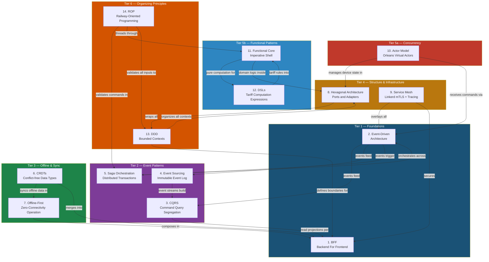
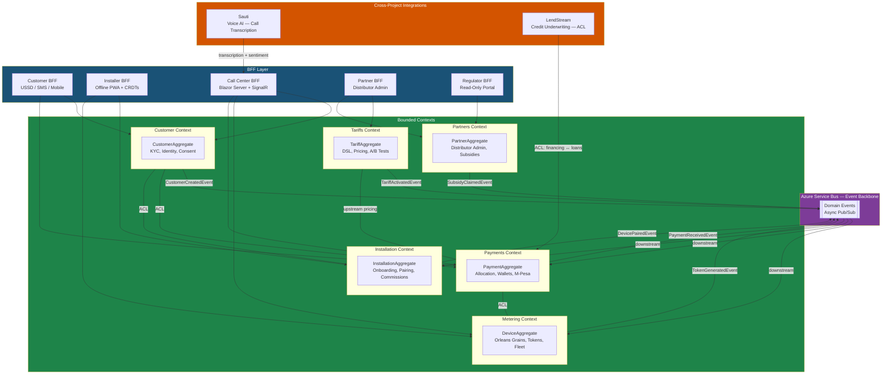
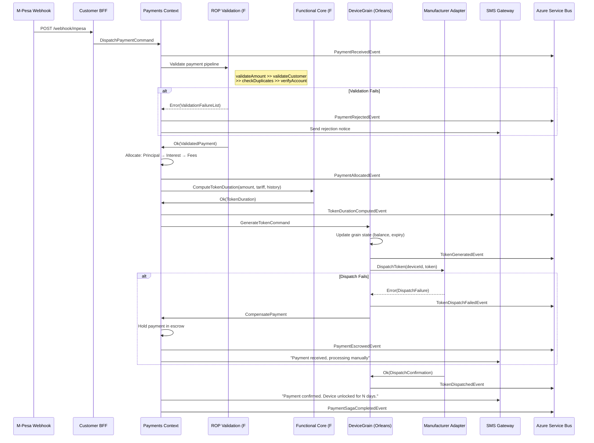
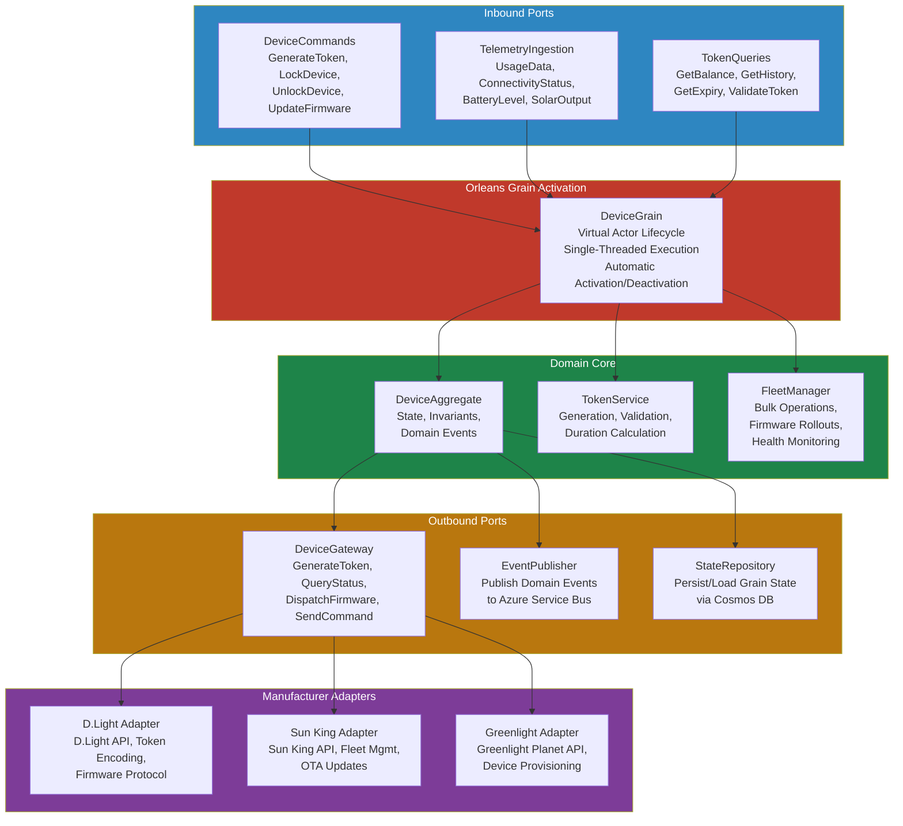
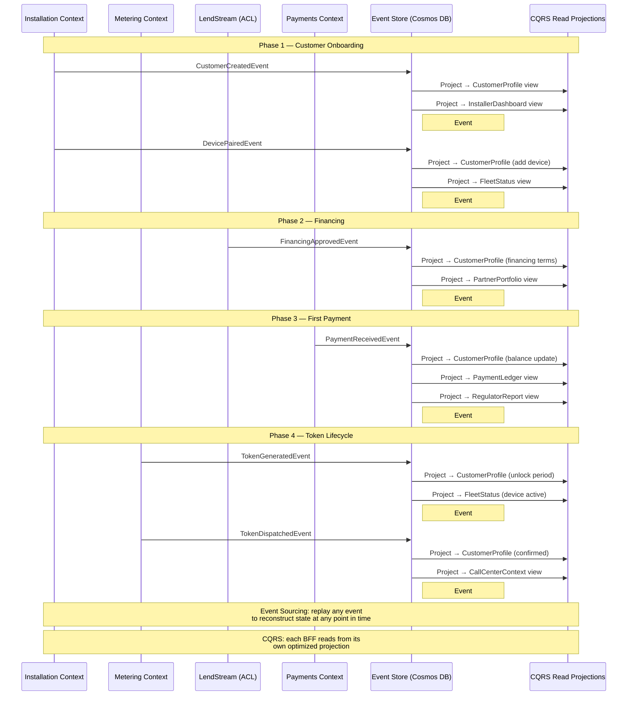

# PayGoHub v2

-FF6600?style=flat-square)

---

## Overview

PayGoHub v2 is the capstone project of the 15-week monk mode sprint -- a white-label PAYG (Pay-As-You-Go) solar energy management platform that **composes all 14 architectural patterns** developed across Tiers 1-5 into a single, production-grade, commercializable system. It targets mid-size African utilities and solar distributors (300+ companies, 35M+ customers served) who need enterprise-grade infrastructure at a fraction of the cost charged by incumbents like Angaza, Paygops, or Solaris. The platform is built on Azure-native .NET with F# for domain-pure computation, integrating Sauti (voice AI) and LendStream (credit underwriting) as cross-project synergies that demonstrate the conglomerate thesis.

---

## Architecture

### All 14 Patterns Composed

PayGoHub v2 is the architectural capstone. Every pattern introduced across Tiers 1-5 finds its natural expression in a single production system. The ability to identify, justify, and compose these patterns -- knowing when each applies and when it doesn't -- is the "third eye" that the 15-week sprint trains. Below, each of the 14 patterns is expanded with its definition, justification for PAYG solar energy, and concrete application in PayGoHub.

---

#### 1. BFF -- Backend For Frontend (Tier 1)

**Definition:** The BFF pattern assigns a dedicated backend service to each distinct frontend client, tailoring API shape, authentication, latency optimization, and data aggregation to the specific needs of that client. Rather than a single monolithic API serving all consumers, each BFF is purpose-built for its audience.

**Why it fits PayGoHub:** PAYG solar has 5 radically different users -- a rural customer checking balance via USSD, a field installer pairing devices offline, a call center agent handling complaints in real-time, a distributor COO configuring tariffs, and a regulator reviewing compliance reports. A single API cannot serve a USSD session (text-only, 160 characters, 3-second timeout) and a Blazor Server real-time dashboard with the same data shape, authentication model, or latency profile.

**Concrete application:** 5 BFFs -- Customer (USSD/SMS/mobile), Installer (offline PWA), Call Center (Blazor Server real-time), Partner (distributor admin), Regulator (read-only portal). Each BFF owns its own query projections, authentication middleware, and rate-limiting policies. The Customer BFF speaks USSD shortcodes and Africa's Talking webhooks; the Call Center BFF maintains persistent SignalR connections for live Sauti transcription; the Regulator BFF serves pre-aggregated, read-only data behind IP-whitelisted access.

---

#### 2. Event-Driven Architecture (Tier 1)

**Definition:** Event-Driven Architecture structures a system around the production, detection, and reaction to domain events. Services communicate asynchronously by publishing events to a message broker rather than making synchronous HTTP calls. This decouples producers from consumers and enables independent scaling and deployment.

**Why it fits PayGoHub:** A single M-Pesa payment touches 5+ subsystems -- token generation, balance update, SMS notification, commission calculation, and audit logging. Synchronous calls would create cascading latency (if SMS is slow, the payment webhook times out) and tight coupling (if commission calculation changes, the payment service must redeploy). In a market where M-Pesa webhook SLAs are tight and network reliability is poor, asynchronous event flow is not optional.

**Concrete application:** Domain events flow between all 6 bounded contexts via Azure Service Bus. `PaymentReceivedEvent` triggers token generation in the Metering context, balance update in the Payments context, SMS notification via the Customer BFF, commission accrual in the Installation context, and immutable audit logging across all contexts -- all asynchronously. Each subscriber processes at its own pace; a slow regulator report generator never blocks customer-facing payment confirmation.

---

#### 3. CQRS -- Command Query Responsibility Segregation (Tier 2)

**Definition:** CQRS separates the write model (commands that change state) from the read model (queries that return data). Each side can use different data models, storage engines, and scaling strategies. Writes enforce business invariants; reads are optimized for consumer-specific data shapes.

**Why it fits PayGoHub:** Payment allocation writes require strict ordering and validation -- financial integrity demands that a payment is allocated to principal before interest before fees, and that token duration is computed deterministically. Call center reads need denormalized customer profiles (payment history, device status, open tickets, Sauti sentiment scores) returned in under 2 seconds. These two concerns have fundamentally different optimization targets: correctness vs. speed. Cramming both into a single model forces compromises on both.

**Concrete application:** Command side in C# with strict domain validation and event emission. Query side builds per-BFF read projections -- the Call Center BFF gets a flattened `CustomerContext` view joining data from 4 bounded contexts; the Partner BFF gets aggregated portfolio analytics; the Regulator BFF gets pre-computed compliance summaries. Each projection is updated asynchronously from domain events, stored in Azure SQL Database, and queryable independently of the write-side event store in Cosmos DB.

---

#### 4. Event Sourcing (Tier 2)

**Definition:** Event Sourcing persists the state of a domain entity as a sequence of immutable state-changing events rather than storing only the current state. The current state is derived by replaying the event stream. This provides a complete audit trail, enables temporal queries, and supports rebuilding read projections from scratch.

**Why it fits PayGoHub:** EPRA (Energy and Petroleum Regulatory Authority) quarterly reporting requires reconstructing any customer's full payment and device history -- when they paid, how much was allocated to principal vs. fees, when tokens were generated and dispatched, when devices were locked or unlocked. CRUD databases lose this trail -- an UPDATE overwrites history. In a regulated fintech-adjacent domain where disputes involve "show me exactly what happened to payment #47,293 on March 14th," event sourcing is a compliance requirement, not a luxury.

**Concrete application:** Every payment, token generation, device state change, tariff activation, and customer lifecycle event is stored as an immutable event in Cosmos DB (event log container). Customer state is reconstructed by replaying events. Read projections for each BFF are built from event streams. Temporal queries enable dispute resolution ("what was this customer's balance at 3:47 PM on March 14th?"). Event replay enables rebuilding any read projection from scratch when schema evolves.

---

#### 5. Saga Orchestration (Tier 2)

**Definition:** A saga is a sequence of local transactions coordinated across multiple services, where each step either succeeds and triggers the next or fails and triggers compensating actions to undo prior steps. Saga orchestration centralizes the coordination logic in a saga orchestrator rather than distributing it across services.

**Why it fits PayGoHub:** The payment allocation flow spans 6 steps and 3 external systems (M-Pesa, device manufacturer API, SMS gateway). If token dispatch fails after payment allocation succeeds, the system must NOT mark the payment as complete -- the saga must execute a compensating action that holds payment in escrow and alerts support. Without sagas, partial failures leave the system in inconsistent states: customer charged but device still locked, or device unlocked but no audit trail.

**Concrete application:** Payment allocation saga: receive M-Pesa webhook, validate payment, allocate to principal/interest/fees, compute token duration, generate token via manufacturer API, dispatch token to device, send SMS confirmation. If token dispatch fails at step 5, compensating actions reverse the allocation (hold payment in escrow), create a support ticket, and notify the customer that their payment is being processed manually. Additional sagas handle device provisioning (pair device, register with manufacturer, activate monitoring, confirm with installer) and subsidy claim processing (validate eligibility, submit to government portal, await approval, credit distributor).

---

#### 6. CRDTs -- Conflict-free Replicated Data Types (Tier 3)

**Definition:** CRDTs are data structures that can be replicated across multiple nodes, modified independently and concurrently on each node, and merged automatically without conflicts. The mathematical properties of CRDTs guarantee that all replicas converge to the same state regardless of the order in which updates are received.

**Why it fits PayGoHub:** Field installers deploy 8-15 solar systems per day across rural Uganda and Kenya with spotty cellular coverage. Each installation involves KYC data capture, device pairing, financing plan selection, and first payment collection. Multiple installers in the same region may onboard customers simultaneously while offline. When they return to coverage, their data must merge cleanly -- two installers creating two different customers must never conflict, and a single installer's sequential edits to one customer's KYC must merge in order.

**Concrete application:** The Installer BFF's offline PWA uses CRDTs (via Yjs) for all onboarding data. Each installation form is a CRDT document. GPS coordinates, customer details, device serial numbers, and photo references are CRDT fields that merge automatically. The Yjs document syncs with the server when connectivity returns. Conflict-free merge means no "sync failed" errors, no data loss, no manual conflict resolution screens that waste installer time in the field.

---

#### 7. Offline-First (Tier 3)

**Definition:** Offline-First design treats network connectivity as an enhancement rather than a requirement. The application stores all necessary data locally, performs all operations against local state, and synchronizes with the server opportunistically when connectivity is available. The user experience is identical whether online or offline.

**Why it fits PayGoHub:** Rural installation sites in East Africa often have zero cellular connectivity. An app that shows a loading spinner or "no connection" error is useless -- the installer has a 15-minute window per customer (the homeowner took time off work, the village chief arranged the visit). If the app cannot function offline, the installer either skips the installation (lost revenue) or falls back to paper forms (data entry errors, delayed activation, no commission tracking).

**Concrete application:** The Installer BFF's PWA works fully offline. Service workers cache the application shell, customer onboarding forms, device pairing logic, and tariff templates. IndexedDB stores all in-progress installations. CRDT documents (Pattern 6) ensure clean sync. The app pre-downloads relevant data (device serial ranges, financing templates, area maps) when the installer is in coverage, so field operations never depend on real-time connectivity. Queue-based sync dispatches completed installations to the server when connectivity returns, with automatic retry and conflict resolution.

---

#### 8. Hexagonal Architecture -- Ports and Adapters (Tier 4)

**Definition:** Hexagonal Architecture (also called Ports and Adapters) structures each service so that the domain core defines abstract ports (interfaces) for all external interactions, and concrete adapters implement those ports for specific technologies. The domain never depends on infrastructure -- infrastructure depends on the domain. This makes the core testable in isolation and allows swapping external dependencies without changing business logic.

**Why it fits PayGoHub:** PayGoHub supports 5+ device manufacturers (D.Light, Greenlight Planet, Sun King, Zola, BioLite), each with a different tokenization protocol, fleet management API, and firmware update mechanism. Without hexagonal architecture, adding manufacturer #6 requires changes across the entire codebase -- payment allocation, token generation, device monitoring, installer pairing. With it, write one adapter implementing the `DeviceGateway` port. The same principle applies to payment providers (M-Pesa Kenya vs. M-Pesa Tanzania vs. Airtel Money) and SMS gateways (Africa's Talking vs. Twilio vs. Azure Communication Services).

**Concrete application:** All 6 bounded contexts use hexagonal architecture. The Metering context defines a `DeviceGateway` port with methods like `GenerateToken`, `QueryDeviceStatus`, `DispatchFirmwareUpdate`. Each manufacturer adapter implements this port with manufacturer-specific API calls, authentication, and token encoding. The Payments context defines a `PaymentProvider` port with adapters for M-Pesa (Kenya), M-Pesa (Tanzania), and Airtel Money. New manufacturer or payment provider integrations are isolated adapter implementations -- the domain core is untouched. Integration tests verify each adapter against the port contract.

---

#### 9. Service Mesh -- Linkerd (Tier 4)

**Definition:** A service mesh is a dedicated infrastructure layer for handling service-to-service communication. It provides mTLS encryption, distributed tracing, automatic retries, circuit breaking, and traffic management transparently -- without requiring application code changes. Each service gets a sidecar proxy that intercepts all network traffic.

**Why it fits PayGoHub:** 6 bounded contexts + 5 BFFs + external integrations = 15+ services communicating over the network. Without a mesh, each service must implement its own TLS termination, retry logic, circuit breakers, and distributed tracing instrumentation. That is 15 services each with duplicated cross-cutting concerns. The mesh handles authentication (mTLS ensures service identity), encryption (all inter-service traffic encrypted), observability (golden metrics per service pair), and resilience (retries, timeouts, circuit breaking) transparently.

**Concrete application:** Full Linkerd mesh deployed on AKS. mTLS between all services -- the Payments context calling the Metering context is authenticated and encrypted without application-level TLS configuration. Distributed tracing links a payment webhook through the saga orchestrator, token generation, device dispatch, and SMS notification into a single trace. Traffic splitting enables canary deployments of individual bounded contexts. Linkerd's tap feature enables real-time traffic inspection for debugging production issues without adding log statements.

---

#### 10. Actor Model / OTP-style Supervision -- via Microsoft Orleans (Tier 5a)

**Definition:** The Actor Model treats each entity as an independent actor (grain in Orleans) with its own state, mailbox, and processing loop. Actors communicate via asynchronous messages. OTP-style supervision adds hierarchical fault management -- when an actor fails, its supervisor decides whether to restart, stop, or escalate. Microsoft Orleans implements virtual actors that are automatically activated on demand and deactivated when idle.

**Why it fits PayGoHub:** A distributor with 80,000 active devices needs per-device state management -- token balance, firmware version, connectivity status, usage telemetry, lock state. Each device is independent: device #47,293 going offline does not affect device #47,294. Traditional approaches (a single service querying a database for each device operation) create contention and latency at scale. The actor model gives each device its own in-memory state, processing queue, and failure isolation. Orleans manages grain lifecycle, activation/deactivation, persistence, and distribution across the cluster automatically.

**Concrete application:** One Orleans grain per PAYG device in the Metering bounded context. The `DeviceGrain` holds current token balance, firmware version, connectivity status, usage telemetry, and manufacturer-specific state. When a payment triggers token generation, the `DeviceGrain` receives a message, computes the new token, dispatches it via the manufacturer adapter (hexagonal port), and updates its state -- all in a single-threaded, no-lock execution context. Grain persistence uses Cosmos DB. Grain deactivation frees memory for idle devices (nighttime in East Africa means millions of devices are inactive). Supervision trees restart failed grains with their last persisted state.

---

#### 11. Functional Core / Imperative Shell (Tier 5b)

**Definition:** Functional Core / Imperative Shell separates a system into a pure functional core (no side effects, no I/O, deterministic) and an imperative shell (handles all I/O, database access, network calls, system time). The shell gathers inputs, passes them to the core for computation, and executes the core's decisions. This makes the core trivially testable and the shell a thin orchestration layer.

**Why it fits PayGoHub:** Tariff calculation -- given a payment amount, customer history, and tariff structure, how many days of device unlock does this payment buy? -- must be deterministic. The same payment to the same customer under the same tariff must always produce the same token duration. If the calculation accidentally depends on database state, system time, or network calls, customers get inconsistent unlock periods. A customer paying KES 500 on Monday should get the same unlock days as paying KES 500 on Tuesday under the same tariff. Pure functions guarantee determinism; the imperative shell handles fetching the customer state and persisting the result.

**Concrete application:** F# modules for tariff calculation, token duration computation, and ROP validation are pure functions -- they take immutable inputs and return results with no side effects. C# handles all I/O: reading customer state from Cosmos DB, calling manufacturer APIs, publishing events to Service Bus, sending SMS. The F# tariff engine takes `(PaymentAmount * CustomerHistory * TariffStructure)` and returns `Result<TokenDuration, ValidationError>`. Unit tests for tariff calculation require zero mocking -- pass inputs, assert outputs. The imperative shell in C# orchestrates: fetch state, call F# core, persist result, publish event.

---

#### 12. DSLs -- Domain-Specific Languages (Tier 5b)

**Definition:** A Domain-Specific Language is a programming language or specification format designed for a particular problem domain. Unlike general-purpose languages, DSLs constrain expressiveness to the domain's concepts, making programs readable by domain experts, validatable at compile time, and resistant to classes of errors that general-purpose code permits.

**Why it fits PayGoHub:** Distributors want to define pricing rules ("first 30 days free, then KES 50/day, device cost amortized over 12 months, early payoff discount of 5%") without filing engineering tickets and waiting for a sprint cycle. They also want to A/B test tariff variations without code deployment. A general-purpose programming language is too powerful -- it allows tariffs that charge negative amounts, reference non-existent fields, or create infinite loops. The DSL validates mathematical consistency at compile time and constrains the solution space to valid tariff structures only.

**Concrete application:** Tariff DSL built with F# computation expressions in the Tariffs bounded context. Distributors define tariff structures using a builder syntax that reads like business rules. The DSL compiler validates that the tariff is mathematically consistent (no negative charges, amortization sums to device cost, promotional periods have defined end dates). Validated tariffs are stored as data and interpreted by the tariff engine (Pattern 11's functional core). A/B testing activates multiple tariffs for different customer cohorts without code deployment. The DSL supports simulation -- run a candidate tariff against 10,000 historical customers and compare revenue, default rates, and payoff timelines before activating.

---

#### 13. DDD -- Domain-Driven Design (Tier 6, Primary)

**Definition:** Domain-Driven Design is a software design approach that centers the architecture on the business domain. It uses bounded contexts to draw explicit boundaries between subdomains, ubiquitous language to ensure developers and domain experts share vocabulary, aggregate roots to enforce transactional consistency, and anti-corruption layers to translate between contexts. DDD ensures the software model mirrors the business model.

**Why it fits PayGoHub:** PAYG solar spans radically different subdomains -- customer identity (KYC, consent, data protection), device fleet management (IoT, firmware, tokenization), financial transactions (payments, allocation, wallets), field operations (installations, logistics, commissions), tariff management (pricing, promotions, A/B tests), and regulatory compliance (reporting, auditing, certifications). Without DDD boundaries, "customer" means something different in every context: an identity record in Customer, a payment profile in Payments, a device owner in Metering, and an installation target in Installation. DDD enforces explicit translation at context boundaries via anti-corruption layers, preventing concept leakage and enabling independent evolution of each subdomain.

**Concrete application:** 6 bounded contexts (Customer, Installation, Metering, Payments, Tariffs, Partners), each with its own aggregate roots, domain events, repositories, and ubiquitous language. The Customer context's `Customer` aggregate and the Payments context's `PaymentProfile` are different classes with different invariants -- connected by a `CustomerId` and an anti-corruption layer that translates between them. Context maps define the relationships: Payments is downstream of Customer (needs customer identity), Metering is downstream of Payments (needs payment events), Tariffs is upstream of Payments (defines pricing rules). Each context is independently deployable, testable, and evolvable. Team members working on the Tariffs context speak tariff language; team members working on Metering speak device language.

---

#### 14. ROP -- Railway-Oriented Programming (Tier 6, Primary)

**Definition:** Railway-Oriented Programming models computation as a two-track railway: the success track (`Ok`) and the error track (`Error`). Each function in a pipeline takes a `Result<Success, Error>` and either continues on the success track (transforms the value and passes it forward) or diverts to the error track (accumulates errors). The entire pipeline produces either a fully validated success value or a structured collection of all errors encountered.

**Why it fits PayGoHub:** Customer onboarding has 8+ validation steps: ID format validation, phone number verification, GPS coordinate bounds checking, device serial format validation, device availability confirmation, financing eligibility assessment, tariff assignment validation, and payment method verification. Traditional exception-based validation throws on the first error, catches somewhere up the stack, and hopes the error message is useful -- the customer learns about one problem at a time. ROP accumulates all errors: "Your ID format is invalid, your GPS coordinates are outside the service area, and the device serial you entered doesn't match any known device." One round-trip, all issues surfaced.

**Concrete application:** F# `Result<Success, Error>` chains handle all validation flows across every bounded context. In the Installation context, customer onboarding validation is a pipeline: `validateIdFormat >> validatePhoneNumber >> checkGpsCoordinates >> validateDeviceSerial >> confirmDeviceAvailable >> assessFinancingEligibility >> assignTariff >> verifyPaymentMethod`. Each step returns `Ok(enrichedData)` or `Error(validationFailure)`. Errors accumulate through the pipeline. The final result is either a fully validated `OnboardingRequest` ready for persistence or a `ValidationFailureList` with structured, localizable error messages for the installer's PWA to display. No exceptions, no try/catch, no surprise control flow. The same pattern applies to payment validation, tariff definition validation, and regulator report generation.

---

### Pattern Composition Summary

| # | Pattern | Introduced | Application in PayGoHub |
|---|---------|-----------|------------------------|
| 1 | BFF (Backend For Frontend) | Tier 1 | 5 distinct BFFs (Customer, Installer, Call Center, Partner, Regulator) |
| 2 | Event-Driven Architecture | Tier 1 | Domain events between all 6 contexts via Azure Service Bus |
| 3 | CQRS (Command Query Responsibility Segregation) | Tier 2 | Command side in C#, per-BFF query projections |
| 4 | Event Sourcing | Tier 2 | All financial/device events immutably stored in Cosmos DB |
| 5 | Saga Orchestration | Tier 2 | Payment allocation, device provisioning, subsidy claims |
| 6 | CRDTs (Conflict-free Replicated Data Types) | Tier 3 | Installer PWA offline onboarding via Yjs |
| 7 | Offline-First | Tier 3 | Field ops work with zero connectivity |
| 8 | Hexagonal Architecture (Ports and Adapters) | Tier 4 | All 6 contexts; manufacturer/payment adapters |
| 9 | Service Mesh (Linkerd) | Tier 4 | mTLS, tracing, retries across 15+ services on AKS |
| 10 | Actor Model / OTP-style Supervision (Orleans) | Tier 5a | One grain per PAYG device for fleet management |
| 11 | Functional Core / Imperative Shell | Tier 5b | F# pure functions for tariff calc; C# handles I/O |
| 12 | DSLs (Domain-Specific Languages) | Tier 5b | Tariff DSL via F# computation expressions |
| 13 | DDD (Domain-Driven Design) | Tier 6 | Primary organizing principle; 6 bounded contexts |
| 14 | ROP (Railway-Oriented Programming) | Tier 6 | All validation flows via `Result<Success, Error>` chains |

### Six Bounded Contexts

| Context | Responsibility | Primary Tech |
|---------|---------------|--------------|
| **Customer** | Identity, KYC, lifecycle, consent management | C# / EF Core |
| **Installation** | Field onboarding, device pairing, installer management | C# + F# validation |
| **Metering** | Device state, token generation, fleet management | F# + Orleans (actor model) |
| **Payments** | M-Pesa integration, payment allocation, wallets | C# + F# (ROP for allocation) |
| **Tariffs** | Tariff DSL, pricing, A/B tests | F# (computation expressions) |
| **Partners** | Distributor admin, regulator reporting, subsidy programs | C# |

Each context owns its domain model, aggregate roots, commands, events, and anti-corruption layers.

### Five BFFs

| BFF | Client | Technology | Key Responsibilities |
|-----|--------|------------|---------------------|
| Customer | Mobile app + USSD + SMS | C# (ASP.NET Core Minimal APIs) | Balance, payment history, device status, support requests |
| Installer | Field PWA (offline-first) | C# + CRDTs via Yjs | Onboarding, device pairing, commission tracking |
| Call Center | Agent desktop web app | C# + Blazor Server (real-time) | Customer context, Sauti integration, call disposition |
| Partner | Distributor admin web | C# + Blazor WASM | Tariff management, reporting, analytics |
| Regulator | Regulator portal | C# + static Razor Pages | Read-only aggregate data access, report downloads |

### F# Module Roles

| Module | Purpose |
|--------|---------|
| **Tariff Engine** | Computation expressions encoding tariff structures; type system prevents mathematical inconsistencies at compile time |
| **Validation (ROP)** | All incoming commands validated via Result chains; errors accumulated as structured data; zero exceptions in validation path |
| **Scheduling** | Token expiration, commission payout, and regulator reporting cadence scheduling |

### Azure Stack

| Component | Service |
|-----------|---------|
| App hosting | Azure App Service + AKS |
| Event bus | Azure Service Bus |
| Event store | Azure Cosmos DB (event log container) |
| Query projections | Azure SQL Database |
| Key storage | Azure Key Vault |
| Observability | Azure Monitor + Application Insights |
| CI/CD | Azure DevOps Pipelines |
| Identity | Azure AD B2C (customer auth) + Azure AD (internal) |
| Messaging | Azure Communication Services (SMS, secondary to Africa's Talking) |
| Service mesh | Linkerd (mTLS + tracing) |
| Actors | Microsoft Orleans |
| Caching | Redis |
| Documents | Blob Storage |
| IaC | Terraform |

### Cross-Project Integrations

**Sauti (PRD 01) -- Call Center Voice AI:**
Incoming calls transcribed via Sauti in real-time. Sentiment scores update the agent UI. Suggested actions use transcripts combined with customer context. Demonstrates the conglomerate thesis at the product level.

**LendStream -- Credit Underwriting:**
PayGoHub treats credit underwriting as a first-class capability via LendStream integration. An anti-corruption layer translates between PayGoHub domain language ("financing plan," "device amortization") and LendStream language ("loan product," "repayment schedule"). Integration uses gRPC contracts and an Azure Service Bus event bridge. Device financing, bundle financing, installer commission advances, and distributor working capital loans all route through LendStream. Cross-cloud (Azure to AWS) at event-bus boundaries only; never in the hot path.

---

## Architecture Diagrams

### Diagram 1: Full 14-Pattern Composition Map

How all 14 architectural patterns compose across tier origins, showing dependencies and enhancement relationships.

### Diagram 2: Bounded Context Map with BFFs

C4-style view of all 6 bounded contexts, 5 BFFs, event backbone, and cross-project integrations.

### Diagram 3: Payment Allocation Saga Flow

Full payment saga from M-Pesa webhook to SMS confirmation, including compensating actions on failure.

### Diagram 4: Hexagonal Architecture — Metering Context

The Metering bounded context's hexagonal structure showing domain core, ports, adapters, and Orleans grain activation.

### Diagram 5: Event Flow Timeline — Customer Lifecycle

A complete customer lifecycle showing Event Sourcing capture and CQRS read projection updates at each stage.

---

## Requirements

| ID | Requirement | Priority | Status |
|----|-------------|----------|--------|
| **Epic 1: Customer Onboarding** | | | |
| REQ-001 | Field installer can onboard a new customer (KYC, device pairing, financing, first payment) in under 15 minutes including offline scenarios | P0 | Not Started |
| REQ-002 | KYC capture supports photo ID, selfie, GPS location, and basic customer details | P0 | Not Started |
| REQ-003 | Device pairing workflow (enter serial, pair with physical unit) completes in under 2 minutes | P0 | Not Started |
| REQ-004 | Financing plan selection from pre-approved templates with LendStream underwriting for device financing | P0 | Not Started |
| REQ-005 | First payment collection via M-Pesa during onboarding flow | P0 | Not Started |
| REQ-006 | Entire onboarding flow works offline with CRDT-based sync when connectivity returns | P0 | Not Started |
| REQ-007 | Customer receives SMS confirmation within 5 minutes of connectivity restoration | P1 | Not Started |
| REQ-008 | Installer commission accrues in real-time on their dashboard | P1 | Not Started |
| **Epic 2: Metering and Payment Allocation** | | | |
| REQ-009 | M-Pesa payment webhook processed within 10 seconds | P0 | Not Started |
| REQ-010 | Payment allocation saga runs: allocate to principal, interest, fees; compute new unlock duration | P0 | Not Started |
| REQ-011 | Tokens generated deterministically from the payment amount | P0 | Not Started |
| REQ-012 | Tokens dispatched to customer device via SMS or IoT API depending on device type | P0 | Not Started |
| REQ-013 | Customer SMS confirmation includes new unlock period (e.g., "Your Sun King is now on for 14 days") | P1 | Not Started |
| REQ-014 | End-to-end payment-to-token flow completes in under 60 seconds | P0 | Not Started |
| **Epic 3: Multi-Manufacturer Device Fleet** | | | |
| REQ-015 | New hardware manufacturer integration completes in under 4 weeks | P1 | Not Started |
| REQ-016 | Each manufacturer integration lives in a hexagonal adapter with no changes to core domain | P0 | Not Started |
| REQ-017 | Manufacturer-specific tokenization logic encapsulated in a dedicated module | P0 | Not Started |
| REQ-018 | Device-specific fleet management (firmware updates, diagnostics) exposed via a unified port | P1 | Not Started |
| REQ-019 | End-to-end test exercises the full flow for each new manufacturer | P1 | Not Started |
| REQ-020 | Manufacturer integration rolled out to specific distributors via feature flag | P1 | Not Started |
| **Epic 4: Tariff DSL** | | | |
| REQ-021 | F#-based DSL allows product managers to define tariff structures in business-readable syntax | P0 | Not Started |
| REQ-022 | DSL validates tariffs for mathematical consistency at definition time | P0 | Not Started |
| REQ-023 | Product managers can simulate tariffs against historical customer data | P1 | Not Started |
| REQ-024 | Tariffs can be activated for a specified cohort (e.g., 10% of new customers in Uganda) for A/B testing | P1 | Not Started |
| REQ-025 | A/B tests run deterministically with comparable results after 30 days | P1 | Not Started |
| REQ-026 | Tariffs can be rolled back without code deployment | P0 | Not Started |
| **Epic 5: Unified Call Center Agent Desktop** | | | |
| REQ-027 | Customer full profile auto-loads in under 2 seconds when inbound call arrives | P0 | Not Started |
| REQ-028 | Sauti live transcription appears in the same agent view | P1 | Not Started |
| REQ-029 | Sentiment score updates every 10 seconds during active call | P2 | Not Started |
| REQ-030 | Suggested next actions appear based on call context and customer state | P1 | Not Started |
| REQ-031 | Call outcome captured with one click and feeds customer profile | P0 | Not Started |
| **Epic 6: Regulator Reporting** | | | |
| REQ-032 | System aggregates required data per regulator format (EPRA, ERA, ENEE) | P1 | Not Started |
| REQ-033 | Reports generated as Excel + PDF | P1 | Not Started |
| REQ-034 | Cryptographic signature on reports proves data integrity | P2 | Not Started |
| REQ-035 | Compliance officer can review, approve, and submit reports via Partner BFF | P1 | Not Started |
| REQ-036 | Full reporting process takes under 4 hours (vs 4 days previously) | P1 | Not Started |
| **Epic 7: LendStream Integration (Credit Underwriting)** | | | |
| REQ-037 | Anti-corruption layer translates between PayGoHub domain language and LendStream domain language | P0 | Not Started |
| REQ-038 | Device financing flows (12-month amortization) routed through LendStream underwriting | P0 | Not Started |
| REQ-039 | Bundle financing (solar + TV + fan) handled by LendStream with full underwriting | P1 | Not Started |
| REQ-040 | Installer commission advances processed as LendStream micro-loans | P2 | Not Started |
| REQ-041 | gRPC contract between PayGoHub Payments and LendStream Scoring contexts (typed, versioned, code-generated from shared .proto) | P0 | Not Started |
| REQ-042 | Event bridge via Azure Service Bus: CustomerRequestedFinancing / LoanOriginated / LoanRejected events | P0 | Not Started |
| REQ-043 | Shared customer identity reconciled via Customer context as system of record | P0 | Not Started |

---

## Acceptance Criteria

### Epic 1: Customer Onboarding

- [ ] **AC-001** KYC capture (photo ID, selfie, GPS, basic details) completes in under 5 minutes
- [ ] **AC-002** Device pairing (enter serial, pair with physical unit) completes in under 2 minutes
- [ ] **AC-003** Financing plan selected from pre-approved templates
- [ ] **AC-004** First payment collected via M-Pesa
- [ ] **AC-005** Entire flow works offline (syncs when connectivity returns via CRDTs)
- [ ] **AC-006** Customer receives SMS confirmation within 5 minutes of connectivity
- [ ] **AC-007** Installer commission accrues in real-time on their dashboard

### Epic 2: Metering and Payment Allocation

- [ ] **AC-008** Webhook processed within 10 seconds
- [ ] **AC-009** Payment allocation saga runs (allocate to principal, interest, fees; compute new unlock duration)
- [ ] **AC-010** Tokens generated deterministically from the payment amount
- [ ] **AC-011** Tokens dispatched to customer device (via SMS or IoT API depending on device type)
- [ ] **AC-012** Customer SMS confirmation includes new unlock period
- [ ] **AC-013** Whole flow completes in under 60 seconds

### Epic 3: Multi-Manufacturer Device Fleet

- [ ] **AC-014** Integration lives in a hexagonal adapter (no changes to core)
- [ ] **AC-015** Manufacturer-specific tokenization logic in a dedicated module
- [ ] **AC-016** Device-specific fleet management exposed via a unified port
- [ ] **AC-017** End-to-end test exercises the full flow for the new manufacturer
- [ ] **AC-018** Integration rolled out to specific distributors via feature flag

### Epic 4: Tariff DSL

- [ ] **AC-019** F#-based DSL validates tariff for mathematical consistency
- [ ] **AC-020** PM can simulate tariff against historical customer data
- [ ] **AC-021** PM can activate tariff for a specified cohort (e.g., 10% of new customers in Uganda)
- [ ] **AC-022** A/B test runs deterministically; results comparable after 30 days
- [ ] **AC-023** PM can roll back tariff without code deployment

### Epic 5: Unified Call Center Agent Desktop

- [ ] **AC-024** Customer full profile auto-loads in under 2 seconds
- [ ] **AC-025** Sauti live transcription appears in the same view
- [ ] **AC-026** Sentiment score updates every 10 seconds
- [ ] **AC-027** Suggested next actions appear based on call context
- [ ] **AC-028** Call outcome captured with one click and feeds customer profile

### Epic 6: Regulator Reporting

- [ ] **AC-029** System aggregates required data per regulator format
- [ ] **AC-030** Report generated as Excel + PDF
- [ ] **AC-031** Cryptographic signature proves data integrity
- [ ] **AC-032** Compliance officer reviews, approves, submits
- [ ] **AC-033** Full process takes under 4 hours (vs 4 days previously)

### Epic 7: LendStream Integration (Credit Underwriting)

- [ ] **AC-034** Anti-corruption layer correctly translates between PayGoHub and LendStream domain vocabularies
- [ ] **AC-035** Device financing request triggers LendStream underwriting via gRPC and returns approval/rejection
- [ ] **AC-036** CustomerRequestedFinancing event published to Azure Service Bus; LoanOriginated/LoanRejected events consumed and projected
- [ ] **AC-037** Customer IDs reconciled via Customer context as system of record (LendStream tracks as external_customer_id)
- [ ] **AC-038** Compliance query can span both PayGoHub and LendStream event stores via shared Customer ID
- [ ] **AC-039** Bundle financing (solar + accessories) routed through LendStream with full underwriting
- [ ] **AC-040** LendStream integration is optional per distributor (feature flag controlled)

---

## Non-Functional Requirements

### Performance

| Metric | Target |
|--------|--------|
| Payment webhook processing (P95) | < 5s |
| Token generation and dispatch (P95) | < 60s end-to-end |
| Field installer onboarding | < 15 min |
| Call center customer load | < 2s |
| Tariff simulation (against 10,000 customers) | < 30s |
| Regulator report generation | < 4 hours |

### Availability

| Component | Target |
|-----------|--------|
| Customer-facing BFFs (USSD, SMS, mobile) | 99.95% |
| Payment processing core | 99.99% |
| Device fleet management | 99.9% |
| Call Center BFF | 99.95% |
| Regulator BFF | 99.5% |

### Security

| Requirement | Implementation |
|-------------|---------------|
| Authentication | OIDC + MFA for internal users; SIM-authenticated USSD/SMS + app-level OAuth for customers |
| Authorization | Multi-tenant distributor isolation; row-level security throughout |
| Device security | Tokens signed with HSM-stored keys; per-distributor signing keys |
| Payment compliance | PCI DSS SAQ-A; no card data stored; mobile money via official APIs |
| Data protection | Kenya DPA, Uganda DPA, GDPR for EU partner data; SOC 2 Type I target Year 2 |
| Audit logging | Event-sourced throughout; every domain event immutably logged |

### Scalability

| Dimension | Target |
|-----------|--------|
| Distributor tenants | 20+ on shared infrastructure |
| Customers per distributor | Up to 500K active |
| Stateless services | Horizontal scaling |
| Device fleet management | 5M+ connected devices |

### Regulatory Compliance

| Requirement | Implementation |
|-------------|---------------|
| Data residency | Kenya customer data in Kenya (Azure South Africa North or local); Uganda data in appropriate region |
| Retention | 7 years for financial records; 3 years for call recordings with consent |
| Reporting | Automated generation for EPRA (Kenya), ERA (Uganda), ENEE (Honduras), others as onboarded |

### Observability

| Requirement | Implementation |
|-------------|---------------|
| Distributed tracing | OpenTelemetry to Azure Monitor with full trace propagation |
| Dashboards | Per-tenant dashboards in Grafana (hosted or Azure-native) |
| Business SLIs | Onboarding success rate, payment allocation accuracy, token dispatch latency |
| Platform SLIs | Service mesh health, database latency, event store write rate |
| Alerting | PagerDuty for P0/P1; Slack for P2/P3 |

---

## Success Metrics

### Business Metrics (End of Sprint)

| Metric | Target |
|--------|--------|
| Paying distributor tenants | 1 (capstone customer) |
| Pilot conversations in progress | 3 |
| Monthly Recurring Revenue | $500+ (from first paid tenant) |
| Credibility artifact | Production-grade platform powering real customer PAYG operations |

### Architectural Metrics

| Metric | Target |
|--------|--------|
| Bounded contexts implemented | 6 |
| Architectural patterns composed | 14 (all from prior tiers) |
| Service mesh coverage | 100% of inter-service calls |
| Event-sourced contexts | 6 (all) |
| Railway-oriented validation paths | All major flows |
| F# modules for DSLs and scheduling | 3+ |

### Quality Metrics

| Metric | Target |
|--------|--------|
| Test coverage on domain logic | > 90% |
| CI/CD pipeline green rate | > 95% |
| Security audit findings | 0 critical; 0 high |
| Cost per customer per month (platform overhead) | < $0.05 |

---

## Definition of Done

- [ ] All 6 bounded contexts with DDD structure and F# validation
- [ ] All 5 BFFs operational
- [ ] 1 distributor paying ($500+ MRR)
- [ ] Sauti integration live in call center
- [ ] M-Pesa integration live
- [ ] 2+ device manufacturer integrations
- [ ] Tariff DSL operational with real A/B test
- [ ] All 14 architectural patterns composed and measurable
- [ ] Security audit passed
- [ ] Azure cost per customer < $0.05/month
- [ ] Documentation: architecture guide, API reference, distributor onboarding guide
- [ ] On-call rotation active
- [ ] Week 15 retrospective captures third-eye lessons from composing all 14 patterns

---

## Commercial

### Pricing Tiers

| Tier | Setup | Monthly | Per-Customer | Features |
|------|-------|---------|--------------|----------|
| **Pilot** | $5,000 | $500 | $0.25 | Up to 5,000 customers, core features |
| **Growth** | $15,000 | $1,500 | $0.20 | Up to 50,000 customers, multi-device, tariff DSL |
| **Scale** | $35,000 | $3,500 | $0.15 | Up to 500,000 customers, all features, regulator reporting |
| **Enterprise** | Custom from $50,000 | From $7,500 | Custom | Unlimited customers, white-label, dedicated deployment, SLA |

### Competitive Positioning

| Competitor | Positioning | PayGoHub v2 Differentiation |
|------------|-------------|----------------------------|
| Angaza | Market leader, expensive | 50%+ lower TCO; African-built; Azure-native; Sauti voice AI integration |
| Paygops | Mid-tier international | Better device coverage; deeper African localization; tariff DSL |
| In-house builds | Expensive to maintain | Buy-not-build economics; ongoing platform investment |
| Solaris / Others | Smaller / niche | Broader capability; service mesh architecture; Azure alignment for corporates |
