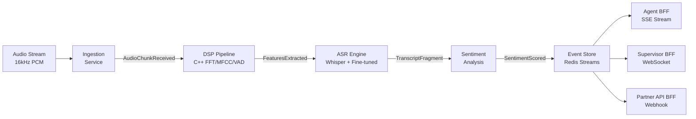
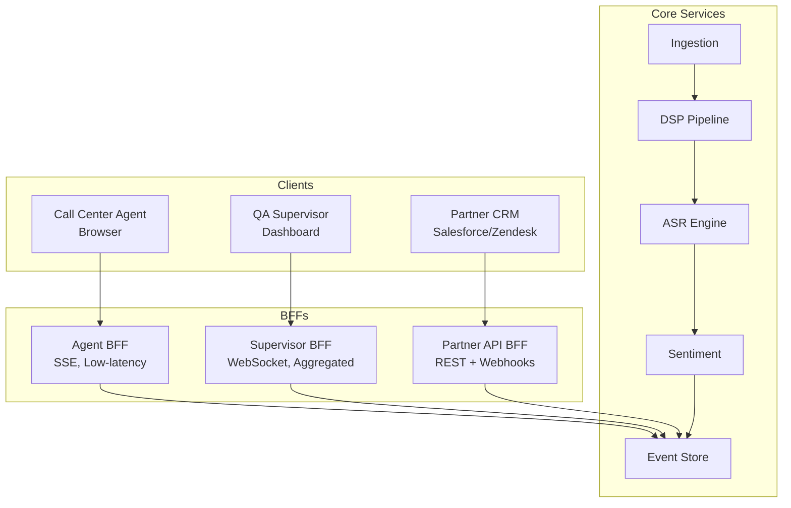
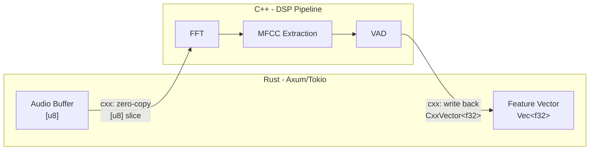

# Sauti by Lee Audio

---

## Overview

Sauti is a production-grade voice AI platform for African languages -- starting with Swahili, Kikuyu, Luo, and Sheng. It provides real-time voice-to-text transcription, translation, sentiment analysis, and voice cloning as APIs and embedded SDKs. Primary customers are BPOs running Kenyan call centers, government service desks, accessibility tool providers, and NGOs operating multilingual field programs.

---

## Architecture

### Key Patterns

#### BFF (Backend For Frontend)

**Definition:** A dedicated backend service per frontend consumer type. Each BFF exposes only the data and operations its specific client needs, in the format it needs. Instead of one monolithic API serving all consumers, each client type gets a tailored backend that handles protocol translation, data shaping, and access control specific to that consumer's workflow.

**Why BFF fits Sauti:** Voice AI serves three radically different consumers -- (1) call center agents need low-latency SSE streaming of transcript fragments as they are produced, (2) supervisors need aggregated real-time team dashboards via WebSocket showing call volume, sentiment trends, and agent status across their entire team, (3) partner systems need stable REST endpoints with webhook delivery for post-call integration into CRMs and ticketing systems. A single API would force all three into lowest-common-denominator design, degrading latency for agents (who cannot tolerate buffering) and flexibility for partners (who need versioned, contract-stable endpoints with HMAC-SHA256 signed payloads).

**Application in Sauti:**

- **Agent BFF** (Rust/Axum, SSE streaming) -- Serves the agent desktop client. Streams `TranscriptFragment` and `SentimentScored` events as SSE messages with sub-second delivery. Handles per-agent authentication and filters events to only the agent's active call.
- **Supervisor BFF** (Rust/Axum, WebSocket push) -- Serves the supervisor dashboard. Aggregates events across all agents in a team, computes rolling metrics (active calls, average sentiment, alert counts), and pushes updates over persistent WebSocket connections. Handles team-scoped authorization.
- **Partner API BFF** (Rust/Axum, REST + webhooks) -- Serves external integrators. Exposes versioned REST endpoints (`/v1/calls`, `/v1/transcripts`) with API key authentication. Dispatches `CallCompleted` webhooks signed with HMAC-SHA256, with exponential backoff retry up to 24 hours and idempotency keys for deduplication.

#### Event-Driven Architecture

**Definition:** System components communicate by producing and consuming events asynchronously. Producers emit events into a stream or bus without knowing or caring who consumes them. This decouples components in both time (consumers process at their own pace) and space (producers and consumers can be deployed, scaled, and failed independently).

**Why Event-Driven fits Sauti:** Voice processing is inherently streaming -- audio arrives as a continuous stream, not discrete request/response pairs. A synchronous request/response architecture would force buffering until a complete utterance is available, adding latency, and would tightly couple each processing stage to the next. Events enable three critical capabilities: (a) back-pressure via Redis Streams consumer group offsets, so a slow sentiment model does not block transcription, (b) replay for debugging failed transcriptions by re-reading events from the stream, and (c) independent scaling of each processing stage based on its own resource profile (CPU-bound DSP scales differently from GPU-bound ASR).

**Application in Sauti:**

The audio processing pipeline is a chain of event-producing services, each consuming from the previous stage:

1. Raw PCM audio chunks arrive at the Ingestion service, which emits `AudioChunkReceived` events into Redis Streams.
2. The DSP service (C++) consumes `AudioChunkReceived`, performs FFT/MFCC feature extraction and VAD (Voice Activity Detection), and emits `FeaturesExtracted` events.
3. The Transcription service consumes `FeaturesExtracted`, runs Whisper inference via ONNX Runtime, and emits `TranscriptFragment` events.
4. The Sentiment service consumes `TranscriptFragment`, scores sentiment on 10-second sliding windows, and emits `SentimentScored` events.
5. The Storage service consumes all event types and persists to EventStoreDB (audit), PostgreSQL (projections), and S3 (audio archival).

Each service belongs to its own Redis Streams consumer group, enabling independent scaling, offset management, and replay.

#### Zero-Copy Buffer Sharing (via `cxx` crate)

**Definition:** Passing data between components without duplicating it in memory. The `cxx` crate creates type-safe FFI (Foreign Function Interface) bindings between Rust and C++ that can share memory regions directly, avoiding the serialization/deserialization and allocation overhead of traditional inter-language communication.

**Why Zero-Copy fits Sauti:** At 16kHz mono PCM (256 kbps per call), each concurrent call generates approximately 32KB/sec of raw audio data. With 10,000 concurrent calls at capacity, that is 320MB/sec flowing between the Rust business logic layer and the C++ DSP pipeline. Copying these buffers at the FFI boundary would double memory bandwidth usage and trigger unnecessary allocations that fragment the heap under sustained load. Zero-copy sharing eliminates this waste entirely, which is critical for maintaining sub-second P50 transcription latency at scale.

**Application in Sauti:**

- Rust's Ingestion service receives raw PCM audio into a `Vec<u8>` buffer. It passes a `&[u8]` slice (pointer + length, no copy) directly to the C++ FFT/MFCC/VAD pipeline via `cxx`-generated bindings.
- C++ DSP routines write computed feature vectors (MFCCs, spectral energy, VAD decisions) back into Rust-owned buffers through `cxx::CxxVector` or pinned mutable slice references.
- No allocation, no copy, no garbage collection at the boundary. The `cxx` crate enforces memory safety at compile time through its ownership and borrowing model, preventing use-after-free and dangling pointer bugs that plague raw C FFI.

### Pattern Lineage

These patterns are introduced in Sauti (Tier 1) and propagate across the entire project portfolio:

- **BFF**: Introduced here with 3 BFFs. Every subsequent project inherits this pattern -- LendStream (4 BFFs), Sherehe (3 BFFs), Unicorns (4+ BFFs), Shamba (4 BFFs), BSD Engine (3 BFFs), PayGoHub (5 BFFs).
- **Event-Driven**: Introduced here with Redis Streams. Carries forward as the core integration pattern in every tier -- Kafka (T2: LendStream), CRDT ops (T3: Sherehe), NATS JetStream (T4: Unicorns), OTP messages (T5a: Shamba), core.async channels (T5b: BSD Engine), Azure Service Bus (T6: PayGoHub).
- **Zero-Copy**: Specific to systems-level work where FFI and memory bandwidth are constraints. Reappears in Tier 4 (Unicorns: Go-Zig FFI for compute-intensive paths).

#### Event Flow Diagram

#### BFF Architecture Diagram

#### Zero-Copy FFI Diagram

### Bounded Contexts

| Context | Responsibility | Language |
|---------|----------------|----------|
| Ingestion | Accept audio streams, enqueue for processing | Rust |
| DSP | Feature extraction, VAD, audio segmentation | C++ |
| Transcription | ASR inference (Whisper + fine-tuned adapters) | Rust (PyO3 to Python) |
| Sentiment | Sentiment classification on transcribed text | Rust (PyO3 to Python) |
| Session | Call lifecycle, speaker diarization state | Rust |
| Compliance | Event store writes, audit retrieval | Rust |
| Webhook Delivery | External integration push | Rust |

### Technology Stack

| Layer | Technologies |
|-------|-------------|
| Backend | Rust 1.80+ (Axum, tokio, tower), C++20 (DSP, SIMD), Python 3.12 (ML via PyO3) |
| ML | ONNX Runtime + Whisper Large v3 (fine-tuned on Swahili) |
| Data | Redis Streams (event bus), EventStoreDB (audit), PostgreSQL (projections), S3 (audio archival) |
| Infrastructure | AWS (us-east-1 primary, af-south-1 for Kenya), EKS, Linkerd, OpenTelemetry |
| Frontend | Next.js + TypeScript, Tailwind + shadcn/ui (minimal in Tier 1) |

---

## Requirements

| ID | Requirement | Priority | Status |
|----|-------------|----------|--------|
| REQ-001 | Live transcription of Swahili/English calls on supervisor dashboard within 2s (P95) | P0 | Not Started |
| REQ-002 | Word error rate on Swahili/English code-switched audio under 20% | P0 | Not Started |
| REQ-003 | Speaker diarization separating agent from customer at 90%+ accuracy | P0 | Not Started |
| REQ-004 | Transcript storage in audit event store for later review | P0 | Not Started |
| REQ-005 | Real-time sentiment scoring emitted every 10 seconds per call | P1 | Not Started |
| REQ-006 | Sentiment alert surfaced to agent (not supervisor) when score drops below 0.3 for 30+ seconds | P1 | Not Started |
| REQ-007 | Immutable audit log with cryptographic hash of audio, transcript, timestamps, and speaker metadata | P0 | Not Started |
| REQ-008 | Compliance BFF retrieves full call history by call-id in under 5 seconds | P0 | Not Started |
| REQ-009 | Automatic retention policy enforcement (auto-delete at 7-year mark) | P1 | Not Started |
| REQ-010 | Webhook delivery within 30 seconds of call end with HMAC-SHA256 signing | P0 | Not Started |
| REQ-011 | Webhook retry with exponential backoff up to 24 hours, with idempotency keys | P1 | Not Started |

---

## Acceptance Criteria

### Epic: Live Transcription for Call Center Agents

- [ ] AC-001: Transcription appears on supervisor dashboard within 2 seconds of speech (P95 latency)
- [ ] AC-002: Word error rate on Swahili/English code-switched audio is under 20%
- [ ] AC-003: Speaker diarization correctly separates agent from customer (90%+ accuracy)
- [ ] AC-004: Transcript is stored in the audit event store for later review
- [ ] AC-005: Sentiment score (0-1) emitted every 10 seconds per active call
- [ ] AC-006: Sentiment scores visible on agent personal dashboard within 2 seconds
- [ ] AC-007: Alert surfaced to agent (not supervisor) if sentiment drops below 0.3 for 30+ seconds

### Epic: Compliance and Audit for Regulated Customers

- [ ] AC-008: Complete event record written with cryptographic hash of audio, transcript, timestamps, and speaker metadata
- [ ] AC-009: Events are immutable (no delete, no update; only append)
- [ ] AC-010: Compliance BFF retrieves full call history by call-id in under 5 seconds
- [ ] AC-011: Retention policies enforced automatically (auto-delete at 7-year mark if configured)

### Epic: Partner API Integration

- [ ] AC-012: Webhook delivery triggered within 30 seconds of call end
- [ ] AC-013: Webhook payloads include call-id, full transcript, sentiment history, speaker metadata
- [ ] AC-014: Webhook deliveries signed with HMAC-SHA256 for signature validation
- [ ] AC-015: Failed webhook deliveries retry with exponential backoff up to 24 hours
- [ ] AC-016: Idempotency key included for deduplication

---

## Non-Functional Requirements

### Performance Targets

| Metric | Target | Measurement |
|--------|--------|-------------|
| Transcription latency (P50) | < 800ms | Audio chunk ingestion to transcript fragment emission |
| Transcription latency (P95) | < 2s | Audio chunk ingestion to transcript fragment emission |
| Sentiment scoring latency (P95) | < 1s | 10s audio window close to score emission |
| Webhook delivery latency (P95) | < 30s | Call end to first webhook attempt |
| System throughput | 10,000 concurrent calls | Sustained, across all tenants |
| Audio ingestion rate | 16kHz mono PCM | 256 kbps streaming per call |

### Availability Targets

| Component | Target | Approach |
|-----------|--------|----------|
| Core API (Agent BFF) | 99.95% | Multi-AZ deployment, health-check-driven failover |
| Transcription workers | 99.9% | Worker pools with automatic scaling, failed-job retry |
| Event store | 99.99% | EventStoreDB cluster with 3-node replication |
| Partner webhook delivery | 99.5% (first attempt) | Graceful retry covers the gap |

---

## Success Metrics

### Business Metrics (End of Week 15)

| Metric | Target | Current |
|--------|--------|---------|
| Paying customers (Sauti-Pro tier) | 3 | 0 |
| Monthly Recurring Revenue | $500 | $0 |
| Pilot conversations in progress | 10 | 0 |
| Customer retention (pilots who paid) | 70%+ | N/A |

### Technical Metrics (End of Sprint)

| Metric | Target |
|--------|--------|
| Swahili WER on code-switched audio | < 20% |
| End-to-end transcription latency (P95) | < 2s |
| System uptime | > 99.5% |
| Calls processed during sprint | 10,000+ |

### Product Metrics (by Week 8)

| Metric | Target |
|--------|--------|
| Agent BFF endpoints shipped | 5+ |
| Supervisor BFF endpoints shipped | 8+ |
| Partner API endpoints shipped | 3+ |
| Webhook delivery reliability | > 99.5% |

---

## Definition of Done

- [ ] All user stories in Section 4 have passing acceptance tests
- [ ] WER on Swahili/English code-switched evaluation set < 20%
- [ ] P95 transcription latency < 2s measured over 1,000 real call minutes
- [ ] 3 paying customers signed; first invoices collected
- [ ] Security audit passed (external review or internal checklist)
- [ ] Documentation complete: API reference, integration guide, admin guide
- [ ] Deployment reproducible from scratch in under 2 hours via Terraform + Helm
- [ ] On-call rotation defined
- [ ] Monitoring + alerting operational; PagerDuty integrated
- [ ] Legal: Terms of Service, Privacy Policy, Data Processing Agreement drafted

---

## Commercial

### Pricing Tiers

| Tier | Price | Features | Target |
|------|-------|----------|--------|
| Sauti-Free | $0/mo | 1,000 min/mo, English + Swahili, 1 agent | Pilots, dev trials |
| Sauti-Pro | $99/mo | 10,000 min, all languages, 10 agents, basic analytics | Small BPOs, NGOs |
| Sauti-Business | $499/mo | 100,000 min, unlimited agents, advanced QA, API access | Mid BPOs |
| Sauti-Enterprise | Custom (from $2,500/mo) | Unlimited usage, on-premises, custom model training, SLA | Government, banking, large BPOs |
| Partner API | $0.02/min | Pay-as-you-go API access | System integrators, developers |
