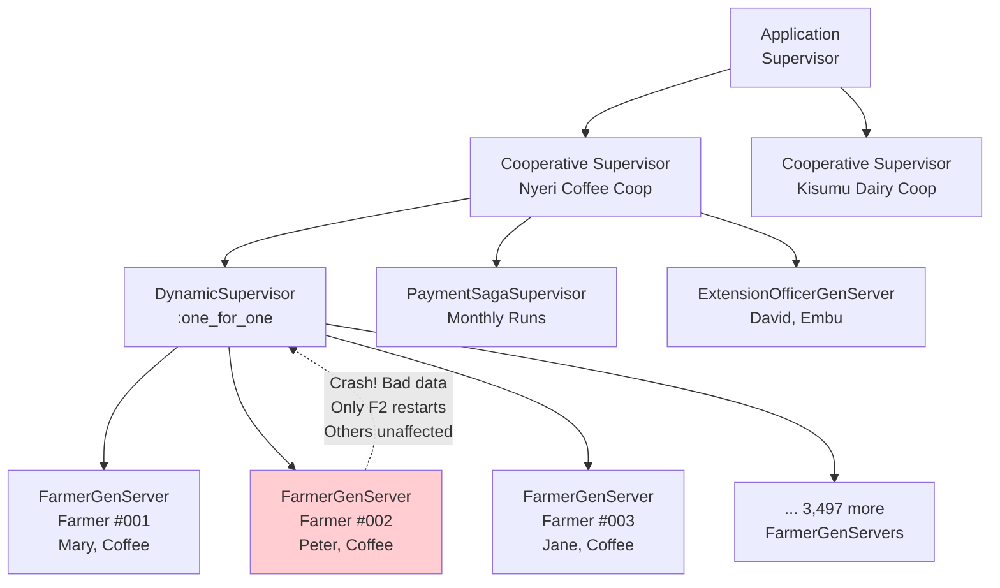
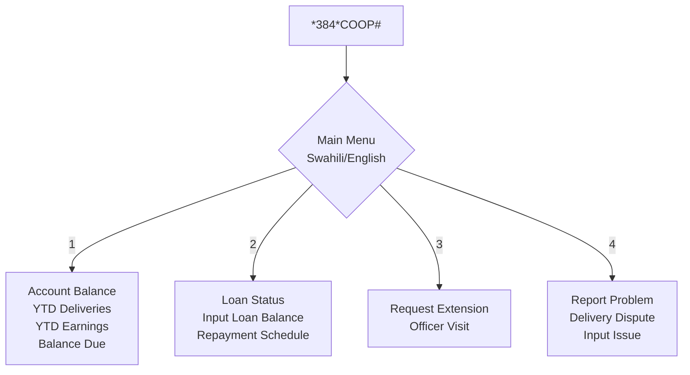
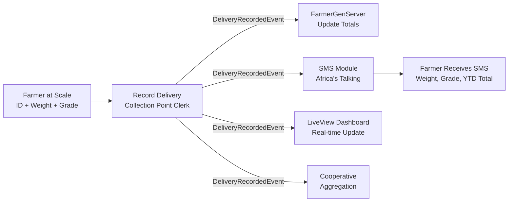

# Shamba

---

## Overview

Shamba is an agricultural cooperative operations platform for East African coffee, tea, dairy, and horticulture cooperatives, built on Elixir/OTP where each registered farmer becomes a supervised GenServer process. The platform coordinates deliveries, payments, loans, agronomy advice, and extension visits through OTP supervision trees that mirror cooperative organizational structure. Shamba also includes the **Greenland AgriTech** module -- a farm-level decision support platform using the Kajiado farm as its first proving ground, targeting individual commercial farms with irrigation optimization, yield prediction, and market intelligence.

---

## Architecture

### OTP Architecture

Each farmer is modeled as an independent GenServer process, supervised by a `DynamicSupervisor` per cooperative using a `:one_for_one` restart strategy. This ensures that one farmer's bad data or crash never affects other farmers. Long-lived farmer state (YTD deliveries, pending payments, active loans, last visit, preferences) is held in-process and passivated to PostgreSQL after idle periods.

**Core OTP Components:**

- **Farmer GenServer** -- one process per registered farmer; handles delivery events, payment events, loan updates, visit logs
- **Cooperative Supervisor** -- supervises all Farmer GenServers for a cooperative; handles cooperative-wide broadcasts
- **Payment Saga Supervisor** -- spawns a saga GenServer per payment run; coordinates parallel M-Pesa disbursements with concurrency limits
- **Extension Officer GenServer** -- one per active officer; tracks assigned farmers, planned visits, pending sync

### Four BFFs

| BFF | Client | Technology | Key Responsibilities |
|-----|--------|------------|---------------------|
| Farmer BFF | USSD menus + SMS | Elixir (GenServer-based USSD handler) | Balance, loans, visit requests, SMS notifications |
| Cooperative Officer BFF | Web back-office | Ruby on Rails + React embeds | Farmer management, delivery recording, payment runs, reports |
| Buyer BFF | Public website + API | PHP/Laravel + Blade | Lot browsing, traceability, purchase orders |
| Extension Officer BFF | Mobile PWA | Elixir Phoenix LiveView | Visit logging (offline), farmer prioritization, outcome tracking |

### Language Role Allocation

| Language | Role | Rationale |
|----------|------|-----------|
| Elixir/OTP | Core farmer processes, payment sagas, USSD handler, real-time LiveView dashboards | Actor model is the natural fit for 500-15,000 independent farmer processes per cooperative |
| Ruby/Rails | Cooperative admin UI (user management, permissions, billing, reports) | Rails is the fastest framework for CRUD-heavy back-office UIs |
| PHP/Laravel | Public marketplace, traceability browser, buyer-facing pages | Excellent SEO tooling; mature PHP hosting in East Africa enables cooperative self-hosting |

### Technology Stack

| Layer | Technologies |
|-------|-------------|
| Backend | Elixir 1.17+ / OTP, Phoenix 1.7+ (LiveView), Ruby 3.3+ / Rails 7.2+, PHP 8.3+ / Laravel 11 |
| Data | PostgreSQL, Redis (session/pub-sub/cache), Mnesia (optional hot farmer cache) |
| Integrations | M-Pesa Daraja (B2C/C2B), Africa's Talking (SMS/voice/USSD), Safaricom USSD gateway |
| Infrastructure | AWS af-south-1, Kubernetes (EKS), Erlang distribution for BEAM clustering, Terraform, ArgoCD |

### Architecture Patterns

#### OTP Supervision Trees (Open Telecom Platform)

**Definition:** OTP is Erlang/Elixir's framework for building fault-tolerant systems. A supervision tree is a hierarchy of supervisor processes that monitor worker processes. When a worker crashes, its supervisor restarts it according to a defined strategy: `:one_for_one` restarts only the crashed child, `:one_for_all` restarts all children, `:rest_for_one` restarts the crashed child and all younger siblings.

**Why it fits Shamba:** A cooperative has 3,500 farmers. Each farmer has independent state -- deliveries, payments, loans, visits. If farmer #2,847's GenServer crashes due to corrupted delivery data, it should restart with clean state WITHOUT affecting the other 3,499 farmers. OTP supervision trees were literally designed for this exact scenario: millions of independent processes with independent failure modes. The `:one_for_one` strategy ensures fault isolation at the individual farmer level.

**Concrete application:** `CooperativeSupervisor` (one per cooperative) supervises a `DynamicSupervisor` that spawns one `FarmerGenServer` per registered farmer. Each `FarmerGenServer` holds state: YTD deliveries, pending payments, active loans, last visit, preferences. If a farmer's process crashes, the supervisor restarts it, rehydrating state from PostgreSQL. The supervision tree mirrors the cooperative's organizational structure.

#### Actor Model

**Definition:** A concurrency model where "actors" are independent computational entities that: (1) maintain private state, (2) communicate only via asynchronous messages, (3) never share memory. Each actor processes one message at a time, eliminating data races by design.

**Why it fits Shamba:** Each farmer in a cooperative is genuinely independent -- their delivery history, loan balance, and payment schedule don't depend on other farmers. The actor model maps directly: farmer = actor, delivery record = message, payment calculation = state update. Actors provide: (a) fault isolation -- one farmer's crash doesn't cascade, (b) location transparency -- a farmer's GenServer can run on any node in the BEAM cluster, (c) natural concurrency -- 3,500 farmers process deliveries in parallel during harvest season.

**Concrete application:** `FarmerGenServer` receives messages: `{:delivery, %{weight: 50, grade: :AA, timestamp: ...}}`, `{:payment, %{amount: 5000, period: :march_2026}}`, `{:visit, %{officer_id: ..., topics: [...]}}`. Each message updates the farmer's private state. No locks, no shared memory, no data races. During harvest, all 3,500 farmers can record deliveries simultaneously -- each GenServer processes its own messages independently.

#### Pipeline Pattern

**Definition:** Data flows through a series of processing stages, each performing a specific transformation. Each stage is independent, composable, and can be scaled separately. The output of one stage feeds the input of the next.

**Why it fits Shamba:** Delivery recording at a collection point must be fast (50-100 farmers/hour during peak harvest) and reliable. The pipeline: weighing, grading, SMS notification, dashboard update, cooperative aggregation. Each stage operates independently -- if SMS delivery is slow, it doesn't block the weigher from recording the next farmer. Pipeline architecture enables concurrent processing at each stage and graceful degradation (SMS delay doesn't delay the dashboard).

**Concrete application:** Farmer presents at scale. Clerk enters weight + grade. `DeliveryRecordedEvent` emitted. Pipeline stages: (1) FarmerGenServer updates running totals, (2) SMS module sends confirmation to farmer via Africa's Talking, (3) LiveView dashboard updates in real-time, (4) cooperative-level aggregation updates YTD totals. Each stage is a separate consumer of the event.

#### Inherited Patterns

The following patterns are inherited from earlier tiers and applied directly in Shamba. Each is deeply integrated into the platform architecture.

---

##### Hexagonal Architecture (Ports and Adapters)

**Definition:** Hexagonal Architecture (also called Ports and Adapters, coined by Alistair Cockburn) structures an application so that the core domain logic sits at the center, completely isolated from external systems. The domain defines "ports" -- interfaces that describe what it needs from the outside world (e.g., "send a notification," "process a payment," "store a record") without specifying how. "Adapters" are concrete implementations that plug into those ports, connecting the domain to specific external technologies. The key insight is that the domain never imports, references, or depends on any adapter -- dependency arrows always point inward toward the domain core.

**Why it fits Shamba:** Shamba integrates with three critical external services that are each single points of failure in East African infrastructure: M-Pesa (Safaricom's Daraja API for B2C farmer payments and C2B loan repayments), Africa's Talking (SMS bulk messaging, voice notifications, and USSD short code hosting), and the Safaricom USSD gateway (the channel through which 2G/feature-phone farmers interact with the platform). Each of these services has its own API contract, authentication model, rate limits, retry semantics, and failure modes. Without hexagonal architecture, the domain logic for "pay a farmer" would be entangled with M-Pesa HTTP calls, OAuth token refresh, callback URL registration, and transaction status polling. When Safaricom changes the Daraja API version (which has happened three times since 2019), the change would ripple through the entire codebase. With hexagonal architecture, the domain says `PaymentPort.disburse(farmer_id, amount, reference)` and the `DarajaAdapter` handles everything M-Pesa-specific. Swapping Africa's Talking for Twilio (or adding WhatsApp Business API alongside SMS) requires writing a new adapter, not touching domain logic.

**Application in Shamba:** The domain core defines four primary ports: (1) `PaymentPort` -- consumed by the `DarajaB2CAdapter` for outbound farmer payments and `DarajaC2BAdapter` for inbound loan repayments, with a `MockPaymentAdapter` for testing that simulates success, failure, and timeout scenarios; (2) `NotificationPort` -- consumed by the `AfricasTalkingSMSAdapter` for bulk SMS, `AfricasTalkingVoiceAdapter` for voice call fallbacks on critical events, and `AfricasTalkingUSSDAdapter` for session-based USSD interactions; (3) `StoragePort` -- consumed by the `PostgresAdapter` for durable farmer state and event projections, with `MnesiaAdapter` as an optional hot cache for frequently accessed farmer data in the BEAM cluster; (4) `WeatherPort` (Greenland module) -- consumed by `KenyaMetAdapter` and `ECMWFAdapter` for farm-localized weather data, with `OnFarmStationAdapter` for direct sensor integration. Each adapter is a standalone module with its own configuration, connection pooling, and circuit breaker. The domain core compiles and tests without any adapter present.

---

##### Backend-for-Frontend (BFF)

**Definition:** The Backend-for-Frontend pattern assigns a dedicated backend service to each distinct frontend consumer type. Rather than building a single monolithic API that attempts to serve all clients (mobile, web, USSD, third-party integrations), each BFF exposes only the data and operations its specific client needs, in exactly the format and protocol that client requires. Each BFF handles protocol translation (REST, WebSocket, SSE, USSD sessions), data shaping (what fields to include, what to aggregate, what to omit), authentication (how the client proves identity), and access control (what the client is allowed to see) specific to that consumer's workflow and constraints.

**Why it fits Shamba:** Shamba serves four radically different consumer types with incompatible interface requirements. A smallholder farmer on a Nokia feature phone interacts via USSD (text-based, session-stateful, 160-character screen limit, 3-second response requirement, SIM-authenticated) and SMS (asynchronous, one-way notifications). A cooperative officer in a rural headquarters uses a web back-office with React components for managing thousands of farmer records, running payment cycles, and generating reports -- this requires CRUD endpoints, paginated lists, and file upload/download. A coffee buyer on the public internet browses lots, views traceability data, and places purchase orders -- this requires SEO-friendly server-rendered pages and public API endpoints. An extension officer in a field with intermittent 2G connectivity uses a PWA that must work fully offline and sync when coverage returns -- this requires a real-time WebSocket connection (when online) and a local-first data sync protocol. A single API serving all four would force the USSD farmer into REST semantics they cannot use, bloat the extension officer's sync payload with buyer data they do not need, and expose cooperative financial data to the public buyer interface.

**Application in Shamba:** (1) **Farmer BFF** (Elixir, GenServer-based USSD handler) -- Manages stateful USSD sessions where each active session is a short-lived GenServer. Receives USSD callbacks from Safaricom gateway, routes to the farmer's long-lived `FarmerGenServer` for data (balance, loans, visits), formats responses within the 160-character USSD screen limit, and manages session timeouts. Also handles outbound SMS via the `NotificationPort`. Authentication is SIM-based -- the farmer's phone number is their identity. (2) **Cooperative Officer BFF** (Ruby on Rails + React embeds) -- Serves the web back-office used by cooperative managers, accountants, and clerks. Provides CRUD for farmer management, CSV/Excel upload endpoints with streaming validation, payment run initiation with dual-authorization workflow, delivery recording interfaces, and report generation (PDF, Excel). Communicates with the Elixir core via internal API or distributed Erlang. (3) **Buyer BFF** (PHP/Laravel + Blade) -- Serves the public-facing website and API. Provides SEO-optimized lot browsing pages, traceability viewer (lot-to-farmer mapping with optional anonymization), and purchase order endpoints. Laravel's Blade templating renders server-side HTML for search engine indexing. (4) **Extension Officer BFF** (Elixir Phoenix LiveView) -- Serves the offline-capable PWA. LiveView provides real-time server-rendered UI when online; the PWA service worker and IndexedDB provide offline capability. Visit logging forms persist locally, sync via background fetch when connectivity returns, and the LiveView connection re-establishes automatically.

---

##### Event-Driven Architecture

**Definition:** In an event-driven architecture, system components communicate by producing and consuming events asynchronously through an event bus or stream. An event represents a fact that has occurred -- something that happened in the past and cannot be undone (e.g., "a delivery was recorded," "a payment was disbursed," "a visit was logged"). Producers emit events without knowing or caring which components will consume them. Consumers subscribe to event types they care about and process them at their own pace. This decouples components in both time (consumers do not need to be running when the event is produced) and space (producers and consumers can be deployed, scaled, and failed independently).

**Why it fits Shamba:** Every significant action in a cooperative generates downstream effects that should not block the primary action. When a collection-point clerk records a delivery, four things must happen: (a) the farmer's GenServer updates its running totals, (b) an SMS confirmation is sent to the farmer, (c) the cooperative's LiveView dashboard updates in real-time, (d) the cooperative-level YTD aggregation recalculates. If these were synchronous, a slow SMS gateway would make the clerk wait before recording the next farmer -- unacceptable when 50-100 farmers are queuing during peak harvest. Events enable each downstream consumer to process independently. If the SMS adapter is slow, it processes its queue at its own pace while the clerk continues recording deliveries at full speed. Events also enable replay -- if a dashboard projection is corrupted, it can be rebuilt by replaying the event stream from the beginning. And events enable future consumers to be added without modifying producers -- when WhatsApp Business API is added in v1.5, it subscribes to `DeliveryRecordedEvent` alongside the existing SMS consumer.

**Application in Shamba:** The platform emits five core domain events: (1) `DeliveryRecordedEvent` -- emitted when a clerk records a delivery; consumed by `FarmerGenServer` (update totals), `SMSNotifier` (send confirmation), `LiveViewDashboard` (push update), `CooperativeAggregator` (update YTD); (2) `PaymentDisbursedEvent` -- emitted when an M-Pesa B2C transaction completes (success or failure); consumed by `FarmerGenServer` (update balance), `SMSNotifier` (send confirmation or failure notice), `AuditLogger` (record for audit report); (3) `VisitLoggedEvent` -- emitted when an extension officer's visit syncs from offline; consumed by `FarmerGenServer` (update profile), `CooperativeReporter` (update visit metrics), `FunderReporter` (World Bank/USAID visit tracking); (4) `InputDistributedEvent` -- emitted when a clerk checks off an input distribution; consumed by `FarmerGenServer` (create loan), `SMSNotifier` (send loan confirmation); (5) `FarmerRegisteredEvent` -- emitted on successful registration; consumed by `DynamicSupervisor` (spawn GenServer), `SMSNotifier` (send welcome). Events are published via OTP message passing within the BEAM cluster (using `Phoenix.PubSub` backed by `pg` for distributed pub/sub across nodes) and persisted to PostgreSQL for projection rebuilds.

---

##### CQRS (Command Query Responsibility Segregation)

**Definition:** CQRS (Command Query Responsibility Segregation) separates the write model (commands that change state) from the read model (queries that return data) into distinct paths, each optimized for its specific workload. The write path focuses on data integrity, validation, business rule enforcement, and consistency -- it processes commands and produces events. The read path focuses on query speed, data shaping, and denormalization -- it consumes events and maintains precomputed read models (projections) optimized for specific query patterns. The two paths can use different data stores, different schemas, and scale independently.

**Why it fits Shamba:** Shamba's write workload and read workload have fundamentally different performance profiles and optimization needs. The write path during harvest season processes 50-100 deliveries per hour per collection point across potentially dozens of collection points -- each delivery must validate the farmer exists, validate the grade is configured for that crop, update the farmer's running totals atomically, and emit events. This path must be optimized for throughput and consistency, which the GenServer actor model provides naturally (each farmer's writes are serialized through their GenServer -- no locks, no contention). The read path serves USSD balance queries (must respond in under 3 seconds), LiveView dashboards (must update in under 2 seconds), monthly reports (must aggregate thousands of farmer records), and buyer traceability queries (must join deliveries to lots to farmers). These reads would be slow if they queried the write model directly (hitting individual GenServers). Instead, read-optimized projections in PostgreSQL serve each query pattern with precomputed, denormalized data.

**Application in Shamba:** The write path flows through OTP: USSD commands, delivery recordings, payment confirmations, and visit logs are all messages sent to GenServers. Each GenServer processes commands, updates its in-process state, and emits domain events. The read path consumes these events and maintains four projections: (1) `FarmerBalanceProjection` -- denormalized table with one row per farmer containing current YTD deliveries, earnings, outstanding loans, and pending payments; serves USSD balance queries in under 50ms; (2) `CooperativeDashboardProjection` -- aggregated metrics per cooperative (total deliveries today, payment run status, active farmers, SMS delivery rate); serves LiveView dashboard pushes; (3) `TraceabilityProjection` -- lot-to-farmer mapping with grade distributions, region data, and processing methods; serves buyer traceability queries; (4) `PaymentAuditProjection` -- complete payment history with M-Pesa references, statuses, and timestamps; serves audit report generation. Each projection is updated asynchronously by an event consumer and can be rebuilt from scratch by replaying the event stream.

---

##### Saga Pattern (Distributed Transaction Coordination)

**Definition:** The Saga pattern coordinates a multi-step business transaction across multiple services or actors where each step may fail independently. Unlike a traditional database transaction that uses locks and two-phase commit (which does not scale across distributed systems), a saga breaks the transaction into a sequence of local transactions, each with a compensating action that undoes its effect. If step N fails, the saga executes compensating actions for steps N-1 through 1 in reverse order, returning the system to a consistent state. Sagas can be orchestrated (a central coordinator drives the sequence) or choreographed (each step triggers the next via events).

**Why it fits Shamba:** The monthly payment run is a distributed transaction involving 3,500 independent M-Pesa B2C API calls. Each call can succeed, fail (insufficient funds in the cooperative's float, invalid phone number, Safaricom timeout), or hang indefinitely. A traditional transaction approach (lock all farmers, execute all payments, commit or rollback) is impossible -- M-Pesa is an external API with no transaction support, and locking 3,500 GenServers would freeze the entire cooperative for the duration of the run. The saga pattern enables each farmer's payment to be an independent saga step: if farmer #2,847's payment fails (invalid phone number), the saga records the failure and moves on to farmer #2,848. Failed payments are compensated by queueing them for manual review rather than rolling back the entire run. The cooperative manager sees a real-time progress dashboard showing successes, failures, and pending payments.

**Application in Shamba:** The `PaymentSagaSupervisor` spawns one `PaymentRunSaga` GenServer per payment run. This orchestrator saga: (1) retrieves the list of farmers and calculated amounts from the `PaymentAuditProjection`; (2) spawns a `FarmerPaymentSaga` Task per farmer (rate-limited to respect M-Pesa API limits, e.g., 50 concurrent calls); (3) each `FarmerPaymentSaga` calls `PaymentPort.disburse/3` via the `DarajaB2CAdapter`, waits for the M-Pesa callback (success/failure), and emits `PaymentDisbursedEvent`; (4) on success, the farmer's GenServer updates its balance and the `SMSNotifier` sends confirmation; (5) on failure, the saga records the failure reason, emits `PaymentFailedEvent`, and the farmer is added to the manual review queue; (6) on timeout (no M-Pesa callback within 120 seconds), the saga queries M-Pesa's transaction status API and resolves accordingly; (7) when all farmer sagas complete, the orchestrator generates the audit report. The `PaymentSagaSupervisor` uses `:one_for_one` strategy -- if a `FarmerPaymentSaga` crashes, only that farmer's payment is affected, and the supervisor restarts it for retry.

---

##### Offline-First Architecture

**Definition:** Offline-first architecture treats network connectivity as an enhancement rather than a requirement. The application is designed to function fully without a network connection, storing all data locally and synchronizing with the server when connectivity is available. This is not merely "graceful degradation" (showing an error page when offline) -- the application's primary mode of operation assumes no connectivity, and online synchronization is an asynchronous background process. Local data persistence uses technologies like IndexedDB, SQLite, or service worker caches. Conflict resolution on sync uses strategies like last-write-wins, CRDTs (Conflict-free Replicated Data Types), or operational transforms.

**Why it fits Shamba:** Rural East African infrastructure imposes hard connectivity constraints on two of Shamba's four user types. Extension officers covering 800 farmers across multiple cooperatives spend their working day in the field -- visiting farms in areas where 2G coverage is intermittent or absent. If the visit logging application required connectivity, the officer would either skip documentation (losing data) or carry a paper notebook (defeating the purpose of digitization). Collection-point clerks at rural weighing stations face similar constraints -- during peak harvest, a connectivity dropout cannot stop the weighing queue. Farmers on USSD/SMS have no offline requirement because the channel itself provides connectivity (the USSD session is stateful on the telecom network), and the cooperative back-office typically has a stable connection at rural headquarters. The offline-first design ensures that the two field-facing interfaces -- extension officer PWA and collection-point UX -- never lose data regardless of connectivity state.

**Application in Shamba:** (1) **Extension Officer PWA** -- Built on Phoenix LiveView with a service worker layer. Visit logging forms (GPS coordinates via browser Geolocation API, visit duration timer, advice topics from a pre-cached dropdown, photos stored as blobs in IndexedDB, follow-up action items) persist entirely in IndexedDB. When the PWA detects connectivity (via `navigator.onLine` and periodic health-check pings to the server), a background sync worker reads unsynchronized visits from IndexedDB, serializes them as `VisitLoggedEvent` payloads, and pushes them to the server via a POST endpoint. The server processes each visit through the farmer's GenServer and acknowledges receipt; the PWA marks the visit as synced. Conflict resolution is last-write-wins keyed on `(officer_id, farmer_id, visit_timestamp)` -- duplicate visits from retry scenarios are idempotent. (2) **Collection-Point UX** -- The delivery recording interface uses a local event log (IndexedDB) as primary storage. Each delivery is recorded locally with a monotonically increasing sequence number, displayed immediately on the clerk's screen, and queued for sync. When connectivity is available, deliveries sync to the server and are processed through the farmer's GenServer. The clerk's local display shows both synced and unsynced deliveries with clear visual indicators. If connectivity is lost mid-session, the clerk continues recording at full speed -- the queue drains automatically when connectivity returns.

#### Pattern Lineage

- **Inherits:** All T1-T4 patterns (Hexagonal, BFF, Event-Driven, CQRS, Sagas, Offline-First)
- **Introduces:** OTP Supervision Trees + Actor Model + Pipeline
- **Carries forward:** Actor model reappears in T6 (PayGoHub) as Microsoft Orleans virtual actors for device fleet management (one grain per PAYG device, supervised by Orleans silo lifecycle). Pipeline pattern reappears wherever data flows through sequential stages.

---

## Requirements

### Module A -- Shamba Cooperative Platform

| ID | Requirement | Priority | Status |
|----|-------------|----------|--------|
| REQ-001 | Bulk-register 3,500+ existing farmer members into the system via CSV/Excel upload with row-level validation and GenServer spawning per farmer, completing migration in under a week | P0 | Not Started |
| REQ-002 | Process 10,000+ row uploads without timeout using streaming upload architecture | P0 | Not Started |
| REQ-003 | Invalid rows returned in a downloadable remediation report with per-row error details | P0 | Not Started |
| REQ-004 | Successfully registered farmers receive SMS welcome with their cooperative ID | P1 | Not Started |
| REQ-005 | Record a farmer's delivery in under 30 seconds including weight, grade, and quality notes at collection points | P0 | Not Started |
| REQ-006 | Farmer lookup by 4-digit ID or QR code scan on farmer card | P0 | Not Started |
| REQ-007 | Weight captured optionally from integrated scale; grade selected from configured options per crop | P0 | Not Started |
| REQ-008 | SMS delivery confirmation sent to farmer within 10 seconds of recording | P0 | Not Started |
| REQ-009 | Delivery immediately reflected in cooperative running dashboard via Phoenix LiveView | P0 | Not Started |
| REQ-010 | Farmer GenServer processes delivery event, updating YTD running totals in-process | P0 | Not Started |
| REQ-011 | USSD menu accessible via `*384*{coop-code}#` on any mobile network with language selection (Swahili/English/Kikuyu) | P0 | Not Started |
| REQ-012 | USSD Option 1: current account balance (YTD deliveries, YTD earnings, balance due) | P0 | Not Started |
| REQ-013 | USSD Option 2: outstanding loans (input loan balance, repayment schedule) | P0 | Not Started |
| REQ-014 | USSD Option 3: request extension officer visit | P1 | Not Started |
| REQ-015 | USSD Option 4: report a problem (delivery dispute, input issue) | P1 | Not Started |
| REQ-016 | USSD session response times under 3 seconds per screen | P0 | Not Started |
| REQ-017 | Post-delivery SMS sent within 30 seconds including date, weight, grade, running YTD total, and payment date | P0 | Not Started |
| REQ-018 | Failed SMS retries handled with voice call fallback for critical events (payments due) | P1 | Not Started |
| REQ-019 | Monthly payment cycle calculates each farmer's payment (deliveries x price - loan repayments - input deductions) | P0 | Not Started |
| REQ-020 | Payment preview with totals by farmer, class, and branch before confirmation | P0 | Not Started |
| REQ-021 | Each farmer GenServer triggers M-Pesa B2C disbursement saga on confirmation | P0 | Not Started |
| REQ-022 | Payment sagas execute in parallel with concurrency limits respecting M-Pesa API rate limits | P0 | Not Started |
| REQ-023 | Successful disbursement triggers SMS to farmer; failed disbursements queued for manual review | P0 | Not Started |
| REQ-024 | Full payment cycle completes in under 1 hour for 3,500 farmers | P0 | Not Started |
| REQ-025 | Audit report produced showing every payment and its status | P0 | Not Started |
| REQ-026 | Payment runs require dual authorization (officer initiates + manager approves) | P0 | Not Started |
| REQ-027 | Per-farmer input allocation calculated from configurable formula (e.g., 50kg fertilizer per acre coffee) | P1 | Not Started |
| REQ-028 | Farmer receives SMS with allocation and opt-in/opt-out choice | P1 | Not Started |
| REQ-029 | Opted-in farmers assigned to distribution points and dates | P1 | Not Started |
| REQ-030 | Distribution-point clerks check off deliveries in real-time | P1 | Not Started |
| REQ-031 | Each distribution automatically creates a loan on the farmer's account | P1 | Not Started |
| REQ-032 | Input loan appears in farmer USSD balance and next payment deduction | P1 | Not Started |
| REQ-033 | Visit logging works fully offline (GPS, duration, advice topics, photos, follow-up actions) | P0 | Not Started |
| REQ-034 | Offline data persists locally; syncs to server within 60 seconds when coverage returns | P0 | Not Started |
| REQ-035 | Farmer GenServer processes visit event, updating farmer profile | P1 | Not Started |
| REQ-036 | Cooperative sees visit in real-time reports | P1 | Not Started |
| REQ-037 | Buyer requests traceability via Buyer BFF for a coffee lot | P1 | Not Started |
| REQ-038 | System shows aggregated contributing farmers (anonymized to ID if privacy required) | P1 | Not Started |
| REQ-039 | Grade distribution, region, and processing method displayed per lot | P1 | Not Started |
| REQ-040 | Cryptographic hash proves lot composition (optional public blockchain for premium lots) | P2 | Not Started |
| REQ-041 | Cooperative staff authenticated via email/password + MFA for managers | P0 | Not Started |
| REQ-042 | Extension officers authenticated via phone number + PIN | P0 | Not Started |
| REQ-043 | Farmers authenticated by SIM (no login required -- SMS/USSD channel provides identity) | P0 | Not Started |
| REQ-044 | RBAC enforced: farmer sees only own data; cooperative staff sees only their cooperative | P0 | Not Started |
| REQ-045 | Farmer national IDs encrypted at rest; phone numbers hashed for lookups; access auditing enabled | P0 | Not Started |
| REQ-046 | Platform compliant with Kenya Data Protection Act and cooperative sector regulations | P0 | Not Started |
| REQ-047 | Multi-tenant architecture supporting 50+ cooperatives on a single platform instance | P1 | Not Started |
| REQ-048 | Support cooperatives from 500 to 15,000 members each | P0 | Not Started |
| REQ-049 | Handle seasonal delivery spikes (10x normal volume during harvest) | P0 | Not Started |
| REQ-050 | Horizontally scale Phoenix nodes behind load balancer with BEAM cluster for GenServer distribution | P1 | Not Started |
| REQ-051 | Per-cooperative dashboards (active farmers, delivery volume, payment accuracy) | P1 | Not Started |
| REQ-052 | Platform-wide monitoring via Erlang observer, Phoenix LiveDashboard, and Grafana | P1 | Not Started |
| REQ-053 | Alerting on payment failures, SMS delivery drops, and USSD response degradation | P1 | Not Started |
| REQ-054 | GenServer health monitoring with supervision tree visualizations | P2 | Not Started |

### Module B -- Greenland AgriTech

| ID | Requirement | Priority | Status |
|----|-------------|----------|--------|
| REQ-055 | Soil moisture sensors (multi-depth capacitive probes) deployed across farm plot zones reporting every 15 minutes via LoRaWAN or GSM | P0 | Not Started |
| REQ-056 | ESP32-based sensor gateways aggregate and relay sensor data to cloud | P0 | Not Started |
| REQ-057 | Weather station integration (on-farm or Kenya Met Department API) for rain, wind, solar, temperature, humidity | P0 | Not Started |
| REQ-058 | Evapotranspiration model (FAO-56 Penman-Monteith baseline) refined with on-farm data | P1 | Not Started |
| REQ-059 | Irrigation recommendation engine: zone-level watering advice with timing ("Zone 3 needs watering in 6 hours; Zone 1 can wait 2 days") | P0 | Not Started |
| REQ-060 | Historical yield data captured per plot, per crop, per season | P1 | Not Started |
| REQ-061 | Growing-degree-day (GDD) tracking using farm weather data | P1 | Not Started |
| REQ-062 | ML-based yield prediction with expected harvest tonnage range and confidence interval, updated weekly | P2 | Not Started |
| REQ-063 | Computer vision pest/disease diagnosis from farmer phone photos with identified pest/disease, severity, treatment recommendation, and cost estimate | P2 | Not Started |
| REQ-064 | Farm-localized weather forecasts downscaled from regional models using farm microclimate data | P1 | Not Started |
| REQ-065 | Planting window recommendations based on seasonal forecasts | P2 | Not Started |
| REQ-066 | Per-crop, per-plot fertilizer and input recommendations based on soil test results | P2 | Not Started |
| REQ-067 | ROI and P&L tracking per plot: revenue, costs (inputs, labor, water, equipment, overhead), water ROI, labor ROI | P2 | Not Started |
| REQ-068 | Market price feeds from wholesale markets (Wakulima, Gikomba, Mombasa) with price trend analysis | P2 | Not Started |
| REQ-069 | Farm GenServer architecture: per-plot state tracking with supervised processes | P0 | Not Started |
| REQ-070 | Dashboard showing farm sensor data in near-real-time | P0 | Not Started |
| REQ-071 | Irrigation recommendation rule encoded in DSL (BSD Engine integration) | P1 | Not Started |

---

## Acceptance Criteria

### Epic 4.1: Farmer Onboarding and Registration

- [ ] AC-001: CSV/Excel upload via Cooperative Officer BFF with row-level validation (name format, phone number format, ID number, land size plausibility, crop categories)
- [ ] AC-002: Valid rows become registered farmers with a spawned GenServer process each
- [ ] AC-003: Invalid rows returned in a downloadable remediation report with per-row error details
- [ ] AC-004: Successfully registered farmers receive SMS welcome with their cooperative ID
- [ ] AC-005: Process handles 10,000+ rows without timeout (streaming upload with backpressure)

### Epic 4.2: Delivery Recording

- [ ] AC-006: Clerk enters farmer 4-digit ID or scans QR code on farmer card
- [ ] AC-007: Weight captured (optionally from integrated scale); grade selected from configured options for that crop
- [ ] AC-008: Delivery recorded and SMS confirmation sent to farmer within 10 seconds end-to-end
- [ ] AC-009: Farmer GenServer processes delivery event, updating YTD running totals in-process
- [ ] AC-010: Delivery immediately reflected in cooperative running dashboard via Phoenix LiveView within 2 seconds

### Epic 4.3: Farmer Self-Service (USSD/SMS)

- [ ] AC-011: Farmer dials `*384*{coop-code}#` on any mobile network; USSD menu presented in preferred language (Swahili/English/Kikuyu)
- [ ] AC-012: Option 1 shows current account balance (YTD deliveries, YTD earnings, balance due)
- [ ] AC-013: Option 2 shows outstanding loans (input loan balance, repayment schedule)
- [ ] AC-014: Option 3 requests an extension officer visit (routed to assigned officer's GenServer)
- [ ] AC-015: Option 4 reports a problem (delivery dispute, input issue) with reference ticket generated
- [ ] AC-016: Session response times under 3 seconds per screen (P95)
- [ ] AC-017: SMS sent within 30 seconds after every delivery including: date, weight, grade, running YTD total, expected payment date
- [ ] AC-018: Failed SMS deliveries retry via Africa's Talking; voice call fallback triggered for critical events (payments due, large balance changes)

### Epic 4.4: Payment Cycles

- [ ] AC-019: System calculates each farmer payment (deliveries x price - loan repayments - input deductions) with line-item breakdown
- [ ] AC-020: Preview with totals by farmer, class, and branch displayed before confirmation; dual authorization required (officer initiates + manager approves)
- [ ] AC-021: Each farmer GenServer triggers M-Pesa B2C disbursement saga on confirmation
- [ ] AC-022: Sagas execute in parallel with configurable concurrency limits respecting M-Pesa API rate limits
- [ ] AC-023: Successful disbursement triggers SMS to farmer with amount, reference, and balance; failed disbursements queued for manual review without blocking other farmers
- [ ] AC-024: Full payment cycle completes in under 1 hour for 3,500 farmers
- [ ] AC-025: Audit report produced showing every payment, its status (success/failed/pending), M-Pesa reference, and timestamp

### Epic 4.5: Input Distribution and Loans

- [ ] AC-026: Per-farmer allocation calculated from configurable formula (e.g., 50kg fertilizer per acre coffee)
- [ ] AC-027: Farmer receives SMS with allocation details and opt-in/opt-out choice via USSD reply
- [ ] AC-028: Opted-in farmers assigned to distribution points and dates with SMS notification
- [ ] AC-029: Distribution-point clerks check off deliveries in real-time via the Cooperative Officer BFF
- [ ] AC-030: Each distribution automatically creates a loan on the farmer's account with configured repayment terms
- [ ] AC-031: Loan appears in farmer USSD balance query (Option 2) and is applied as deduction in next payment cycle

### Epic 4.6: Extension Officer Workflows

- [ ] AC-032: Visit logging works fully offline: GPS coordinates, duration, advice topics, photos, follow-up actions all captured without connectivity
- [ ] AC-033: Data persists locally in PWA storage; syncs to server within 60 seconds when coverage returns
- [ ] AC-034: Farmer GenServer processes visit event on sync, updating farmer profile with visit history
- [ ] AC-035: Cooperative sees visit in real-time reports via LiveView dashboard; funders (World Bank, USAID) can access visit aggregates

### Epic 4.7: Traceability for Buyers

- [ ] AC-036: Buyer requests traceability via Buyer BFF for a specific coffee lot by lot ID
- [ ] AC-037: System shows aggregated contributing farmers (anonymized to cooperative ID if privacy required by Kenya DPA)
- [ ] AC-038: Grade distribution, region, altitude, and processing method displayed per lot
- [ ] AC-039: Cryptographic hash proves lot composition; optional public blockchain anchor for premium lots targeting direct-trade buyers

### Epic 4.8: Security and Compliance

- [ ] AC-040: Cooperative staff login via email/password; managers require MFA (TOTP or SMS code)
- [ ] AC-041: Extension officers authenticate via phone number + PIN (simpler for field conditions)
- [ ] AC-042: Farmers authenticated by SIM identity on USSD/SMS channel; no separate login required
- [ ] AC-043: RBAC enforced: farmer can only see their own data; cooperative staff see only their cooperative; cross-cooperative data access blocked
- [ ] AC-044: Farmer national IDs encrypted at rest (AES-256); phone numbers hashed for lookups; all access audited with user ID and timestamp
- [ ] AC-045: Platform passes security audit covering financial controls and PII threat model before production launch

### Epic 4.9: Scalability and Observability

- [ ] AC-046: Single platform instance supports 50+ cooperatives concurrently (multi-tenant isolation)
- [ ] AC-047: System handles 10x normal delivery volume during harvest season spikes without degradation
- [ ] AC-048: Phoenix nodes horizontally scalable behind load balancer; BEAM cluster distributes GenServers across nodes
- [ ] AC-049: Per-cooperative dashboards operational showing active farmers, delivery volume, and payment accuracy metrics
- [ ] AC-050: Platform-wide monitoring via Erlang observer, Phoenix LiveDashboard, and Grafana with alerting on payment failures, SMS delivery drops, and USSD response degradation

### Epic 13: Greenland AgriTech (Kajiado Farm Proving Ground)

- [ ] AC-051: 2-3 soil moisture sensors operational on Kajiado farm, reporting every 15 minutes
- [ ] AC-052: ESP32 gateway streaming sensor data to cloud endpoint via LoRaWAN or GSM
- [ ] AC-053: Dashboard showing farm sensor data (soil moisture, weather) in near-real-time
- [ ] AC-054: Farm GenServer architecture implemented with per-plot state tracking (moisture levels, crop stage, last irrigation)
- [ ] AC-055: First irrigation recommendation rule encoded in DSL ("if soil moisture < X AND forecast dry THEN water Zone Y")
- [ ] AC-056: Basic yield history recorded for onion crop with per-plot, per-season granularity
- [ ] AC-057: Hardware setup guide documented with deployment photos and lessons learned
- [ ] AC-058: Decision documented on commercial pathway: standalone product or Shamba add-on module

---

## Non-Functional Requirements

### Performance

| Metric | Target |
|--------|--------|
| Delivery recording (collection-point UX) | < 10 seconds end-to-end |
| USSD response time (per screen) | < 3 seconds |
| SMS delivery latency (P95) | < 30 seconds |
| Monthly payment run (3,500 farmers) | < 1 hour |
| Farmer GenServer spawn time | < 100ms |
| Phoenix LiveView dashboard update | < 2 seconds |

### Availability

| Component | Target |
|-----------|--------|
| Cooperative Officer BFF (back-office) | 99.5% (office hours) |
| Farmer USSD/SMS interface | 99.9% |
| Payment runs | Must never corrupt state -- prefer failure over partial |
| GenServer supervision | 99.99% (automatic restart on crash) |

### Connectivity Tolerance

| Component | Requirement |
|-----------|-------------|
| Collection-point UX | Works offline (2G-tolerant, sync later) |
| Extension officer app | Works fully offline |
| Cooperative back-office | Requires connectivity (acceptable -- rural HQ typically has connection) |
| Farmer USSD/SMS | No offline requirement (channel itself is the solution) |

### Scalability

| Dimension | Target |
|-----------|--------|
| Cooperative size range | 500 to 15,000 members per cooperative |
| Multi-tenant capacity | 50+ cooperatives on a single platform instance |
| Seasonal delivery spikes | 10x normal volume during harvest without degradation |
| Horizontal scaling | Phoenix nodes behind load balancer; BEAM cluster for GenServer distribution |
| Farmer sharding | GenServers distributed across nodes via Erlang distribution |

### Security

| Control | Implementation |
|---------|---------------|
| Cooperative staff authentication | Email/password + MFA (TOTP or SMS) for managers |
| Extension officer authentication | Phone number + PIN (simplified for field conditions) |
| Farmer authentication | SIM-based via USSD/SMS channel (no login required) |
| Authorization | RBAC; farmer sees own data only; cooperative staff see their cooperative only |
| PII handling | National IDs encrypted at rest (AES-256); phone numbers hashed for lookups; access auditing |
| Financial controls | Payment runs require dual approval (officer initiates + manager approves) |
| Compliance | Kenya Data Protection Act; cooperative sector regulations |

### Observability

| Component | Implementation |
|-----------|---------------|
| Per-cooperative dashboards | Active farmers, delivery volume, payment accuracy metrics |
| Platform-wide monitoring | Erlang observer, Phoenix LiveDashboard, Grafana for business metrics |
| Alerting | Payment failures, SMS delivery drops, USSD response degradation |
| GenServer health | Supervision tree visualizations; crash rate monitoring |

### Language Support

| Language | Status |
|----------|--------|
| Swahili | Initial launch |
| English | Initial launch |
| Kikuyu, Luo, Kamba | Expandable based on cooperative member demographics |
| SMS template localization | Farmer receives messages in preferred language |

---

## Success Metrics

### Business Metrics (End of Week 15)

| Metric | Target |
|--------|--------|
| Paying cooperatives | 2+ |
| Total farmers registered | 5,000+ |
| Monthly Recurring Revenue | $1,000+ |
| Transaction volume (farmer payments) | $100K+ |
| Transaction fee revenue | $500+ |

### Operational Metrics

| Metric | Target |
|--------|--------|
| Payment accuracy | 99.99%+ (< 1 error per 10,000 payments) |
| Farmer NPS (via SMS survey) | > 50 |
| SMS delivery success rate | > 99% |
| USSD session completion rate | > 90% |
| Collection-point clerk time per delivery | < 30 seconds |

### Technical Metrics

| Metric | Target |
|--------|--------|
| BEAM cluster uptime | > 99.95% |
| GenServer crash rate | < 0.001% per day |
| Payment run completion in under 1 hour | 100% |
| Code coverage on domain logic | > 85% |

---

## Definition of Done

- [ ] All user stories in Section 4 have passing acceptance tests
- [ ] 2 cooperatives live in production (1 paid, 1 final-stage pilot)
- [ ] 5,000+ farmers registered
- [ ] Monthly payment run successfully executed for full farmer base
- [ ] USSD response time consistently under 3 seconds
- [ ] SMS delivery rate > 99% over 30-day window
- [ ] BEAM cluster stable; supervision restart rate normal
- [ ] Security audit passed (financial + PII threat model)
- [ ] Documentation: admin guide (Swahili + English), extension officer guide, USSD reference
- [ ] Onboarding playbook for new cooperatives (template contracts, training materials, data migration scripts)
- [ ] On-call rotation established (harvest season stakes are high)

---

## Commercial

### Shamba Pricing (Cooperative Platform)

| Tier | Price | Features | Target |
|------|-------|----------|--------|
| Pilot | Free for 6 months | Up to 500 farmers | New cooperatives, onboarding |
| Growth | $0.50/farmer/month | All core features | Small cooperatives (500-2,000 farmers) |
| Standard | $0.40/farmer/month | All features + priority support | Mid cooperatives (2,000-10,000) |
| Enterprise | From $0.30/farmer/month | Custom integrations, dedicated support, on-prem option | Large cooperatives (10,000+) |
| Transaction fee | 0.5% on M-Pesa disbursements | All tiers | On total payment volume |

### Greenland Pricing (Farm-Level Platform)

| Tier | Price | Features | Target |
|------|-------|----------|--------|
| Greenland-Scout | $15/month | 1 farm, irrigation + weather, mobile app | Smallholders, early adopters |
| Greenland-Grow | $50/month | Up to 50 acres, adds CV diagnosis + input optimization | Mid-size commercial farms |
| Greenland-Pro | $150/month | Up to 500 acres, all features, priority support | Large commercial operations |
| Greenland-Enterprise | From $500/month | Multi-farm, custom ML models, white-label, dedicated agronomist | Flower farms, export operations |
| Hardware | At-cost + 15% margin | Sensor kits, gateways, weather stations | Starter + expansion packs |
