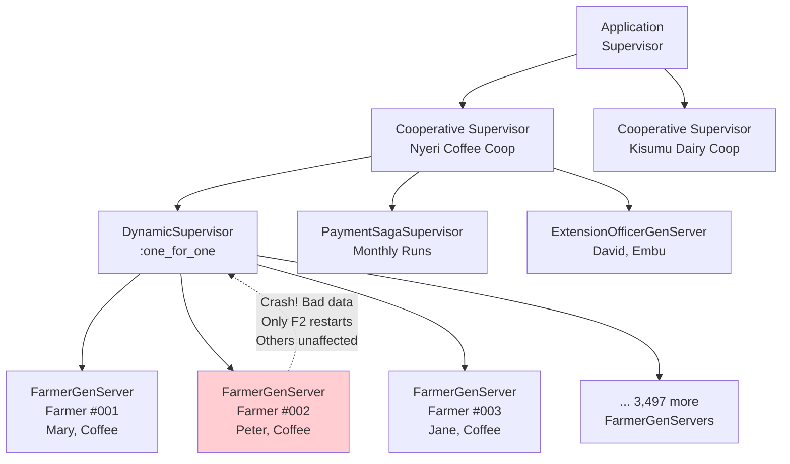
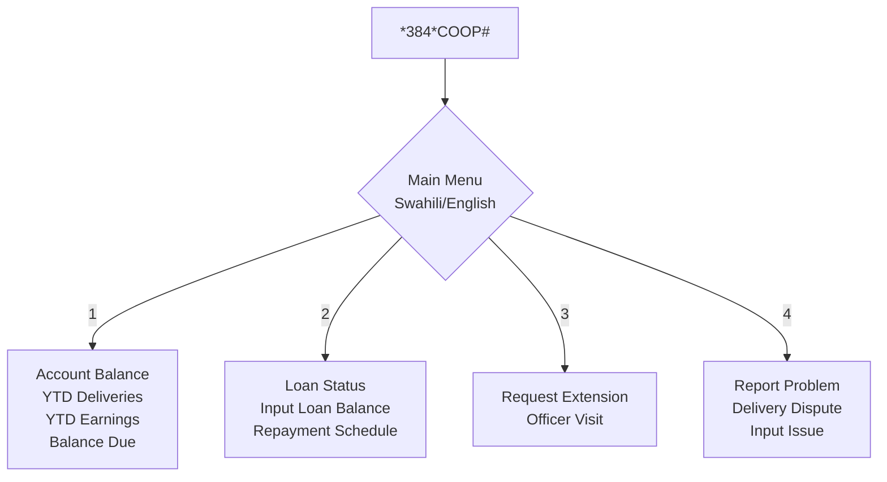
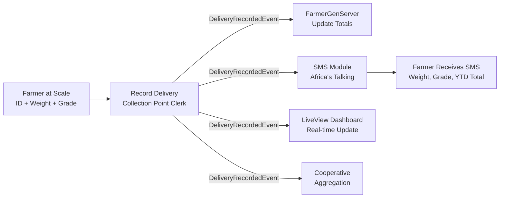
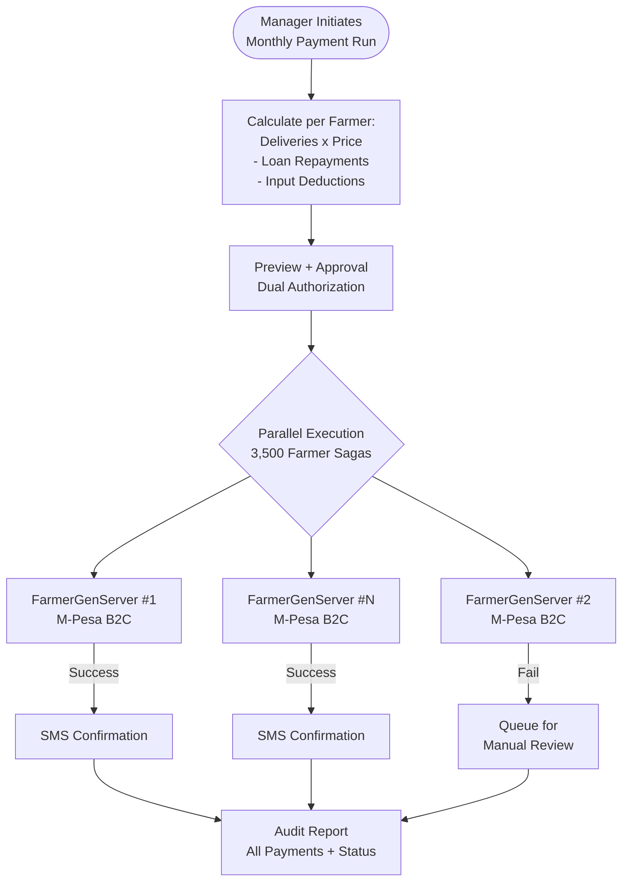

# Shamba

---

## Overview

Shamba is an agricultural cooperative operations platform for East African coffee, tea, dairy, and horticulture cooperatives, built on Elixir/OTP where each registered farmer becomes a supervised GenServer process. The platform coordinates deliveries, payments, loans, agronomy advice, and extension visits through OTP supervision trees that mirror cooperative organizational structure. Shamba also includes the **Greenland AgriTech** module -- a farm-level decision support platform using the Kajiado farm as its first proving ground, targeting individual commercial farms with irrigation optimization, yield prediction, and market intelligence.

---

## Architecture

### OTP Architecture

Each farmer is modeled as an independent GenServer process, supervised by a `DynamicSupervisor` per cooperative using a `:one_for_one` restart strategy. This ensures that one farmer's bad data or crash never affects other farmers. Long-lived farmer state (YTD deliveries, pending payments, active loans, last visit, preferences) is held in-process and passivated to PostgreSQL after idle periods.

**Core OTP Components:**

- **Farmer GenServer** -- one process per registered farmer; handles delivery events, payment events, loan updates, visit logs
- **Cooperative Supervisor** -- supervises all Farmer GenServers for a cooperative; handles cooperative-wide broadcasts
- **Payment Saga Supervisor** -- spawns a saga GenServer per payment run; coordinates parallel M-Pesa disbursements with concurrency limits
- **Extension Officer GenServer** -- one per active officer; tracks assigned farmers, planned visits, pending sync

### Four BFFs

| BFF | Client | Technology | Key Responsibilities |
|-----|--------|------------|---------------------|
| Farmer BFF | USSD menus + SMS | Elixir (GenServer-based USSD handler) | Balance, loans, visit requests, SMS notifications |
| Cooperative Officer BFF | Web back-office | Ruby on Rails + React embeds | Farmer management, delivery recording, payment runs, reports |
| Buyer BFF | Public website + API | PHP/Laravel + Blade | Lot browsing, traceability, purchase orders |
| Extension Officer BFF | Mobile PWA | Elixir Phoenix LiveView | Visit logging (offline), farmer prioritization, outcome tracking |

### Language Role Allocation

| Language | Role | Rationale |
|----------|------|-----------|
| Elixir/OTP | Core farmer processes, payment sagas, USSD handler, real-time LiveView dashboards | Actor model is the natural fit for 500-15,000 independent farmer processes per cooperative |
| Ruby/Rails | Cooperative admin UI (user management, permissions, billing, reports) | Rails is the fastest framework for CRUD-heavy back-office UIs |
| PHP/Laravel | Public marketplace, traceability browser, buyer-facing pages | Excellent SEO tooling; mature PHP hosting in East Africa enables cooperative self-hosting |

### Technology Stack

| Layer | Technologies |
|-------|-------------|
| Backend | Elixir 1.17+ / OTP, Phoenix 1.7+ (LiveView), Ruby 3.3+ / Rails 7.2+, PHP 8.3+ / Laravel 11 |
| Data | PostgreSQL, Redis (session/pub-sub/cache), Mnesia (optional hot farmer cache) |
| Integrations | M-Pesa Daraja (B2C/C2B), Africa's Talking (SMS/voice/USSD), Safaricom USSD gateway |
| Infrastructure | AWS af-south-1, Kubernetes (EKS), Erlang distribution for BEAM clustering, Terraform, ArgoCD |

### Architecture Patterns

#### OTP Supervision Trees (Open Telecom Platform)

**Definition:** OTP is Erlang/Elixir's framework for building fault-tolerant systems. A supervision tree is a hierarchy of supervisor processes that monitor worker processes. When a worker crashes, its supervisor restarts it according to a defined strategy: `:one_for_one` restarts only the crashed child, `:one_for_all` restarts all children, `:rest_for_one` restarts the crashed child and all younger siblings.

**Why it fits Shamba:** A cooperative has 3,500 farmers. Each farmer has independent state -- deliveries, payments, loans, visits. If farmer #2,847's GenServer crashes due to corrupted delivery data, it should restart with clean state WITHOUT affecting the other 3,499 farmers. OTP supervision trees were literally designed for this exact scenario: millions of independent processes with independent failure modes. The `:one_for_one` strategy ensures fault isolation at the individual farmer level.

**Concrete application:** `CooperativeSupervisor` (one per cooperative) supervises a `DynamicSupervisor` that spawns one `FarmerGenServer` per registered farmer. Each `FarmerGenServer` holds state: YTD deliveries, pending payments, active loans, last visit, preferences. If a farmer's process crashes, the supervisor restarts it, rehydrating state from PostgreSQL. The supervision tree mirrors the cooperative's organizational structure.

#### Actor Model

**Definition:** A concurrency model where "actors" are independent computational entities that: (1) maintain private state, (2) communicate only via asynchronous messages, (3) never share memory. Each actor processes one message at a time, eliminating data races by design.

**Why it fits Shamba:** Each farmer in a cooperative is genuinely independent -- their delivery history, loan balance, and payment schedule don't depend on other farmers. The actor model maps directly: farmer = actor, delivery record = message, payment calculation = state update. Actors provide: (a) fault isolation -- one farmer's crash doesn't cascade, (b) location transparency -- a farmer's GenServer can run on any node in the BEAM cluster, (c) natural concurrency -- 3,500 farmers process deliveries in parallel during harvest season.

**Concrete application:** `FarmerGenServer` receives messages: `{:delivery, %{weight: 50, grade: :AA, timestamp: ...}}`, `{:payment, %{amount: 5000, period: :march_2026}}`, `{:visit, %{officer_id: ..., topics: [...]}}`. Each message updates the farmer's private state. No locks, no shared memory, no data races. During harvest, all 3,500 farmers can record deliveries simultaneously -- each GenServer processes its own messages independently.

#### Pipeline Pattern

**Definition:** Data flows through a series of processing stages, each performing a specific transformation. Each stage is independent, composable, and can be scaled separately. The output of one stage feeds the input of the next.

**Why it fits Shamba:** Delivery recording at a collection point must be fast (50-100 farmers/hour during peak harvest) and reliable. The pipeline: weighing, grading, SMS notification, dashboard update, cooperative aggregation. Each stage operates independently -- if SMS delivery is slow, it doesn't block the weigher from recording the next farmer. Pipeline architecture enables concurrent processing at each stage and graceful degradation (SMS delay doesn't delay the dashboard).

**Concrete application:** Farmer presents at scale. Clerk enters weight + grade. `DeliveryRecordedEvent` emitted. Pipeline stages: (1) FarmerGenServer updates running totals, (2) SMS module sends confirmation to farmer via Africa's Talking, (3) LiveView dashboard updates in real-time, (4) cooperative-level aggregation updates YTD totals. Each stage is a separate consumer of the event.

#### Inherited Patterns

The following patterns are inherited from earlier tiers and applied directly in Shamba:

- **Hexagonal Architecture** -- M-Pesa (Daraja API), SMS (Africa's Talking), and USSD (Safaricom gateway) are adapters plugged into ports defined by the domain core. Swapping Africa's Talking for Twilio requires changing only the adapter, not the domain logic.
- **Backend-for-Frontend (BFF)** -- Four dedicated BFFs (Farmer, Cooperative Officer, Buyer, Extension Officer) each tailored to their client's capabilities and constraints.
- **Event-Driven Architecture** -- Domain events (`DeliveryRecordedEvent`, `PaymentDisbursedEvent`, `VisitLoggedEvent`) decouple producers from consumers, enabling the pipeline pattern above.
- **CQRS (Command Query Responsibility Segregation)** -- Write path (delivery recording, payment execution) is optimized for throughput via GenServer message processing. Read path (dashboards, reports, USSD balance queries) is optimized for speed via precomputed read models.
- **Saga Pattern** -- Payment runs coordinate M-Pesa disbursements across 3,500 farmers with compensating transactions on failure. Each payment saga is a supervised GenServer with defined rollback steps.

- **Offline-First** -- Extension officer PWA and collection-point UX persist data locally and sync when connectivity returns, critical for rural East African infrastructure.

#### Pattern Lineage

- **Inherits:** All T1-T4 patterns (Hexagonal, BFF, Event-Driven, CQRS, Sagas, Offline-First)
- **Introduces:** OTP Supervision Trees + Actor Model + Pipeline
- **Carries forward:** Actor model reappears in T6 (PayGoHub) as Microsoft Orleans virtual actors for device fleet management (one grain per PAYG device, supervised by Orleans silo lifecycle). Pipeline pattern reappears wherever data flows through sequential stages.

---

## Requirements

| Epic | Description | Primary Persona |
|------|-------------|-----------------|
| 4.1 Farmer Onboarding | Bulk-register farmers via CSV/Excel upload with validation and GenServer spawning | Cooperative Manager |
| 4.2 Delivery Recording | Record deliveries in under 30 seconds with weight, grade, quality notes | Collection-Point Clerk |
| 4.3 Farmer Self-Service | USSD/SMS interface for account balance, loans, visit requests, dispute reporting | Smallholder Farmer |
| 4.4 Payment Cycles | Monthly payment run for 3,500 farmers in under 1 hour with M-Pesa disbursement | Cooperative Manager |
| 4.5 Input Distribution | Coordinated fertilizer/input distribution with per-farmer allocation and automatic loan setup | Cooperative Manager |
| 4.6 Extension Officer Workflows | Offline-capable farm visit logging with sync-on-reconnect | Extension Officer |
| 4.7 Traceability for Buyers | Trace coffee lots back to contributing farmers with cryptographic proof | Buyer/Processor |

---

## Acceptance Criteria

### 4.1 Farmer Onboarding and Registration

- [ ] CSV/Excel upload via Cooperative Officer BFF with row-level validation (name, phone, ID, land size, crop)
- [ ] Valid rows become registered farmers with a spawned GenServer process each
- [ ] Invalid rows returned in a downloadable remediation report
- [ ] Successfully registered farmers receive SMS welcome with their cooperative ID
- [ ] Process handles 10,000+ rows without timeout (streaming upload)

### 4.2 Delivery Recording

- [ ] Clerk enters farmer 4-digit ID or scans QR code on farmer card
- [ ] Weight captured (optionally from integrated scale); grade selected from configured options
- [ ] Delivery recorded and SMS confirmation sent to farmer within 10 seconds
- [ ] Farmer GenServer processes delivery event, updating running totals
- [ ] Delivery immediately reflected in cooperative running dashboard

### 4.3 Farmer Self-Service (USSD/SMS)

- [ ] Farmer dials `*384*{coop-code}#` on any network; USSD menu in preferred language (Swahili/English/Kikuyu)
- [ ] Option 1: current account balance (YTD deliveries, YTD earnings, balance due)
- [ ] Option 2: outstanding loans (input loan balance, repayment schedule)
- [ ] Option 3: request extension officer visit
- [ ] Option 4: report a problem (delivery dispute, input issue)
- [ ] Session response times under 3 seconds per screen
- [ ] SMS sent within 30 seconds after every delivery (date, weight, grade, running YTD total, payment date)
- [ ] Failed SMS retries handled; voice call fallback for critical events

### 4.4 Payment Cycles

- [ ] System calculates each farmer payment (deliveries x price - loan repayments - input deductions)
- [ ] Preview with totals by farmer, class, branch before confirmation
- [ ] Each farmer GenServer triggers M-Pesa B2C disbursement saga on confirmation
- [ ] Sagas execute in parallel with concurrency limits respecting M-Pesa API rate limits
- [ ] Successful disbursement triggers SMS to farmer; failed disbursements queued for manual review
- [ ] Full cycle completes in under 1 hour for 3,500 farmers
- [ ] Audit report produced showing every payment and its status

### 4.5 Input Distribution and Loans

- [ ] Per-farmer allocation calculated from formula (e.g., 50kg fertilizer per acre coffee)
- [ ] Farmer receives SMS with allocation and opt-in/opt-out choice
- [ ] Opted-in farmers assigned to distribution points and dates
- [ ] Distribution-point clerks check off deliveries in real-time
- [ ] Each distribution automatically creates a loan on the farmer account
- [ ] Loan appears in farmer USSD balance and next payment deduction

### 4.6 Extension Officer Workflows

- [ ] Visit logging works fully offline (GPS, duration, advice topics, photos, follow-up actions)
- [ ] Data persists locally; syncs to server within 60 seconds when coverage returns
- [ ] Farmer GenServer processes visit event, updating profile
- [ ] Cooperative sees visit in real-time reports

### 4.7 Traceability for Buyers

- [ ] Buyer requests traceability via Buyer BFF for a coffee lot
- [ ] System shows aggregated contributing farmers (anonymized to ID if privacy required)
- [ ] Grade distribution, region, processing method displayed
- [ ] Cryptographic hash proves lot composition (optional public blockchain for premium lots)

---

## Non-Functional Requirements

### Performance

| Metric | Target |
|--------|--------|
| Delivery recording (collection-point UX) | < 10 seconds end-to-end |
| USSD response time (per screen) | < 3 seconds |
| SMS delivery latency (P95) | < 30 seconds |
| Monthly payment run (3,500 farmers) | < 1 hour |
| Farmer GenServer spawn time | < 100ms |
| Phoenix LiveView dashboard update | < 2 seconds |

### Availability

| Component | Target |
|-----------|--------|
| Cooperative Officer BFF (back-office) | 99.5% (office hours) |
| Farmer USSD/SMS interface | 99.9% |
| Payment runs | Must never corrupt state -- prefer failure over partial |
| GenServer supervision | 99.99% (automatic restart on crash) |

### Connectivity Tolerance

| Component | Requirement |
|-----------|-------------|
| Collection-point UX | Works offline (2G-tolerant, sync later) |
| Extension officer app | Works fully offline |
| Cooperative back-office | Requires connectivity (acceptable -- rural HQ typically has connection) |
| Farmer USSD/SMS | No offline requirement (channel itself is the solution) |

### Language Support

| Language | Status |
|----------|--------|
| Swahili | Initial launch |
| English | Initial launch |
| Kikuyu, Luo, Kamba | Expandable based on cooperative member demographics |
| SMS template localization | Farmer receives messages in preferred language |

---

## Success Metrics

### Business Metrics (End of Week 15)

| Metric | Target |
|--------|--------|
| Paying cooperatives | 2+ |
| Total farmers registered | 5,000+ |
| Monthly Recurring Revenue | $1,000+ |
| Transaction volume (farmer payments) | $100K+ |
| Transaction fee revenue | $500+ |

### Operational Metrics

| Metric | Target |
|--------|--------|
| Payment accuracy | 99.99%+ (< 1 error per 10,000 payments) |
| Farmer NPS (via SMS survey) | > 50 |
| SMS delivery success rate | > 99% |
| USSD session completion rate | > 90% |
| Collection-point clerk time per delivery | < 30 seconds |

### Technical Metrics

| Metric | Target |
|--------|--------|
| BEAM cluster uptime | > 99.95% |
| GenServer crash rate | < 0.001% per day |
| Payment run completion in under 1 hour | 100% |
| Code coverage on domain logic | > 85% |

---

## Definition of Done

- [ ] All user stories in Section 4 have passing acceptance tests
- [ ] 2 cooperatives live in production (1 paid, 1 final-stage pilot)
- [ ] 5,000+ farmers registered
- [ ] Monthly payment run successfully executed for full farmer base
- [ ] USSD response time consistently under 3 seconds
- [ ] SMS delivery rate > 99% over 30-day window
- [ ] BEAM cluster stable; supervision restart rate normal
- [ ] Security audit passed (financial + PII threat model)
- [ ] Documentation: admin guide (Swahili + English), extension officer guide, USSD reference
- [ ] Onboarding playbook for new cooperatives (template contracts, training materials, data migration scripts)
- [ ] On-call rotation established (harvest season stakes are high)

---

## Commercial

### Shamba Pricing (Cooperative Platform)

| Tier | Price | Features | Target |
|------|-------|----------|--------|
| Pilot | Free for 6 months | Up to 500 farmers | New cooperatives, onboarding |
| Growth | $0.50/farmer/month | All core features | Small cooperatives (500-2,000 farmers) |
| Standard | $0.40/farmer/month | All features + priority support | Mid cooperatives (2,000-10,000) |
| Enterprise | From $0.30/farmer/month | Custom integrations, dedicated support, on-prem option | Large cooperatives (10,000+) |
| Transaction fee | 0.5% on M-Pesa disbursements | All tiers | On total payment volume |

### Greenland Pricing (Farm-Level Platform)

| Tier | Price | Features | Target |
|------|-------|----------|--------|
| Greenland-Scout | $15/month | 1 farm, irrigation + weather, mobile app | Smallholders, early adopters |
| Greenland-Grow | $50/month | Up to 50 acres, adds CV diagnosis + input optimization | Mid-size commercial farms |
| Greenland-Pro | $150/month | Up to 500 acres, all features, priority support | Large commercial operations |
| Greenland-Enterprise | From $500/month | Multi-farm, custom ML models, white-label, dedicated agronomist | Flower farms, export operations |
| Hardware | At-cost + 15% margin | Sensor kits, gateways, weather stations | Starter + expansion packs |
