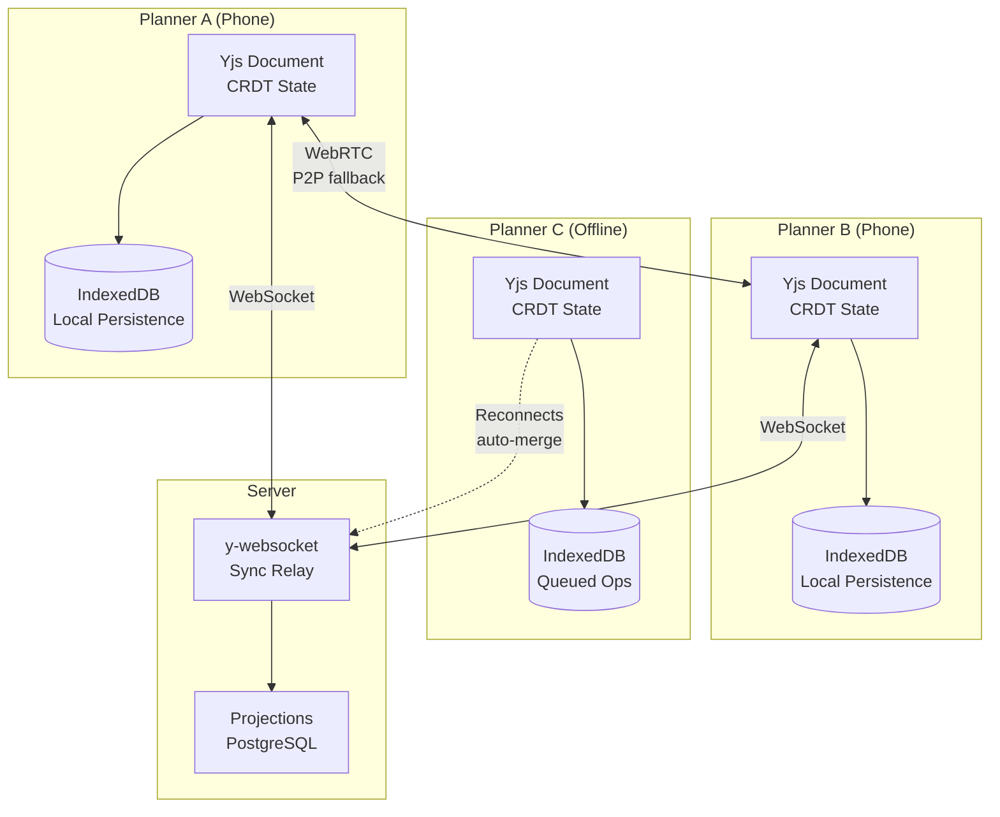
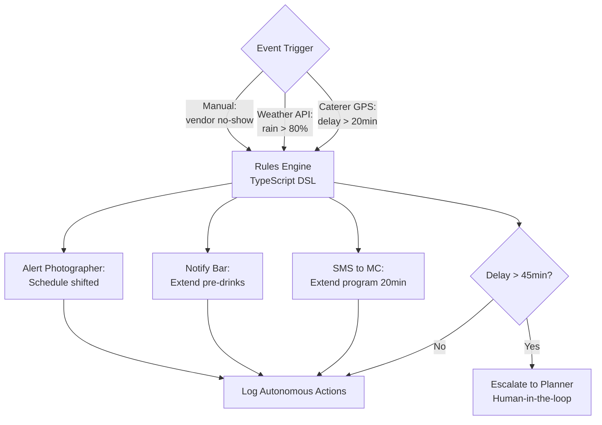
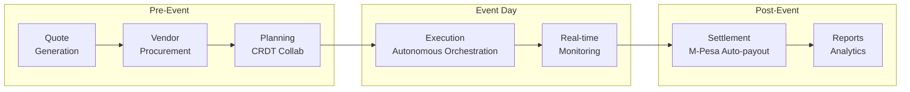

# Sherehe

---

## Overview

**Sherehe** (*"celebration/event" in Swahili*) is an autonomous event orchestration platform for East Africa, covering the full event lifecycle from pre-event planning and pricing through vendor coordination, real-time execution with autonomous contingency handling, and post-event settlement. It handles events ranging from 30-person birthday parties to 10,000-person corporate conferences.

The platform's distinguishing capability is **real-time autonomous orchestration** backed by a CRDT-based offline-first architecture. When a caterer runs late, Sherehe automatically re-sequences the agenda, notifies affected vendors, and escalates to the planner only when thresholds are exceeded -- no human orchestrator in the loop for routine contingencies.

---

## Architecture

### Key Patterns

#### CRDTs (Conflict-free Replicated Data Types)

**Definition:** Data structures mathematically designed so that concurrent modifications by different users always merge to a consistent state without coordination. No central authority needed. No conflict resolution dialogs. The math guarantees convergence.

**Why it fits Sherehe:** 3 planners edit the same wedding event simultaneously on phones at a Kenyan venue with spotty WiFi. Traditional databases would produce "conflict: user A changed field X while user B changed field Y -- which wins?" CRDTs eliminate this entirely. Every edit is a CRDT operation; every merge is provably correct. This is the same technology Figma uses for real-time collaborative design.

**Application in Sherehe:**

1. **Document Model:** The Yjs library manages each event as a single CRDT document. The document contains nested CRDT types: `Y.Map` for event metadata (name, date, location, status), `Y.Array` for the vendor list and guest list (ordered collections where insertions and deletions at any position merge correctly), and `Y.Text` for rich-text fields like event notes and MC scripts (supports concurrent character-level insertions without overwriting).
2. **Concurrent Editing:** Three planners -- the lead planner editing the timeline on her phone, an assistant updating the guest list on a tablet, and a coordinator adjusting the budget on a laptop -- all modify the same CRDT document simultaneously. Each edit generates a CRDT operation (insert, delete, update) that is applied locally first. When synced, operations merge deterministically regardless of arrival order.
3. **Merge Semantics:** Yjs uses a YATA (Yet Another Transformation Approach) algorithm. For concurrent inserts at the same position, deterministic tie-breaking based on client ID ensures all replicas converge to the same order. For concurrent updates to the same field, last-writer-wins semantics apply (configurable per field). For deletions, tombstones mark deleted items so that concurrent edits to a deleted item are handled gracefully.
4. **Persistence and Sync:** IndexedDB (via Dexie.js) persists the full CRDT state vector locally, surviving browser close, crash, and offline periods. On reconnection, the Yjs sync protocol exchanges only the missing operations (delta sync), not the full document state, minimizing bandwidth on 3G connections.
5. **Server-Side Projections:** The y-websocket sync relay persists CRDT operations to a durable log. A projection service consumes these operations and builds read-optimized views in PostgreSQL -- flattened event summaries, vendor rosters, budget totals -- used by the analytics dashboard, reporting endpoints, and search indexes.

#### Offline-First / Local-First Architecture

**Definition:** The application works fully without network connectivity. Data lives on the client first (IndexedDB); the server is a sync relay, not the source of truth. When connectivity returns, changes sync automatically.

**Why it fits Sherehe:** Kenyan venues (KICC, rural retreats, beach hotels) frequently have unreliable or no WiFi. Event day is the one day the app MUST work -- and it is the day connectivity is least reliable (hundreds of attendees overwhelming cell towers). An app that shows a spinner when offline is useless. Local-first means the app behaves identically whether connected or not.

**Application in Sherehe:**

1. **Local-First Data Layer:** All event data -- metadata, vendor list, guest list, timeline, budget, notes, contingency plans, and vendor contact information -- is stored in IndexedDB via Dexie.js as the primary data store. The application reads from and writes to IndexedDB first; the server never gates any user action. This means page load, navigation, and editing all work at local-disk speed regardless of network conditions.
2. **CRDT Operation Queue:** When the device is offline, every edit generates a CRDT operation that is applied to the local Yjs document and queued in IndexedDB. The queue accumulates operations across hours or days of offline work. No operation is lost because IndexedDB is transactional and survives browser close and device restart.
3. **Automatic Sync on Reconnection:** When connectivity returns, the y-websocket client detects the connection and initiates a delta sync -- exchanging only the operations the server has not seen and receiving only the operations the client has not seen. Full reconciliation completes within 30 seconds (P95) for typical event documents under 10MB.
4. **WebRTC Peer-to-Peer Fallback:** In venue scenarios where the server is unreachable but multiple planners are on the same local WiFi (common at KICC, Sarova, beach hotels), Sherehe establishes WebRTC peer-to-peer connections via the simple-peer library. Planners sync directly with each other using the Yjs WebRTC provider, maintaining real-time collaboration even without internet access. When internet returns, all peers sync with the server.
5. **Progressive Enhancement:** The application uses a service worker to cache the application shell (HTML, CSS, JavaScript bundles, fonts, icons) for instant load. Combined with the IndexedDB data layer, this means a planner can open Sherehe from a home screen shortcut at a rural venue with zero connectivity and have full access to all their event data and editing capabilities.

#### Autonomous Orchestration Engine

**Definition:** A rules-based execution engine that takes pre-configured actions in response to real-time events, without human intervention for routine scenarios.

**Why it fits Sherehe:** When a caterer is 30 minutes late to a 300-person corporate conference, manual re-coordination takes 30-60 minutes -- the planner calls the MC, the MC adjusts the program, the bar needs to extend, the photographer needs the updated timeline. During those 30 minutes, the event stalls. Rules-based autonomy handles this in seconds: `when caterer.delay > 20min then notify(mc, "extend_program"); adjust(bar, "extend_service"); alert(photographer, "schedule_shifted")`. The planner reviews the action log, not the action itself.

**Application in Sherehe:**

1. **Rule Engine:** A TypeScript rules engine compiled from a simple DSL (Domain-Specific Language). Rules are expressed declaratively: `when caterer.status == "late" && delay > 20min then notify(mc, "extend_program"); adjust(bar, "extend_service")`. Default rule templates ship with the platform for common event types (wedding, corporate conference, social gathering). Planners can customize thresholds and actions per event via the Planner BFF UI. Rules are evaluated server-side when events arrive from any source -- GPS vendor tracking, timeline triggers, weather API polling, or manual status updates from the planner.
2. **Action Executors:** Each autonomous action is handled by a typed executor: SMS notifications via Africa's Talking API (supports Swahili and English templates), email notifications, push notifications via web push API, schedule adjustments (which apply CRDT operations to the event document so all connected planners see the change in real-time), M-Pesa payment triggers for automatic backup vendor activation (e.g., activating a secondary caterer when the primary is a confirmed no-show), and third-party API calls (weather lookups via OpenWeatherMap, traffic lookups via Google Maps for updated vendor ETAs).
3. **Safety Rails:** Every autonomous action is logged with full context: the trigger condition that fired, the rule that matched, the action taken, the timestamp, and the affected parties. Configurable thresholds per action type prevent over-reaction (e.g., SMS notifications suppressed if the same notification was sent within the last 15 minutes). Human-in-the-loop escalation paths ensure that high-impact actions (vendor replacement, budget changes, guest notifications) always require planner approval.
4. **Kill Switch and Dry-Run Mode:** The planner has a one-tap kill switch accessible from the event-day dashboard that immediately disables all autonomous actions for an event, reverting to manual-only mode. Dry-run mode allows planners to test new rules before event day -- the system evaluates rules and logs what actions it would take without actually executing them, giving planners confidence in their configuration.
5. **LLM Assist (Augmentation, Not Execution):** An LLM (OpenAI or Gemini) assists during the planning phase by generating contingency plan suggestions ("What should happen if it rains at an outdoor venue?"), drafting SMS templates in Swahili and English, and recommending rule configurations based on event type and historical patterns. The LLM is explicitly not in the execution loop -- all event-day actions are rules-based, deterministic, and auditable. The LLM helps write the rules; the rules engine executes them.

#### Micro-Frontends

**Definition:** Frontend architecture where independently deployable UI applications compose into a single user experience. Each micro-frontend owns its deployment pipeline, technology choices, and release cadence.

**Why it fits Sherehe:** Sherehe's vendor marketplace features have a completely different release cadence, performance budget, and development team than the planner coordination tools. Coupling them in a monolith means vendor marketplace bugs block planner releases. Micro-frontends let each BFF's frontend ship independently.

**Application in Sherehe:**

1. **Planner BFF** (Next.js PWA, mobile-first, TypeScript + Fastify backend) -- Serves the event planner and their assistants. Handles CRDT document sync via y-websocket, event CRUD operations, quote generation workflow, autonomous orchestration rule configuration, action log viewing, kill switch control, and contingency plan management. This is the most complex BFF, owning the primary planning workflow and real-time collaboration features.
2. **Vendor BFF** (Next.js PWA, marketplace-focused, TypeScript + Fastify backend) -- Serves vendors (caterers, photographers, MCs, decor teams, etc.). Handles marketplace browsing of available RFPs, bid submission with pricing and availability, booking confirmation receipt, earnings dashboard showing pending and completed payments, and vendor profile management including portfolio uploads and ratings.
3. **Client BFF** (shareable link, read-mostly, lightweight, TypeScript + Fastify backend) -- Serves event clients (the person hiring the planner). Provides a shareable link for viewing event plans, approving quotes, making M-Pesa payments, and receiving automatic status updates. Intentionally lightweight and read-heavy -- clients approve but do not edit.
4. **Independent Deployment:** Each BFF is a separate Next.js application deployed to Vercel independently with its own CI/CD pipeline. A bug in the vendor marketplace does not block planner releases. A performance regression in the client portal does not affect the planner's event-day experience. Each BFF connects to shared backend services (PostgreSQL, Redis, Yjs sync relay) but owns its own API routes, authentication flow, and UI.
5. **Tailored Protocol per Consumer:** The Planner BFF uses WebSocket connections for real-time CRDT sync and SSE (Server-Sent Events) for autonomous action log streaming. The Vendor BFF uses REST for marketplace interactions with push notifications for new RFPs. The Client BFF uses REST with email and SMS notifications for quote approvals and payment confirmations. Each BFF exposes only the data and operations its consumer needs.

#### Event-Driven Architecture (Inherited from Tier 1)

**Definition:** System components communicate by producing and consuming events asynchronously. Producers emit events into a stream or message bus without knowing or caring who consumes them. This decouples components in both time (consumers process at their own pace) and space (producers and consumers can be deployed, scaled, and failed independently). Events represent facts that have occurred -- immutable records of state changes -- rather than commands requesting future actions.

**Why Event-Driven fits Sherehe:** Event orchestration is inherently event-driven -- the domain itself is about events triggering other events. A caterer's GPS location update triggers a delay calculation, which triggers a notification chain, which triggers schedule adjustments, which trigger CRDT document updates that propagate to all connected planners. Synchronous request/response would create tight coupling between these stages: the GPS service would need to know about the notification service, which would need to know about the schedule service. Event-driven architecture lets each service react independently to upstream events, enabling the autonomous orchestration engine to add new rule-action pairs without modifying existing services.

**Application in Sherehe:**

1. **Event Taxonomy:** Every significant action in Sherehe produces a domain event: `EventCreated`, `VendorBooked`, `QuoteApproved`, `VendorLocationUpdated`, `ContingencyActivated`, `AutonomousActionTaken`, `PaymentInitiated`, `SettlementCompleted`. These events flow through Redis pub/sub for real-time cross-service communication and are persisted in PostgreSQL for audit and replay.
2. **Autonomous Orchestration Consumer:** The orchestration engine subscribes to all vendor and environment events (`VendorLocationUpdated`, `WeatherForecastReceived`, `VendorStatusChanged`). It evaluates rules against incoming events and emits action events (`SMSNotificationSent`, `ScheduleAdjusted`, `EscalationTriggered`) that downstream services consume.
3. **CRDT-Event Bridge:** CRDT operations (edits to the event document) are bridged into the event stream. When a planner updates the timeline via Yjs, the sync relay emits a `TimelineUpdated` event that the projection service consumes to update PostgreSQL read models, the notification service consumes to alert affected vendors, and the analytics service consumes to track planning velocity.
4. **Independent Scaling:** The notification service (high volume on event day -- hundreds of SMS and push notifications per hour) scales independently from the quote generation service (CPU-intensive but low volume). Each service owns its own consumer group offset and processes events at its own pace.
5. **Replay and Debugging:** Because events are persisted, any processing failure can be debugged by replaying the event stream through the failed service. If the orchestration engine made an incorrect autonomous decision, the full event sequence leading to that decision is available for root-cause analysis.

#### CQRS -- Command Query Responsibility Segregation (Inherited from Tier 2)

**Definition:** CQRS (Command Query Responsibility Segregation) separates the write model (commands that change state) from the read model (queries that return data) into distinct subsystems. The write side optimizes for consistency, validation, and business rule enforcement. The read side optimizes for query performance, denormalization, and consumer-specific data shapes. The two sides synchronize via events or projections, accepting eventual consistency in exchange for independent optimization.

**Why CQRS fits Sherehe:** Sherehe's write and read patterns are fundamentally different. The write side is CRDT-based -- collaborative edits from multiple planners merging through mathematical convergence. The read side needs flat, queryable projections: "Show me all events this month with budget over $10K," "List all vendors booked for Saturday," "Generate a settlement report." Forcing the CRDT document model to serve both collaborative editing and analytical queries would compromise both. CQRS lets the CRDT handle writes (optimized for merge, offline, collaboration) while PostgreSQL projections handle reads (optimized for SQL queries, joins, aggregation, reporting).

**Application in Sherehe:**

1. **Command Side (CRDT Documents):** All state mutations flow through the Yjs CRDT document model. When a planner adds a vendor, adjusts the budget, or edits the timeline, the change is a CRDT operation applied locally and synced via y-websocket. The CRDT document is the write-optimized source of truth.
2. **Projection Builder:** A dedicated projection service consumes CRDT operations from the sync relay and builds read-optimized views in PostgreSQL: a flattened `events` table with denormalized vendor counts and budget totals, a `vendor_bookings` table with availability and payment status, a `guest_list` table with RSVP status and dietary preferences.
3. **Query Side (PostgreSQL Read Models):** All read operations -- dashboard queries, search, filtering, reporting, analytics, settlement calculations -- hit PostgreSQL projections, never the CRDT document. This means complex queries (e.g., "Show me all December weddings where catering budget exceeds photography budget") execute as standard SQL without deserializing CRDT state.
4. **BFF-Specific Projections:** Each BFF reads from projections tailored to its consumer: the Planner BFF reads from event-centric projections with full vendor and budget detail; the Vendor BFF reads from vendor-centric projections showing available RFPs and earnings; the Client BFF reads from simplified event projections with approval-relevant fields only.
5. **Eventual Consistency Tradeoff:** Projections may lag CRDT writes by a few seconds. This is acceptable because planners see real-time state via the CRDT document (which is always up-to-date locally), while projections power non-critical read paths (dashboards, reports, search) where a 2-3 second delay is imperceptible.

#### Sagas (Inherited from Tier 2)

**Definition:** A saga is a pattern for managing long-running, multi-step business transactions that span multiple services. Instead of a single distributed transaction (which requires two-phase commit and is fragile in distributed systems), a saga breaks the transaction into a sequence of local transactions, each with a compensating action that undoes its effect if a later step fails. Sagas can be orchestrated (a central coordinator directs the sequence) or choreographed (each service listens for events and decides its own next step).

**Why Sagas fit Sherehe:** Vendor booking is a multi-step process that touches multiple services and external systems: (1) planner selects a vendor, (2) system initiates M-Pesa deposit, (3) vendor receives booking confirmation, (4) contract document is generated and signed, (5) vendor is added to the event timeline. If step 3 fails (vendor is now unavailable), steps 1 and 2 must be compensated (refund deposit, remove vendor from event). A saga coordinates this reliably without distributed transactions, which M-Pesa does not support anyway.

**Application in Sherehe:**

1. **Vendor Booking Saga (Orchestrated):** A saga orchestrator in the Planner BFF coordinates: `SelectVendor` -> `InitiateDeposit` (M-Pesa Daraja API) -> `AwaitPaymentConfirmation` -> `SendBookingConfirmation` (SMS via Africa's Talking) -> `GenerateContract` (PDF generation) -> `AddToTimeline` (CRDT operation). If any step fails, compensating actions execute in reverse order: cancel contract, reverse deposit, notify planner of failure.
2. **Post-Event Settlement Saga (Orchestrated):** On event completion: `CalculateFinalPayments` (per vendor, minus deposits) -> `ApplyCommissionDeductions` -> `InitiateM-PesaTransfers` (one per vendor) -> `AwaitConfirmations` -> `GenerateSettlementReport`. Disputed line items fork into an `EscrowHoldSaga` that pauses payment pending resolution.
3. **Contingency Activation Saga (Choreographed):** When a contingency is activated (one-tap or autonomous): `ActivateContingency` event emitted -> notification service sends SMS to guests -> decor team receives move-indoors instruction -> MC receives updated script -> photographer receives adjusted schedule -> timeline service updates CRDT document. Each service acts independently on the event; no central coordinator is needed because every action is idempotent and order-independent.
4. **Compensating Actions:** Every saga step has a defined compensating action. Deposit initiation is compensated by deposit reversal. Booking confirmation is compensated by cancellation SMS. Timeline addition is compensated by timeline removal (CRDT delete operation). Compensations are logged with the same audit trail as forward actions.
5. **Timeout Handling:** Each saga step has a configurable timeout. If M-Pesa does not confirm a deposit within 5 minutes, the saga times out and initiates compensation. If a vendor does not acknowledge a booking confirmation within 24 hours, the saga escalates to the planner for manual resolution.

### CRDT Sync Architecture

### Autonomous Orchestration Flow

### Event Lifecycle

### Pattern Lineage

- **Inherits:** BFF + Event-Driven (T1), CQRS + Event Sourcing + Sagas (T2)
- **Introduces:** CRDTs + Offline-First + Micro-Frontends + Autonomous Orchestration
- **Carries forward:** CRDTs reused in Unicorns v2 (offline POS inventory sync) and PayGoHub v2 (field installer offline onboarding). Offline-first becomes standard for all field-facing apps.

### Feature Breakdown: Autonomous Vendor Delay Handling

1. **GPS Tracking Layer:** Vendors with confirmed bookings receive a tracking link via SMS (Africa's Talking API). The Vendor BFF captures GPS coordinates every 60 seconds using the browser Geolocation API when the vendor opens the link. Coordinates stream as `VendorLocationUpdated` events to the orchestration engine. Google Maps Distance Matrix API calculates estimated time of arrival (ETA) against the scheduled arrival time.
2. **Delay Detection and Threshold Evaluation:** The orchestration engine compares the vendor's current ETA against their scheduled arrival time. When `delay > 20 minutes`, the engine matches this against configured rules for that vendor category. Different categories have different thresholds: a photographer arriving 20 minutes late is handled differently from a caterer arriving 20 minutes late (catering requires prep time; photography can start immediately).
3. **Autonomous Notification Chain:** On threshold breach, the engine executes a notification chain: SMS to the MC with a localized Swahili/English template ("Please extend the current program by 20 minutes -- catering is delayed"), push notification to the bar coordinator to extend pre-drinks service, push notification to the photographer with the updated timeline, and a CRDT operation to update the event timeline document so all connected planners see the shift in real-time.
4. **Escalation Path:** If the delay exceeds 45 minutes (configurable per event), the system escalates to human-in-the-loop mode: the planner receives a high-priority push notification with the full delay context (vendor name, current location, ETA, actions already taken autonomously). The planner can then choose to activate a backup vendor (triggering the Vendor Booking Saga with the backup), continue waiting, or manually override the autonomous actions.
5. **Audit Log and Post-Event Review:** Every autonomous action is recorded in the event's audit log with: trigger condition (GPS coordinates, calculated ETA, threshold breached), rule that fired, action taken (SMS content, notification recipients, CRDT operations applied), timestamp, and outcome. Post-event, the planner receives a summary: "Here's what the system did autonomously during your event -- would you make the same decisions?"

### Feature Breakdown: Quote Generation Pipeline

1. **Event Intake Form:** The planner inputs event parameters: type (wedding, corporate conference, social gathering, government function), guest count, date, location (selected from a venue database or entered manually), and optional preferences (indoor/outdoor, budget range, dietary requirements). The Planner BFF validates inputs and creates an `EventDraft` in the CRDT document.
2. **Vendor Category Suggestion:** Based on the event type and size, the system suggests required vendor categories: a 300-person corporate conference needs catering, venue, sound/AV, MC, photographer/videographer, decor, security, and transport. A 30-person birthday party needs catering, venue, and optional decor/photography. Category suggestions are driven by configurable templates per event type, refined by historical data from past events on the platform.
3. **Vendor Matching and Benchmarked Pricing:** For each category, the system queries the vendor marketplace database to find 3-5 vendors matching the event's date, location radius, budget range, and rating threshold. Each vendor option includes benchmarked pricing derived from historical bookings on the platform and publicly available rate cards. Pricing is adjusted for seasonal factors (December weddings command a 25% premium in Nairobi) and location factors (venues outside the city center have lower vendor travel markups).
4. **Budget Assembly and Real-Time Recalculation:** The system assembles a total budget estimate with line items per vendor category. The budget is stored as a CRDT `Y.Map` so that adjustments by the planner (swapping vendors, changing quantities, adding/removing categories) trigger instant total recalculation. Underpriced line items are flagged with a warning icon and tooltip explaining the historical benchmark.
5. **Quote PDF Generation and Client Sharing:** The Planner BFF generates a professional PDF quote using a branded template (configurable per planner's business). The PDF includes itemized costs, vendor details, payment terms, and event timeline summary. A shareable link is generated for the Client BFF, allowing the client to view the quote on any device without logging in, approve individual line items, request changes via inline comments, and initiate M-Pesa payment for the deposit.

### Feature Breakdown: Contingency Package System

1. **Template Library:** Sherehe ships with pre-built contingency templates for common East African event scenarios: Rain Plan (move outdoor activities indoors, adjust decor layout, update guest notifications), Power Outage (activate generator backup, switch to battery-powered sound, adjust lighting plan), Vendor No-Show (activate backup vendor, adjust timeline, notify affected parties), Medical Emergency (alert on-site medic, clear access routes, notify event security), and VIP Schedule Change (adjust program order, notify MC and photographer, update seating arrangement).
2. **Planner Customization:** Each template is fully customizable per event. The planner can edit trigger conditions (e.g., change rain threshold from 80% to 60%), modify action lists (add "notify parking attendant" to the rain plan), set autonomous vs manual activation per contingency, and define escalation contacts. Customized contingencies are stored in the CRDT event document and available offline.
3. **Trigger Monitoring:** The orchestration engine continuously monitors trigger sources for active events: OpenWeatherMap API for weather conditions (polled every 15 minutes, increased to every 5 minutes within 4 hours of event start), vendor GPS tracking for no-show detection, manual status updates from the planner, and M-Pesa callback notifications for payment failures that might indicate vendor withdrawal.
4. **One-Tap Activation:** When a trigger condition is met, the planner receives a notification with a "Activate [Plan Name]" button. One tap executes all actions in the contingency package simultaneously: SMS notifications to all affected vendors and guests (via Africa's Talking), CRDT updates to the event timeline and layout documents, push notifications to the event team, and MC script updates inserted into the shared notes. If autonomous activation is enabled for that contingency type, the system activates without the planner's tap and logs the action.
5. **Rollback Capability:** Every contingency activation creates a snapshot of the pre-activation event state (CRDT document version). If the trigger condition resolves (rain stops, vendor arrives, power returns), the planner can roll back to the pre-activation state with one tap. Rollback re-sends notifications to all affected parties informing them of the reversion. Partial rollback is supported -- keep some changes (e.g., keep the indoor decor layout) while reverting others (revert the MC script to original).

### Three BFFs

| BFF | Client | Technology | Key Responsibilities |
|-----|--------|------------|----------------------|
| Planner BFF | Next.js PWA (mobile-first) | TypeScript + Fastify | Event planning, CRDT sync, autonomous action controls |
| Vendor BFF | Next.js PWA | TypeScript + Fastify | Marketplace browsing, bidding, earnings dashboard |
| Client BFF | Shareable link, read-mostly | TypeScript + Fastify | View event, approve quotes, make payments |

### Technology Stack

| Layer | Technologies |
|-------|-------------|
| Frontend | Next.js 15+ PWA, React + TypeScript (strict), Tailwind CSS + shadcn/ui, Yjs (CRDT), IndexedDB via Dexie.js, WebRTC via simple-peer |
| Backend | TypeScript + Fastify (BFFs), Node.js workers (orchestration engine) |
| Data | PostgreSQL (projections, accounts), Redis (session, pub/sub), S3 / Cloudflare R2 (images, PDFs), Yjs document store |
| Integrations | M-Pesa Daraja (payments), Africa's Talking (SMS), OpenWeatherMap, Google Maps, Twilio (voice backup), OpenAI or Gemini (planning assist) |
| Infrastructure | Vercel (frontend), Fly.io (BFFs, Nairobi region), AWS (data + orchestration engine), Ably or self-hosted (real-time sync) |

---

## Requirements

| ID | Requirement | Priority | Status |
|----|-------------|----------|--------|
| REQ-001 | Generate a complete event quote in under 30 minutes based on event type, size, date, and location | P0 | Not Started |
| REQ-002 | Suggest vendor categories and provide 3-5 vendor options with benchmarked pricing per category | P0 | Not Started |
| REQ-003 | Generate total budget estimate with line items and produce quote PDF in under 5 minutes | P0 | Not Started |
| REQ-004 | Client can view and approve quote via shareable link (Client BFF) | P0 | Not Started |
| REQ-005 | Forecast inventory and package pricing based on seasonal demand and vendor availability (requires 50+ historical events) | P1 | Not Started |
| REQ-006 | Flag underpriced line items vs historical benchmarks and suggest seasonal adjustments | P1 | Not Started |
| REQ-007 | Warn when critical vendors are unavailable on requested date | P1 | Not Started |
| REQ-008 | Multi-user simultaneous editing of event plans via CRDTs without conflict dialogs | P0 | Not Started |
| REQ-009 | Each user sees others' changes within 5 seconds when online | P0 | Not Started |
| REQ-010 | Full event history log showing who changed what and when | P0 | Not Started |
| REQ-011 | Full offline editing with all features (edit, view, add notes, log decisions) continuing to work offline | P0 | Not Started |
| REQ-012 | Changes persisted locally in IndexedDB; sync within 30 seconds of reconnection with no user intervention | P0 | Not Started |
| REQ-013 | Autonomously handle routine execution-day contingencies (vendor delays, schedule adjustments, notifications) | P0 | Not Started |
| REQ-014 | Planner can view autonomous action log in real-time and override any autonomous action with one tap | P0 | Not Started |
| REQ-015 | Escalate to planner (human-in-the-loop) when delay exceeds 45 minutes | P0 | Not Started |
| REQ-016 | Pre-configured contingency packages (rain plan, power outage, no-show) activatable with one tap or autonomously | P1 | Not Started |
| REQ-017 | Weather API triggers "Rain Plan Ready" prompt when rain probability exceeds 80% within 2 hours | P1 | Not Started |
| REQ-018 | One-tap contingency activation triggers SMS, decor team, MC script, and photography plan adjustments | P1 | Not Started |
| REQ-019 | Autonomous activation is opt-in per contingency type | P1 | Not Started |
| REQ-020 | Vendors receive relevant booking opportunities (RFP notification within 10 minutes) and can submit bids within 5 minutes | P1 | Not Started |
| REQ-021 | Planner sees vendor bid alongside 2-4 competitors | P1 | Not Started |
| REQ-022 | Selected vendor gets booking confirmation + 50% deposit via M-Pesa immediately | P1 | Not Started |
| REQ-023 | Automatic vendor payment settlement after event completion via M-Pesa (minus deposits already paid) | P1 | Not Started |
| REQ-024 | Commission deductions apply automatically on settlement | P1 | Not Started |
| REQ-025 | M-Pesa transfers execute within 1 hour of event completion | P1 | Not Started |
| REQ-026 | Settlement report generated for planner records | P1 | Not Started |
| REQ-027 | Disputed line items held in escrow pending resolution | P1 | Not Started |
| REQ-028 | All autonomous actions logged with full audit trail; configurable human-in-the-loop thresholds | P0 | Not Started |
| REQ-029 | Kill switch: planner can disable all autonomy with one tap on event day | P0 | Not Started |
| REQ-030 | Dry-run mode for testing new autonomous rules before event day | P1 | Not Started |
| REQ-031 | Weekly review report: "Here's what the system did autonomously this week" | P2 | Not Started |
| REQ-032 | OAuth 2.0 + magic-link authentication; MFA for planner accounts handling >$50K events | P0 | Not Started |
| REQ-033 | Role-based authorization (owner, co-planner, assistant, view-only) | P0 | Not Started |
| REQ-034 | TLS 1.3 in transit; AES-256 at rest; end-to-end encryption for client contract documents | P0 | Not Started |
| REQ-035 | Guest lists encrypted; retention per configurable policy; GDPR/POPIA/Kenya DPA compliance | P1 | Not Started |
| REQ-036 | Sync service supports 10,000 concurrent active editing sessions | P1 | Not Started |
| REQ-037 | Event state supports up to 100MB per event (decor plans, seating charts, photo gallery) | P1 | Not Started |

---

## Acceptance Criteria

### Epic: Pre-Event Planning and Pricing

- [ ] AC-001: System suggests vendor categories needed (catering, venue, decor, sound, etc.) based on event type, guest count, date, and location
- [ ] AC-002: For each category, system provides 3-5 vendor options with benchmarked pricing
- [ ] AC-003: Total budget estimate with line items generated; quote PDF produced in under 5 minutes
- [ ] AC-004: Adjusting any line item recalculates the total in real-time
- [ ] AC-005: Client can view and approve quote via shareable link (Client BFF)
- [ ] AC-006: System flags underpriced line items vs historical benchmarks (requires 50+ historical events in platform)
- [ ] AC-007: Seasonal pricing adjustments suggested (e.g., December weddings +25%)
- [ ] AC-008: Warning surfaced when critical vendors are unavailable on requested date

### Epic: Real-Time Collaborative Planning

- [ ] AC-009: Three concurrent users editing different fields of the same event merge automatically via CRDTs without conflict dialogs
- [ ] AC-010: Each user sees others' changes within 5 seconds when online
- [ ] AC-011: Offline changes merge cleanly on reconnection without user intervention
- [ ] AC-012: Full event history log shows who changed what and when (CRDT operation log)
- [ ] AC-013: All features (edit, view, add notes, log decisions) continue working fully offline
- [ ] AC-014: Changes persisted locally in IndexedDB; sync within 30 seconds of reconnection
- [ ] AC-015: No user intervention required to resolve sync conflicts on reconnection

### Epic: Autonomous Execution-Day Orchestration

- [ ] AC-016: When vendor GPS-tagged arrival is 20+ minutes behind schedule, system autonomously sends SMS to MC to delay opening
- [ ] AC-017: System autonomously notifies bar to extend pre-drinks service on vendor delay
- [ ] AC-018: System autonomously alerts photographer to schedule shift on vendor delay
- [ ] AC-019: Supervisor-needs-to-know notification triggered to planner if delay exceeds 45 minutes (human-in-the-loop escalation)
- [ ] AC-020: Planner can view autonomous action log in real-time with full context
- [ ] AC-021: Planner can override any autonomous action with one tap
- [ ] AC-022: Weather API triggers "Rain Plan Ready" prompt when rain probability exceeds 80% within 2 hours
- [ ] AC-023: One-tap rain plan activation triggers: SMS to guests with venue adjustment, notification to decor team to move tables indoors, MC script update inserted, photography plan adjusted
- [ ] AC-024: Autonomous activation is opt-in per contingency type
- [ ] AC-025: Kill switch available: planner can disable all autonomy with one tap on event day
- [ ] AC-026: Dry-run mode available for testing new rules before event day
- [ ] AC-027: All autonomous actions logged with full audit trail (action taken, trigger condition, timestamp, affected parties)

### Epic: Vendor Marketplace and Bidding

- [ ] AC-028: Vendor receives RFP notification within 10 minutes of planner posting
- [ ] AC-029: Vendor can submit bid with pricing and availability in under 5 minutes
- [ ] AC-030: Planner sees vendor bid alongside 2-4 competitors
- [ ] AC-031: Selected vendor gets booking confirmation + 50% deposit via M-Pesa immediately

### Epic: Post-Event Settlement

- [ ] AC-032: Final payments triggered for each vendor on event completion (minus deposits already paid)
- [ ] AC-033: Commission deductions apply automatically
- [ ] AC-034: M-Pesa transfers execute within 1 hour of event completion
- [ ] AC-035: Settlement report generated for planner records with full line-item breakdown
- [ ] AC-036: Disputed line items held in escrow pending resolution

### Epic: Security and Compliance

- [ ] AC-037: OAuth 2.0 + magic-link authentication implemented; MFA enforced for planner accounts handling >$50K events
- [ ] AC-038: Role-based authorization enforced (owner, co-planner, assistant, view-only) across all BFFs
- [ ] AC-039: TLS 1.3 in transit; AES-256 at rest; end-to-end encryption for client contract documents
- [ ] AC-040: PCI DSS SAQ-A compliance (no card data stored); M-Pesa integration via official Daraja APIs only
- [ ] AC-041: Guest lists encrypted; retention per configurable policy
- [ ] AC-042: Right to delete, data portability, and consent management implemented per GDPR/POPIA/Kenya DPA

---

## Non-Functional Requirements

### Performance

| Metric | Target |
|--------|--------|
| Quote generation (P95) | < 5 minutes |
| Page load (P95, on 3G) | < 3 seconds |
| CRDT sync latency when online (P95) | < 5 seconds |
| Offline-to-online reconciliation (P95) | < 30 seconds |
| Contingency auto-activation (P95) | < 60 seconds from trigger |
| Autonomous action log updates | < 2 seconds |

### Availability

| Component | Target |
|-----------|--------|
| Planner BFF | 99.9% |
| Sync service | 99.95% |
| Autonomous orchestration engine | 99.99% |
| Vendor marketplace | 99.5% |

### Offline-First Capabilities

| Available Offline | Not Required Offline |
|-------------------|----------------------|
| All event data readable | Real-time sync with teammates |
| New edits (saved to IndexedDB) | Vendor marketplace (search/bidding) |
| Check-ins and vendor arrival logging | Autonomous orchestration triggers |
| Notes and photos | |
| Vendor contact info | |
| Contingency plans | |

### Security

| Requirement | Standard |
|-------------|----------|
| Authentication | OAuth 2.0 + magic-link; MFA for planner accounts handling >$50K events |
| Authorization | Role-based (owner, co-planner, assistant, view-only) |
| Encryption in transit | TLS 1.3 |
| Encryption at rest | AES-256; end-to-end for client contract documents |
| Payment security | PCI DSS SAQ-A (no card data stored); M-Pesa via official Daraja APIs |
| PII handling | Guest lists encrypted; retention per configurable policy |
| Regulatory compliance | GDPR, POPIA (South Africa), Kenya Data Protection Act -- right to delete, data portability, consent management |

### Scalability

| Metric | Target |
|--------|--------|
| Concurrent active editing sessions | 10,000 |
| Max event state size | 100MB (decor plans, seating charts, photo gallery) |
| CRDT encoding efficiency | Sub-linear growth with change count (no linear state bloat) |

### Autonomous Orchestration Safety

| Safeguard | Implementation |
|-----------|----------------|
| Audit trail | All autonomous actions logged with full context (trigger, rule, action, timestamp, affected parties) |
| Human-in-the-loop thresholds | Configurable per action type; high-impact actions always require planner approval |
| Kill switch | One-tap disable of all autonomy on event day |
| Scope limitation | Autonomous actions use only registered APIs; never send spontaneous messages to non-registered parties |
| Dry-run mode | Test new rules against simulated events without execution |
| Weekly review report | "Here's what the system did autonomously this week -- would you make the same decisions?" |

### Accessibility

| Requirement | Standard |
|-------------|----------|
| Compliance level | WCAG 2.1 AA |
| Screen reader | All planning flows |
| Keyboard navigation | Full support |
| Visual | High-contrast mode |
| Localization | Swahili + English |

---

## Success Metrics

### Business Metrics (End of Week 15)

| Metric | Target |
|--------|--------|
| Active planners on platform | 25 |
| Paying planners (any tier) | 10 |
| Events managed through platform | 50+ |
| Monthly Recurring Revenue | $500+ |
| Transaction fee revenue | $200+ |

### Product Metrics

| Metric | Target |
|--------|--------|
| Quote generation time (avg) | < 20 min (vs 2-3 day baseline) |
| Planner NPS | > 40 |
| Events using autonomous orchestration | 50%+ |
| Offline session completion rate | > 99% |

### Technical Metrics

| Metric | Target |
|--------|--------|
| CRDT merge conflict rate | < 0.1% |
| Event day execution error rate | < 2% |
| Sync success rate | > 99.5% |

---

## Definition of Done

- [ ] All user stories have passing acceptance tests
- [ ] CRDT sync tested with 5+ concurrent users, no data loss
- [ ] Offline-to-online sync works 100% reliably in testing
- [ ] Autonomous orchestration engine with 10+ rule templates deployed
- [ ] M-Pesa payment integration live
- [ ] 10 paying planners onboarded
- [ ] Security audit passed
- [ ] Accessibility audit passed (WCAG 2.1 AA)
- [ ] Documentation: user guide, vendor onboarding guide, API docs
- [ ] On-call rotation active for event-day incidents

---

## Commercial

| Tier | Price | Features | Target |
|------|-------|----------|--------|
| Sherehe-Free | $0/mo | 1 event/month, basic features | Trial, one-off planners |
| Sherehe-Solo | $49/mo | Unlimited events, 1 planner, basic autonomous rules | Solo planners |
| Sherehe-Team | $149/mo | 5 planners, advanced autonomy, vendor marketplace access | Small firms |
| Sherehe-Pro | $499/mo | Unlimited planners, custom rules, white-label client views | Established firms |
| Transaction fees | 2-3% on vendor bookings | All tiers | Marketplace revenue |

---

## Phased Rollout

### MVP (Week 6)

| Deliverable | Details |
|-------------|---------|
| Planner BFF | Event CRUD, CRDT-based offline-first editing, multi-user real-time sync |
| Quote generator | Basic vendor list + pricing suggestions |
| Autonomous rule | One demo scenario: vendor-late-notify-MC |
| Commercial goal | 5 planners using free tier; collecting feedback |

### v1.0 (Week 10)

| Deliverable | Details |
|-------------|---------|
| Vendor BFF | Marketplace browsing, bidding, earnings dashboard |
| Client BFF | Shared quotes, approval workflow, M-Pesa payment |
| Autonomous rules | 5+ orchestration rules deployed |
| M-Pesa integration | Vendor deposits via Daraja API |
| Pricing | Tier-based pricing launched |
| Commercial goal | 25 active planners; 10 paying; $500 MRR |

### v1.5 (Week 15)

| Deliverable | Details |
|-------------|---------|
| Vendor marketplace | Full bidding with RFP notifications |
| Post-event settlement | Auto-payouts + commission deductions |
| Contingency packages | Library of pre-built templates (rain, power, no-show) |
| WebRTC peer sync | Peer-to-peer sync for venue operations |
| Commercial goal | 50+ events managed; $1,000+ MRR; first enterprise customer |

### v2.0 (Post-Sprint)

| Deliverable | Details |
|-------------|---------|
| Multi-country | Uganda, Tanzania, Rwanda expansion |
| Event insurance | Insurance integration for event cancellation |
| Corporate features | Guest RSVP workflows, badge printing, session scheduling |
| AI-powered design | Seating charts, decor suggestions from mood boards |

---

## Risks and Mitigations

| Risk | Likelihood | Impact | Mitigation |
|------|------------|--------|-----------|
| CRDT edge cases cause data loss | Low | High | Extensive testing; conflict resolution UI for the <0.1% edge case; full audit log; CRDT state snapshots for rollback |
| Autonomous actions cause customer embarrassment (e.g., SMS to wrong person) | Medium | High | Strong safety rails; dry-run mode; opt-in per action; audit log; kill switch; human-in-the-loop escalation for high-impact actions |
| Vendor adoption lags | High | Medium | Seed marketplace manually first; charge no fee to vendors until 100+ onboarded; offer "your planner can book you faster if they use Sherehe" |
| Event planners are not software-savvy | High | Medium | UX-first design; optional concierge onboarding for Team+ tiers; Swahili + English localization |
| M-Pesa transaction fees erode margins | Medium | Medium | Build in margin from Day 1; consider bank transfer fallback for high-value events |
