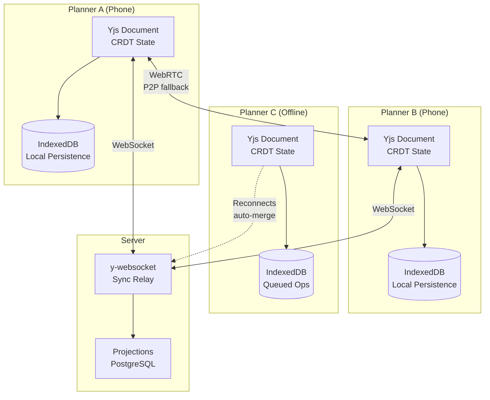
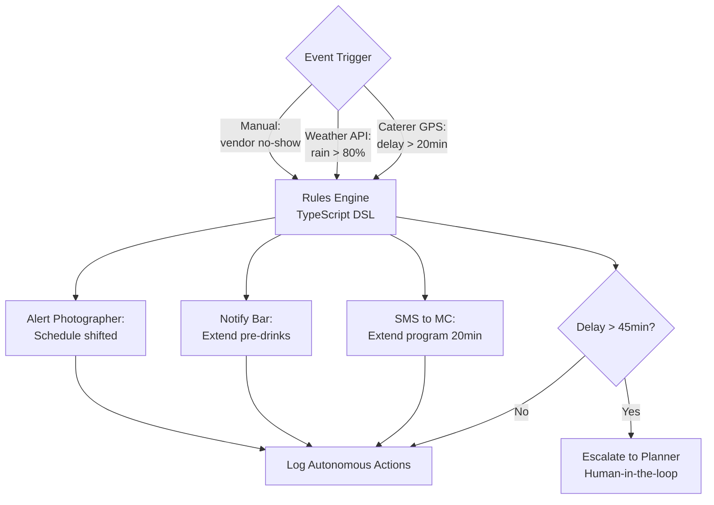
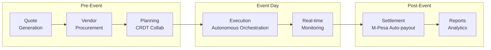

# Sherehe

---

## Overview

**Sherehe** (*"celebration/event" in Swahili*) is an autonomous event orchestration platform for East Africa, covering the full event lifecycle from pre-event planning and pricing through vendor coordination, real-time execution with autonomous contingency handling, and post-event settlement. It handles events ranging from 30-person birthday parties to 10,000-person corporate conferences.

The platform's distinguishing capability is **real-time autonomous orchestration** backed by a CRDT-based offline-first architecture. When a caterer runs late, Sherehe automatically re-sequences the agenda, notifies affected vendors, and escalates to the planner only when thresholds are exceeded -- no human orchestrator in the loop for routine contingencies.

---

## Architecture

### Key Patterns

#### CRDTs (Conflict-free Replicated Data Types)

**Definition:** Data structures mathematically designed so that concurrent modifications by different users always merge to a consistent state without coordination. No central authority needed. No conflict resolution dialogs. The math guarantees convergence.

**Why it fits Sherehe:** 3 planners edit the same wedding event simultaneously on phones at a Kenyan venue with spotty WiFi. Traditional databases would produce "conflict: user A changed field X while user B changed field Y -- which wins?" CRDTs eliminate this entirely. Every edit is a CRDT operation; every merge is provably correct. This is the same technology Figma uses for real-time collaborative design.

**Application:** Yjs library manages the event document as a CRDT. The vendor list, timeline, budget, and guest list are all CRDT types (Y.Map, Y.Array, Y.Text). Three planners can edit the guest list, timeline, and budget simultaneously -- all changes merge cleanly. IndexedDB persists the CRDT state locally for offline access.

#### Offline-First / Local-First Architecture

**Definition:** The application works fully without network connectivity. Data lives on the client first (IndexedDB); the server is a sync relay, not the source of truth. When connectivity returns, changes sync automatically.

**Why it fits Sherehe:** Kenyan venues (KICC, rural retreats, beach hotels) frequently have unreliable or no WiFi. Event day is the one day the app MUST work -- and it is the day connectivity is least reliable (hundreds of attendees overwhelming cell towers). An app that shows a spinner when offline is useless. Local-first means the app behaves identically whether connected or not.

**Application:** All event data cached in IndexedDB via Dexie.js. CRDT operations applied locally first, queued for sync. When online, y-websocket syncs with server. WebRTC peer-to-peer fallback for venue scenarios where server is unreachable but other planners are nearby on the same WiFi.

#### Autonomous Orchestration Engine

**Definition:** A rules-based execution engine that takes pre-configured actions in response to real-time events, without human intervention for routine scenarios.

**Why it fits Sherehe:** When a caterer is 30 minutes late to a 300-person corporate conference, manual re-coordination takes 30-60 minutes -- the planner calls the MC, the MC adjusts the program, the bar needs to extend, the photographer needs the updated timeline. During those 30 minutes, the event stalls. Rules-based autonomy handles this in seconds: `when caterer.delay > 20min then notify(mc, "extend_program"); adjust(bar, "extend_service"); alert(photographer, "schedule_shifted")`. The planner reviews the action log, not the action itself.

**Application:** TypeScript rules engine compiled from a DSL. Rules evaluated server-side when events arrive (GPS vendor tracking, weather API, manual updates). Action executors: SMS via Africa's Talking, push notifications, schedule adjustments (CRDT document updates), M-Pesa triggers for backup vendor activation. Safety rails: configurable thresholds, human-in-the-loop escalation, kill switch, dry-run mode.

#### Micro-Frontends

**Definition:** Frontend architecture where independently deployable UI applications compose into a single user experience. Each micro-frontend owns its deployment pipeline, technology choices, and release cadence.

**Why it fits Sherehe:** Sherehe's vendor marketplace features have a completely different release cadence, performance budget, and development team than the planner coordination tools. Coupling them in a monolith means vendor marketplace bugs block planner releases. Micro-frontends let each BFF's frontend ship independently.

**Application:** Planner BFF (Next.js PWA, mobile-first), Vendor BFF (Next.js PWA, marketplace-focused), Client BFF (shareable link, read-mostly, lightweight). Each is a separate Next.js app deployed to Vercel independently.

#### Inherited: BFF, Event-Driven, CQRS, Sagas from Tiers 1-2

### CRDT Sync Architecture

### Autonomous Orchestration Flow

### Event Lifecycle

### Pattern Lineage

- **Inherits:** BFF + Event-Driven (T1), CQRS + Event Sourcing + Sagas (T2)
- **Introduces:** CRDTs + Offline-First + Micro-Frontends + Autonomous Orchestration
- **Carries forward:** CRDTs reused in Unicorns v2 (offline POS inventory sync) and PayGoHub v2 (field installer offline onboarding). Offline-first becomes standard for all field-facing apps.

### Three BFFs

| BFF | Client | Technology | Key Responsibilities |
|-----|--------|------------|----------------------|
| Planner BFF | Next.js PWA (mobile-first) | TypeScript + Fastify | Event planning, CRDT sync, autonomous action controls |
| Vendor BFF | Next.js PWA | TypeScript + Fastify | Marketplace browsing, bidding, earnings dashboard |
| Client BFF | Shareable link, read-mostly | TypeScript + Fastify | View event, approve quotes, make payments |

### Technology Stack

| Layer | Technologies |
|-------|-------------|
| Frontend | Next.js 15+ PWA, React + TypeScript (strict), Tailwind CSS + shadcn/ui, Yjs (CRDT), IndexedDB via Dexie.js, WebRTC via simple-peer |
| Backend | TypeScript + Fastify (BFFs), Node.js workers (orchestration engine) |
| Data | PostgreSQL (projections, accounts), Redis (session, pub/sub), S3 / Cloudflare R2 (images, PDFs), Yjs document store |
| Integrations | M-Pesa Daraja (payments), Africa's Talking (SMS), OpenWeatherMap, Google Maps, Twilio (voice backup), OpenAI or Gemini (planning assist) |
| Infrastructure | Vercel (frontend), Fly.io (BFFs, Nairobi region), AWS (data + orchestration engine), Ably or self-hosted (real-time sync) |

---

## Requirements

| ID | Epic | Requirement | Priority |
|----|------|-------------|----------|
| REQ-001 | Pre-Event Planning | Generate a complete event quote in under 30 minutes based on event type, size, date, and location | P0 |
| REQ-002 | Pre-Event Planning | Forecast inventory and package pricing based on seasonal demand and vendor availability | P1 |
| REQ-003 | Collaborative Planning | Multi-user simultaneous editing of event plans via CRDTs without conflict dialogs | P0 |
| REQ-004 | Collaborative Planning | Full offline editing with automatic sync on reconnection | P0 |
| REQ-005 | Autonomous Orchestration | Autonomously handle routine execution-day contingencies (vendor delays, schedule adjustments, notifications) | P0 |
| REQ-006 | Autonomous Orchestration | Pre-configured contingency packages (rain plan, power outage, no-show) activatable with one tap or autonomously | P1 |
| REQ-007 | Vendor Marketplace | Vendors receive relevant booking opportunities and can submit bids within 5 minutes | P1 |
| REQ-008 | Post-Event Settlement | Automatic vendor payment settlement after event completion via M-Pesa with escrow for disputes | P1 |

---

## Acceptance Criteria

### Epic: Pre-Event Planning and Pricing

- [ ] System suggests vendor categories and provides 3-5 vendor options with benchmarked pricing per category
- [ ] Total budget estimate with line items generated; quote PDF produced in under 5 minutes
- [ ] Adjusting any line item recalculates the total in real-time
- [ ] Client can view and approve quote via shareable link
- [ ] System flags underpriced line items vs historical benchmarks (requires 50+ historical events)
- [ ] Seasonal pricing adjustments suggested (e.g., December weddings +25%)
- [ ] Warning when critical vendors are unavailable on requested date

### Epic: Real-Time Collaborative Planning

- [ ] Three concurrent users editing different fields merge automatically via CRDTs
- [ ] Each user sees others' changes within 5 seconds when online
- [ ] Offline changes merge cleanly on reconnection without user intervention
- [ ] Full event history log shows who changed what and when
- [ ] All features (edit, view, add notes, log decisions) continue working offline
- [ ] Changes persisted locally in IndexedDB; sync within 30 seconds of reconnection

### Epic: Autonomous Execution-Day Orchestration

- [ ] When vendor arrival is 20+ minutes late: auto-notify MC, adjust bar, alert photographer, escalate at 45+ minutes
- [ ] Planner can view autonomous action log in real-time
- [ ] Planner can override any autonomous action with one tap
- [ ] Weather API triggers "Rain Plan Ready" prompt when rain probability exceeds 80% within 2 hours
- [ ] One-tap contingency activation triggers SMS, decor team, MC script, and photography plan adjustments
- [ ] Autonomous activation is opt-in per contingency type

### Epic: Vendor Marketplace and Bidding

- [ ] Vendor receives RFP notification within 10 minutes of posting
- [ ] Vendor can submit bid with pricing and availability in under 5 minutes
- [ ] Planner sees bid alongside 2-4 competitors
- [ ] Selected vendor gets booking confirmation + 50% deposit via M-Pesa immediately

### Epic: Post-Event Settlement

- [ ] Final payments triggered for each vendor on event completion (minus deposits)
- [ ] Commission deductions apply automatically
- [ ] M-Pesa transfers execute within 1 hour
- [ ] Settlement report generated for planner records
- [ ] Disputed line items held in escrow pending resolution

---

## Non-Functional Requirements

### Performance

| Metric | Target |
|--------|--------|
| Quote generation (P95) | < 5 minutes |
| Page load (P95, on 3G) | < 3 seconds |
| CRDT sync latency when online (P95) | < 5 seconds |
| Offline-to-online reconciliation (P95) | < 30 seconds |
| Contingency auto-activation (P95) | < 60 seconds from trigger |
| Autonomous action log updates | < 2 seconds |

### Availability

| Component | Target |
|-----------|--------|
| Planner BFF | 99.9% |
| Sync service | 99.95% |
| Autonomous orchestration engine | 99.99% |
| Vendor marketplace | 99.5% |

### Offline-First Capabilities

| Available Offline | Not Required Offline |
|-------------------|----------------------|
| All event data readable | Real-time sync with teammates |
| New edits (saved to IndexedDB) | Vendor marketplace (search/bidding) |
| Check-ins and vendor arrival logging | Autonomous orchestration triggers |
| Notes and photos | |
| Vendor contact info | |
| Contingency plans | |

### Accessibility

| Requirement | Standard |
|-------------|----------|
| Compliance level | WCAG 2.1 AA |
| Screen reader | All planning flows |
| Keyboard navigation | Full support |
| Visual | High-contrast mode |
| Localization | Swahili + English |

---

## Success Metrics

### Business Metrics (End of Week 15)

| Metric | Target |
|--------|--------|
| Active planners on platform | 25 |
| Paying planners (any tier) | 10 |
| Events managed through platform | 50+ |
| Monthly Recurring Revenue | $500+ |
| Transaction fee revenue | $200+ |

### Product Metrics

| Metric | Target |
|--------|--------|
| Quote generation time (avg) | < 20 min (vs 2-3 day baseline) |
| Planner NPS | > 40 |
| Events using autonomous orchestration | 50%+ |
| Offline session completion rate | > 99% |

### Technical Metrics

| Metric | Target |
|--------|--------|
| CRDT merge conflict rate | < 0.1% |
| Event day execution error rate | < 2% |
| Sync success rate | > 99.5% |

---

## Definition of Done

- [ ] All user stories have passing acceptance tests
- [ ] CRDT sync tested with 5+ concurrent users, no data loss
- [ ] Offline-to-online sync works 100% reliably in testing
- [ ] Autonomous orchestration engine with 10+ rule templates deployed
- [ ] M-Pesa payment integration live
- [ ] 10 paying planners onboarded
- [ ] Security audit passed
- [ ] Accessibility audit passed (WCAG 2.1 AA)
- [ ] Documentation: user guide, vendor onboarding guide, API docs
- [ ] On-call rotation active for event-day incidents

---

## Commercial

| Tier | Price | Features | Target |
|------|-------|----------|--------|
| Sherehe-Free | $0/mo | 1 event/month, basic features | Trial, one-off planners |
| Sherehe-Solo | $49/mo | Unlimited events, 1 planner, basic autonomous rules | Solo planners |
| Sherehe-Team | $149/mo | 5 planners, advanced autonomy, vendor marketplace access | Small firms |
| Sherehe-Pro | $499/mo | Unlimited planners, custom rules, white-label client views | Established firms |
| Transaction fees | 2-3% on vendor bookings | All tiers | Marketplace revenue |
