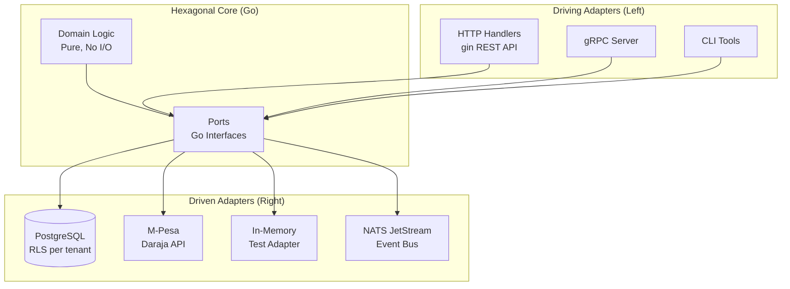
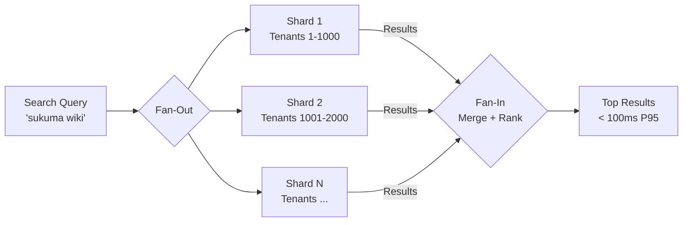
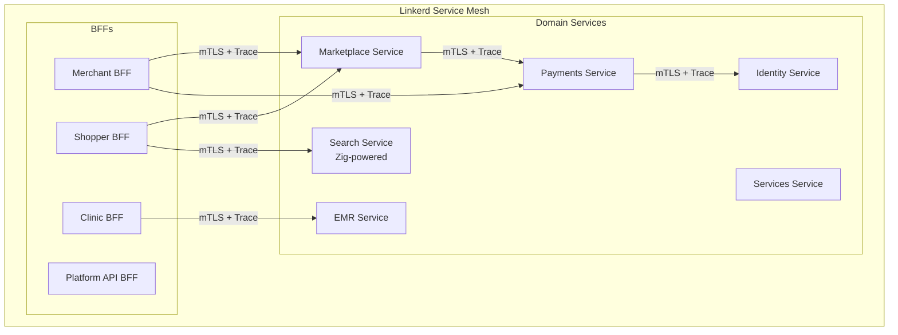

# Unicorns v2


---

## Overview

Unicorns v2 is the architectural refactor that takes an existing multi-tenant SaaS marketplace for African SMBs from "works for 100 tenants" to "architecturally ready for 10,000 tenants." The platform restructures 5 existing Rust Lambda microservices around hexagonal architecture (ports and adapters) with service-mesh-managed cross-cutting concerns, adding Zig-powered performance adapters for search and image processing. The commercial target is the 45M+ African SMBs underserved by Western SaaS -- native M-Pesa checkout, offline-capable POS, healthcare EMR module, and service bookings, all multi-tenant.

---

## Architecture

### Hexagonal Structure

Each bounded context follows ports and adapters. Domain code is pure (no I/O, no framework). Ports are Go interfaces. Adapters handle HTTP, database, M-Pesa, and in-memory implementations for testing. Application services orchestrate domain logic through ports.

```
<context>/
  domain/       # Aggregate roots, value objects, ports (pure Go)
  adapter/       # HTTP, Postgres, in-memory, M-Pesa implementations
  application/   # Service orchestration using ports
  *_test.go      # Domain tests against in-memory adapters
```



### Patterns

#### Hexagonal Architecture (Ports and Adapters)

**Definition:** Domain logic sits at the center with zero dependencies on infrastructure. "Ports" are interfaces that the domain defines (e.g., `ProductRepository`, `PaymentGateway`). "Adapters" implement those interfaces for specific technologies (PostgreSQL, M-Pesa, in-memory for tests). The domain never imports anything from the infrastructure layer.

**Justification:** Unicorns has 6 bounded contexts (Identity, Marketplace, Payments, EMR, Services, Search) that must evolve independently. Without hexagonal separation, adding a "loyalty points" feature would require touching database code, HTTP handlers, M-Pesa integration, and test infrastructure simultaneously. With ports, you write pure domain logic (`func (s *LoyaltyService) AwardPoints(customerID, points)`) that uses `CustomerStore` and `PaymentGateway` ports -- the infrastructure is pluggable. Tests run against in-memory adapters in milliseconds. Production uses PostgreSQL and M-Pesa adapters. Switching from M-Pesa to bank transfer means writing ONE new adapter.

**Application:** Each bounded context in Go has: `domain/` (pure logic, no I/O), `domain/ports.go` (Go interfaces), `adapter/postgres/` (real DB), `adapter/memory/` (tests), `adapter/mpesa/` (payments), `adapter/http/` (REST handlers). Unit tests run against memory adapters in under 2 seconds.

#### Service Mesh (Linkerd)

**Definition:** An infrastructure layer deployed alongside application services that handles cross-cutting concerns (mTLS encryption, retries, circuit breaking, distributed tracing, rate limiting) at the network level. Services don't implement any of this -- the mesh proxy (sidecar) handles it transparently.

**Justification:** 6 bounded contexts + 4 BFFs = 10+ services. Each service communicating with 3-5 others means 30-50 service-to-service connections. If each service re-implements authentication, retry logic, mTLS, and tracing, that's 10 copies of the same cross-cutting code -- each with its own bugs and drift. The mesh handles all of this once, at the network level, with zero business logic changes. Adding mTLS to all services takes zero lines of code -- just enable it in the mesh policy.

**Application:** Linkerd deployed on EKS. Every pod gets a sidecar proxy. All inter-service traffic is automatically mTLS-encrypted (automatic cert rotation). Failed idempotent requests retry 3x with exponential backoff. Circuit breakers open after 10 consecutive failures. Every request carries a trace-id visible in Grafana/Tempo. Per-tenant rate limiting enforced at mesh layer (noisy tenants can't starve others).

#### Fan-Out/Fan-In

**Definition:** A concurrency pattern where a single request is split into multiple parallel sub-requests (fan-out), results are collected and merged (fan-in). Enables parallel processing of independent work items.

**Justification:** Marketplace search across 10,000+ tenants can't query each tenant's product catalog serially -- that would take seconds. Fan-out parallelizes the search across tenant shards. Fan-in aggregates results, applies cross-tenant ranking, and returns the top matches. Similarly, Zig's search tokenizer processes multiple concurrent text streams.

**Application:** Search query arrives at Search BFF, fans out to N tenant shard workers (goroutines), each shard runs the Zig-powered BM25 inverted index, results fan back in via channels, merged, ranked, returned. All within the 100ms P95 target.



#### CRDTs (Conflict-free Replicated Data Types) -- Inherited from Tier 3

**Definition:** Data structures that can be replicated across nodes and updated independently without coordination, guaranteeing eventual consistency through mathematically proven merge semantics. Updates never conflict -- all replicas converge to the same state regardless of the order operations are received.

**Justification:** Offline POS is a hard requirement for African SMBs on unreliable WiFi. A shop that loses connectivity mid-sale must continue processing transactions. Traditional database sync would produce conflicts (two nodes decrement the same inventory item). CRDTs eliminate this -- a G-Counter for sales counts and a PN-Counter for inventory levels merge deterministically. No conflict resolution logic, no last-write-wins data loss.

**Application:** A shop loses WiFi mid-sale. POS processes the transaction locally: item selection, M-Pesa direct/cash payment, receipt print. Inventory adjusts locally via CRDT (PN-Counter decrements stock). When WiFi returns, transactions sync to server automatically. Inventory reconciles without conflicts (CRDTs resolve by mathematical guarantee). M-Pesa payments reconcile via webhook upon reconnection.

#### Inherited Patterns from Tiers 1-2

**BFF (Backend for Frontend) -- Tier 1:** Dedicated API gateways per client type (Merchant, Shopper, Clinic, Platform API). Each BFF aggregates calls to bounded contexts and shapes responses for its specific client, preventing a single monolithic API from serving conflicting client needs.

**Event-Driven Architecture (NATS JetStream) -- Tier 1:** Services communicate asynchronously through events rather than synchronous RPC. When a payment completes, the Payments context publishes `PaymentCompleted` -- Marketplace updates order status, EMR updates billing, and Search re-indexes, all without Payments knowing about any of them.

**CQRS (Command Query Responsibility Segregation) -- Tier 2:** Separate models for reads and writes. Write operations go through domain aggregates enforcing business rules. Read operations hit denormalized projections optimized for query patterns. The merchant dashboard reads from a pre-computed projection updated by events, not from the write model.

**Sagas -- Tier 2:** Long-running business transactions spanning multiple bounded contexts use choreography-based sagas. Checkout spans Marketplace (reserve inventory), Payments (charge M-Pesa), and Services (book appointment) -- if any step fails, compensating actions roll back prior steps.

**Event Sourcing -- Tier 2:** State is stored as an append-only sequence of events rather than mutable rows. Payment history, audit trails, and EMR visit records are naturally event-sourced -- every state change is captured, enabling full replay and audit compliance.

#### Pattern Lineage

- **Inherits:** All Tier 1-3 patterns (BFF, Event-Driven, CQRS, Sagas, Event Sourcing, CRDTs)
- **Introduces:** Hexagonal Architecture + Service Mesh + Fan-Out/Fan-In
- **Carries forward:** Hexagonal becomes the structural backbone for ALL subsequent tiers. Every bounded context in T5a (Shamba), T5b (BSD Engine), and T6 (PayGoHub) uses ports and adapters. Service mesh carries to T6 (PayGoHub on AKS with Linkerd). Fan-out/fan-in reappears in T5a (parallel M-Pesa disbursements across 3,500 farmers).

### Bounded Contexts

| Context | Responsibility |
|---------|----------------|
| **Identity** | User accounts, tenants, authentication, authorization |
| **Marketplace** | Product catalog, orders, pricing, tenant isolation |
| **Payments** | M-Pesa orchestration, wallets, settlements, reconciliation |
| **EMR** | Patient records, prescriptions, NHIF claims (healthcare tenants) |
| **Services** | Appointment booking, calendars, deposits (service providers) |
| **Search** | Indexing, querying, tenant-scoped results (Zig adapter) |

### BFFs

| BFF | Client | Technology | Key Endpoints |
|-----|--------|------------|---------------|
| Merchant BFF | Web admin (PWA) | Go + gin | `POST /storefront`, `GET /orders/dashboard`, `POST /inventory/bulk` |
| Shopper BFF | Mobile app (RN / PWA) | Go + gin | `GET /catalog/search`, `POST /cart`, `POST /checkout` |
| Clinic BFF | Clinic staff web + mobile | Go + gin | `GET /patients`, `POST /visits`, `POST /prescriptions` |
| Platform API BFF | Third-party integrations | Go + gin | OAuth 2.0 API, webhook delivery, partner data exports |

### Zig Performance Adapters

Called from Go via C FFI for performance-critical paths:

| Adapter | Purpose |
|---------|---------|
| Full-text search | BM25 ranking, inverted index, custom Swahili/Kikuyu tokenizer |
| Image thumbnailing | Fast WebP generation for product catalogs |
| Fuzzy matching | Levenshtein + trigram for search "did you mean" |
| PDF generation | Dependency-free PDF for receipts and invoices |

### Service Mesh (Linkerd)

The mesh handles mTLS (automatic cert rotation), distributed tracing (OpenTelemetry), traffic management (canary deployments, traffic splitting), circuit breakers, retries with exponential backoff, per-tenant rate limiting, and cross-tenant traffic denial at the network level. Services retain ownership of business logic, domain-specific authorization, and tenant data isolation.



---

## Requirements

| ID | User Story | Epic |
|----|-----------|------|
| 4.1.1 | As a new SMB, I want to be operational in under 15 minutes | Multi-Tenant Onboarding |
| 4.2.1 | As a developer, I want to add features without touching infrastructure code | Hexagonal Domain Core |
| 4.3.1 | As a shop owner on unreliable WiFi, I want to continue processing sales offline | Offline POS |
| 4.4.1 | As an operator, I want every service call encrypted, retried, and traced without per-service implementation | Service Mesh Reliability |
| 4.5.1 | As a clinic manager, I want patient records, prescriptions, and billing in one system | EMR Module |
| 4.6.1 | As a shopper, I want to find products fast in Swahili or English with fuzzy matching | Unified Search (Zig) |

---

## Acceptance Criteria

### Epic 4.1 -- Multi-Tenant Onboarding

- [ ] New tenant provisioned with isolated database schema in under 30 seconds given phone number and basic business info
- [ ] Default storefront, POS, and basic inventory structure created on signup
- [ ] M-Pesa till number validated and linked
- [ ] SMS sent with login credentials and getting-started link
- [ ] First successful transaction possible within 15 minutes of signup

### Epic 4.2 -- Hexagonal Domain Core

- [ ] New features use pure domain logic through existing ports (PaymentGateway, CustomerStore)
- [ ] No infrastructure code (HTTP, database, M-Pesa API) appears in the domain layer
- [ ] Unit tests run in under 2 seconds with no external dependencies
- [ ] Features work with in-memory adapter for dev and real adapter in production

### Epic 4.3 -- Offline POS

- [ ] Transactions complete locally when WiFi drops (item selection, M-Pesa direct/cash, receipt print)
- [ ] Inventory adjusts locally via CRDT
- [ ] Transactions sync to server automatically when WiFi returns
- [ ] Inventory reconciles without conflicts (CRDTs resolve)
- [ ] M-Pesa transactions reconcile via webhook upon reconnection

### Epic 4.4 -- Service Mesh Reliability

- [ ] All service-to-service communication is mTLS-encrypted
- [ ] Failed requests retry automatically per policy (3 retries with backoff on idempotent calls)
- [ ] Every request has a trace-id propagated end-to-end
- [ ] Full request path viewable in Grafana/Tempo within 30 seconds
- [ ] Circuit breakers open after 10 consecutive failures

### Epic 4.5 -- EMR Module

- [ ] Patient visits saved with full HIPAA-style audit trail
- [ ] Prescriptions flow to pharmacy module with automatic inventory deduction
- [ ] NHIF claims generated in correct format
- [ ] Patient data isolated from other tenants (enforced at adapter layer)

### Epic 4.6 -- Unified Search (Zig)

- [ ] Matching products appear in under 100ms for 100,000+ product catalog
- [ ] Results include exact, synonym (Swahili/English), and fuzzy matches
- [ ] Personalization ranks results by prior browsing/purchases
- [ ] Tenant filtering respected (merchant-scoped results only)

---

## Non-Functional Requirements

### Performance

| Metric | Target |
|--------|--------|
| API response (P95) | < 200ms |
| Search query (P95) | < 100ms |
| Tenant provisioning | < 30s |
| POS transaction (online) | < 2s |
| POS transaction (offline) | < 500ms (fully local) |
| Image thumbnail generation (Zig) | < 50ms per image |
| Service mesh overhead | < 5ms per hop |

### Availability

| Component | Target |
|-----------|--------|
| Merchant BFF | 99.95% |
| Shopper BFF | 99.9% |
| Payments core | 99.99% |
| Marketplace core | 99.9% |
| EMR core | 99.95% |
| Search service | 99.5% (graceful degradation to basic ILIKE) |

### Scalability

| Requirement | Detail |
|-------------|--------|
| Tenant capacity | 10,000+ without architectural changes |
| Data isolation | Per-tenant RLS enforced at adapter layer |
| Noisy neighbor protection | Per-tenant rate limiting at the mesh |
| Horizontal scaling | Any service, zero downtime |

### Security

| Concern | Implementation |
|---------|---------------|
| Multi-tenancy isolation | Row-level security in PostgreSQL; tenant-id in every query; automated cross-tenant leak tests |
| Payment security | Hexagonal port for M-Pesa Daraja; webhook signature validation; idempotency keys on all monetary operations |
| Healthcare compliance | HIPAA-equivalent controls; audit log for every PHI access; encryption at rest |
| Authentication | OIDC via Auth0 or Keycloak; per-tenant SSO for enterprise |
| Authorization | Fine-grained RBAC + ABAC; tenant-admin custom roles |
| Mesh-level | mTLS between all services; zero-trust policy enforcement |

---

## Success Metrics

### Business Metrics (End of Week 15)

| Metric | Target |
|--------|--------|
| Active tenants | 20 (up from ~5 in v1) |
| Paying tenants | 5 |
| Total transaction volume | KES 2M+ (~$15K+) |
| Transaction fee revenue (1.5%) | $225+ |
| Subscription revenue | $500+ |

### Technical Metrics

| Metric | Target |
|--------|--------|
| Cross-context coupling | Measurably lower (cleaner dependency graph) |
| Feature development velocity | 2x+ improvement vs v1 |
| Service mesh trace coverage | 100% of inter-service calls |
| Cross-tenant data leaks | Zero (verified by automated security tests) |
| Platform-wide uptime | 99.9%+ |

### Architectural Metrics

| Metric | Target |
|--------|--------|
| Bounded contexts | 6+ (marketplace, payments, EMR, services, identity, search) |
| Contexts with defined ports | 100% |
| Contexts with swappable adapters | 100% |
| Service mesh coverage | 100% of service-to-service calls |

---

## Definition of Done

- [ ] All 6 bounded contexts have hexagonal structure with defined ports
- [ ] Service mesh operational with mTLS and 100% trace coverage
- [ ] Zig adapters in production for search, image thumbnailing
- [ ] Offline POS works end-to-end with CRDT sync
- [ ] 20 active tenants; 5 paying; no regressions vs v1
- [ ] Per-tenant dashboards live
- [ ] Security audit passed (including multi-tenancy isolation)
- [ ] Disaster recovery tested (full restore)
- [ ] Documentation: architecture overview, per-context guides, operator runbook
- [ ] AWS Solutions Architect Associate cert obtained

---

## Commercial

| Tier | Price | Features |
|------|-------|----------|
| **Starter** | Free | 1 store, basic inventory, M-Pesa checkout |
| **Growth** | $25/mo | 3 stores, analytics, AI recommendations, customer management |
| **Business** | $75/mo | Unlimited stores, EMR module, multi-user, API access |
| **Transaction fee** | 1.5% on M-Pesa payments | All tiers |
