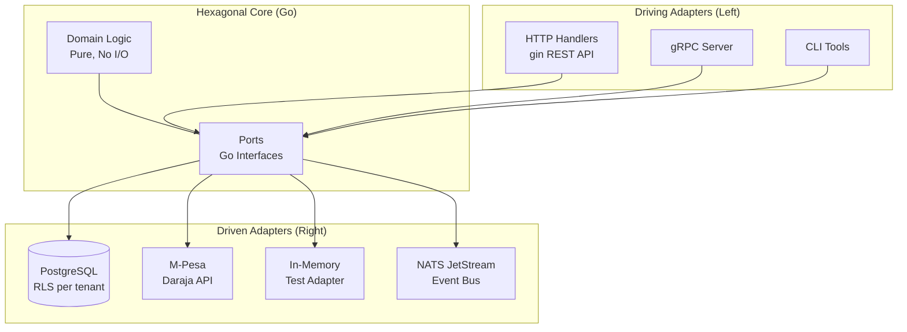
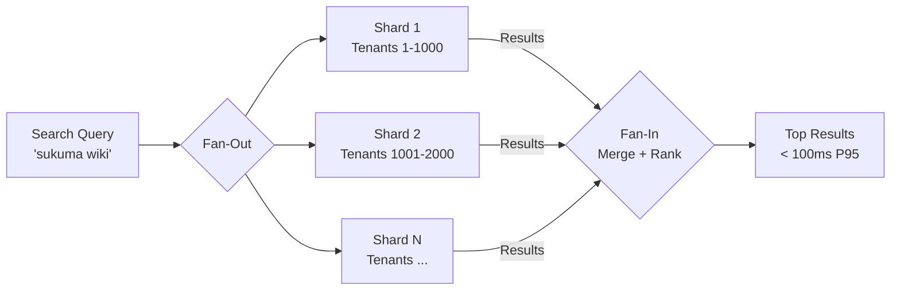
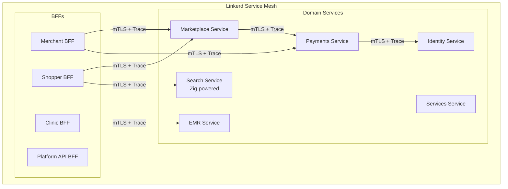

# Unicorns v2


---

## Overview

Unicorns v2 is the architectural refactor that takes an existing multi-tenant SaaS marketplace for African SMBs from "works for 100 tenants" to "architecturally ready for 10,000 tenants." The platform restructures 5 existing Rust Lambda microservices around hexagonal architecture (ports and adapters) with service-mesh-managed cross-cutting concerns, adding Zig-powered performance adapters for search and image processing. The commercial target is the 45M+ African SMBs underserved by Western SaaS -- native M-Pesa checkout, offline-capable POS, healthcare EMR module, and service bookings, all multi-tenant.

---

## Architecture

### Hexagonal Structure

Each bounded context follows ports and adapters. Domain code is pure (no I/O, no framework). Ports are Go interfaces. Adapters handle HTTP, database, M-Pesa, and in-memory implementations for testing. Application services orchestrate domain logic through ports.

```
<context>/
  domain/       # Aggregate roots, value objects, ports (pure Go)
  adapter/       # HTTP, Postgres, in-memory, M-Pesa implementations
  application/   # Service orchestration using ports
  *_test.go      # Domain tests against in-memory adapters
```



### Patterns

#### Hexagonal Architecture (Ports and Adapters)

**Definition:** Domain logic sits at the center with zero dependencies on infrastructure. "Ports" are interfaces that the domain defines (e.g., `ProductRepository`, `PaymentGateway`). "Adapters" implement those interfaces for specific technologies (PostgreSQL, M-Pesa, in-memory for tests). The domain never imports anything from the infrastructure layer.

**Justification:** Unicorns has 6 bounded contexts (Identity, Marketplace, Payments, EMR, Services, Search) that must evolve independently. Without hexagonal separation, adding a "loyalty points" feature would require touching database code, HTTP handlers, M-Pesa integration, and test infrastructure simultaneously. With ports, you write pure domain logic (`func (s *LoyaltyService) AwardPoints(customerID, points)`) that uses `CustomerStore` and `PaymentGateway` ports -- the infrastructure is pluggable. Tests run against in-memory adapters in milliseconds. Production uses PostgreSQL and M-Pesa adapters. Switching from M-Pesa to bank transfer means writing ONE new adapter.

**Application:** Each bounded context in Go has: `domain/` (pure logic, no I/O), `domain/ports.go` (Go interfaces), `adapter/postgres/` (real DB), `adapter/memory/` (tests), `adapter/mpesa/` (payments), `adapter/http/` (REST handlers). Unit tests run against memory adapters in under 2 seconds.

#### Service Mesh (Linkerd)

**Definition:** An infrastructure layer deployed alongside application services that handles cross-cutting concerns (mTLS encryption, retries, circuit breaking, distributed tracing, rate limiting) at the network level. Services don't implement any of this -- the mesh proxy (sidecar) handles it transparently.

**Justification:** 6 bounded contexts + 4 BFFs = 10+ services. Each service communicating with 3-5 others means 30-50 service-to-service connections. If each service re-implements authentication, retry logic, mTLS, and tracing, that's 10 copies of the same cross-cutting code -- each with its own bugs and drift. The mesh handles all of this once, at the network level, with zero business logic changes. Adding mTLS to all services takes zero lines of code -- just enable it in the mesh policy.

**Application:** Linkerd deployed on EKS. Every pod gets a sidecar proxy. All inter-service traffic is automatically mTLS-encrypted (automatic cert rotation). Failed idempotent requests retry 3x with exponential backoff. Circuit breakers open after 10 consecutive failures. Every request carries a trace-id visible in Grafana/Tempo. Per-tenant rate limiting enforced at mesh layer (noisy tenants can't starve others).

#### Fan-Out/Fan-In

**Definition:** A concurrency pattern where a single request is split into multiple parallel sub-requests (fan-out), results are collected and merged (fan-in). Enables parallel processing of independent work items.

**Justification:** Marketplace search across 10,000+ tenants can't query each tenant's product catalog serially -- that would take seconds. Fan-out parallelizes the search across tenant shards. Fan-in aggregates results, applies cross-tenant ranking, and returns the top matches. Similarly, Zig's search tokenizer processes multiple concurrent text streams.

**Application:** Search query arrives at Search BFF, fans out to N tenant shard workers (goroutines), each shard runs the Zig-powered BM25 inverted index, results fan back in via channels, merged, ranked, returned. All within the 100ms P95 target.



#### CRDTs (Conflict-free Replicated Data Types) -- Inherited from Tier 3

**Definition:** Data structures that can be replicated across nodes and updated independently without coordination, guaranteeing eventual consistency through mathematically proven merge semantics. Updates never conflict -- all replicas converge to the same state regardless of the order operations are received.

**Justification:** Offline POS is a hard requirement for African SMBs on unreliable WiFi. A shop that loses connectivity mid-sale must continue processing transactions. Traditional database sync would produce conflicts (two nodes decrement the same inventory item). CRDTs eliminate this -- a G-Counter for sales counts and a PN-Counter for inventory levels merge deterministically. No conflict resolution logic, no last-write-wins data loss.

**Application:** A shop loses WiFi mid-sale. POS processes the transaction locally: item selection, M-Pesa direct/cash payment, receipt print. Inventory adjusts locally via CRDT (PN-Counter decrements stock). When WiFi returns, transactions sync to server automatically. Inventory reconciles without conflicts (CRDTs resolve by mathematical guarantee). M-Pesa payments reconcile via webhook upon reconnection.

#### BFF (Backend For Frontend) -- Inherited from Tier 1

**Definition:** A dedicated backend service per frontend consumer type. Instead of one monolithic API serving all consumers with a lowest-common-denominator contract, each client type (merchant admin, mobile shopper, clinic staff, third-party integrator) gets a purpose-built backend that handles protocol translation, data aggregation from multiple bounded contexts, response shaping, and access control specific to that consumer's workflow. The BFF owns the "last mile" between domain services and the client -- it decides what data to fetch, how to combine it, and what format to return.

**Why BFF fits Unicorns:** Unicorns serves four radically different consumer types with conflicting API needs. A merchant managing 400 SKUs needs bulk inventory endpoints that return paginated product lists with stock levels, pricing history, and supplier metadata. A mobile shopper needs a lightweight catalog search endpoint optimized for 3G connections that returns only product name, price, thumbnail URL, and availability -- no supplier data, no pricing history. A clinic staff member needs patient-centric endpoints that aggregate visit history, prescriptions, and billing in a single response. A third-party integrator needs versioned, contract-stable REST endpoints with OAuth 2.0 authentication and webhook delivery. A single API serving all four would either over-fetch for mobile (wasting bandwidth on 3G), under-fetch for merchants (requiring multiple round-trips), or create authorization complexity where every endpoint must check "which client type is calling and what fields should I include." Four BFFs eliminate this tension entirely -- each BFF is a thin, focused service that calls exactly the bounded contexts it needs and returns exactly the shape its client expects.

**Application in Unicorns:**

- **Merchant BFF** (Go + gin, REST) -- Serves the merchant web admin PWA. Aggregates calls to Marketplace (product catalog, orders), Payments (settlement history, M-Pesa reconciliation), and Identity (staff accounts, roles). Key endpoints: `POST /storefront` (create/update storefront config), `GET /orders/dashboard` (aggregated order metrics from Marketplace + Payments projections), `POST /inventory/bulk` (batch inventory updates). Returns full-fidelity data with pagination, filtering, and sorting for desktop screen densities.
- **Shopper BFF** (Go + gin, REST) -- Serves the mobile app (React Native / PWA). Optimized for low-bandwidth connections: responses are minimal JSON with CDN-hosted image URLs. Aggregates calls to Search (product discovery via Zig adapter), Marketplace (cart, checkout), and Payments (M-Pesa STK push initiation). Key endpoints: `GET /catalog/search` (proxies to Zig-powered search, returns lightweight product cards), `POST /cart` (cart management against Marketplace context), `POST /checkout` (orchestrates the checkout saga across Marketplace, Payments, and Services).
- **Clinic BFF** (Go + gin, REST) -- Serves the clinic staff web and mobile interfaces. Aggregates calls to EMR (patient records, prescriptions, visit history), Payments (NHIF claim status, billing), and Identity (staff authentication, role-based access to PHI). Key endpoints: `GET /patients` (patient list with last-visit summary), `POST /visits` (record a visit with diagnosis, prescription, and billing in a single call), `POST /prescriptions` (create prescription and trigger pharmacy inventory deduction).
- **Platform API BFF** (Go + gin, REST + webhooks) -- Serves third-party integrators. Exposes versioned REST endpoints (`/v1/products`, `/v1/orders`, `/v1/transactions`) with OAuth 2.0 client credentials authentication. Delivers `OrderCompleted`, `PaymentReceived`, and `InventoryChanged` webhooks with HMAC-SHA256 signed payloads, exponential backoff retry up to 24 hours, and idempotency keys for deduplication. Partner data exports available as CSV or JSON bulk downloads.

#### Event-Driven Architecture (NATS JetStream) -- Inherited from Tier 1

**Definition:** System components communicate by producing and consuming events asynchronously through a message broker or event stream. Producers emit events (facts about something that happened) into a stream without knowing or caring who consumes them. Consumers subscribe to event streams and process at their own pace. This decouples components in both time (consumers can lag behind producers without data loss, thanks to stream persistence) and space (producers and consumers can be deployed, scaled, and failed independently without direct dependency).

**Why Event-Driven fits Unicorns:** Unicorns has 6 bounded contexts that must react to each other's state changes without creating direct dependencies. When a payment completes, at least three things must happen: the Marketplace context updates the order status to "paid," the EMR context updates the visit's billing status (if the order is a clinic appointment), and the Search context re-indexes the product's popularity score. In a synchronous request/response architecture, the Payments service would need to import and call Marketplace, EMR, and Search APIs directly -- creating a web of compile-time dependencies that makes independent deployment impossible and turns every failure in a downstream service into a failure in Payments. With events, the Payments context publishes a single `PaymentCompleted` event to NATS JetStream. Marketplace, EMR, and Search each subscribe independently. If Search is down for maintenance, the event waits in the JetStream durable subscription until Search recovers and processes it -- no data loss, no Payments failure, no retry logic in the producer. NATS JetStream is chosen over Kafka for operational simplicity (single binary, no ZooKeeper, lower resource footprint) while still providing at-least-once delivery guarantees, consumer groups, and replay from any point in the stream.

**Application in Unicorns:**

- **Event Bus:** NATS JetStream deployed as a 3-node cluster on EKS. Each bounded context publishes domain events to context-specific subjects (e.g., `payments.events.PaymentCompleted`, `marketplace.events.OrderCreated`, `emr.events.VisitRecorded`). Each consuming context subscribes via durable consumer groups with explicit acknowledgment.
- **Key Event Flows:** `PaymentCompleted` triggers order status update in Marketplace, billing update in EMR, and popularity re-index in Search. `OrderCreated` triggers inventory reservation in Marketplace and appointment hold in Services. `TenantProvisioned` triggers schema creation in every context's database adapter, default storefront setup in Marketplace, and welcome SMS via a notification adapter.
- **Saga Coordination:** Choreography-based sagas (see Sagas pattern below) use events as the coordination mechanism. Each saga step publishes a completion event that triggers the next step in a different context, with compensating events for rollback.
- **Event Schema:** All events are versioned Protocol Buffers with a common envelope (event-id, timestamp, tenant-id, correlation-id, causation-id) enabling cross-context tracing and replay.

#### CQRS (Command Query Responsibility Segregation) -- Inherited from Tier 2

**Definition:** Command Query Responsibility Segregation is an architectural pattern that separates the model used for writing data (the command model, also called the write model) from the model used for reading data (the query model, also called the read model or projection). Commands mutate state through domain aggregates that enforce business rules and invariants. Queries read from denormalized, pre-computed projections optimized for specific read patterns. The write model and read model are kept in sync asynchronously via events -- when a command changes state, the resulting domain event is consumed by a projection builder that updates the read model.

**Why CQRS fits Unicorns:** Unicorns has radically different read and write patterns. A merchant updating a product price is a write operation that must enforce business rules (price cannot be negative, price change must be audited, price change triggers re-indexing). A shopper browsing the catalog is a read operation that needs to query across hundreds of products with filtering, sorting, and pagination -- optimized for speed, not for business rule enforcement. Without CQRS, the same database model serves both, meaning either writes are slow (because the model includes read-optimized indexes and denormalized fields) or reads are slow (because the model is normalized for write integrity). With CQRS, the Marketplace write model is a normalized PostgreSQL schema with strong foreign keys and constraints. The Marketplace read model is a denormalized projection table (or materialized view) with pre-joined product + pricing + stock + tenant data, indexed for the exact query patterns the Shopper BFF uses. The merchant dashboard reads from a separate projection optimized for its analytics queries (sales by day, top products, revenue trends).

**Application in Unicorns:**

- **Write Side:** Commands (`CreateProduct`, `UpdatePrice`, `PlaceOrder`, `RecordVisit`) flow through domain aggregates in each bounded context's `domain/` layer. Aggregates enforce invariants, emit domain events, and persist via the write-side adapter (PostgreSQL with normalized schema).
- **Read Side:** Projection builders consume domain events from NATS JetStream and update denormalized read models. The Shopper BFF queries a `catalog_projection` table with pre-joined product name, price, stock status, merchant name, and thumbnail URL -- a single query returns everything the mobile client needs. The Merchant BFF queries a `dashboard_projection` table with pre-aggregated daily sales, top products, and revenue trends.
- **Consistency:** Write-to-read propagation is eventually consistent (typically under 100ms via NATS). The BFFs handle this by using optimistic UI patterns -- after a merchant updates a price, the BFF returns the new price immediately from the command response, while the projection updates asynchronously in the background.

#### Sagas -- Inherited from Tier 2

**Definition:** A saga is a pattern for managing long-running business transactions that span multiple bounded contexts (or microservices) without using distributed transactions (two-phase commit). Instead of locking resources across services, a saga breaks the transaction into a sequence of local transactions, each within a single bounded context. If any step fails, the saga executes compensating actions to undo the effects of previously completed steps. There are two saga coordination styles: orchestration (a central coordinator directs the steps) and choreography (each service listens for events and decides its next action). Unicorns uses choreography-based sagas, where coordination happens through domain events published to NATS JetStream.

**Why Sagas fit Unicorns:** The Unicorns checkout flow spans three bounded contexts: Marketplace (reserve inventory), Payments (charge via M-Pesa), and optionally Services (book an appointment if the product is a service). A traditional database transaction cannot span these three independent services with separate databases. Two-phase commit (2PC) would require all three services to hold locks simultaneously, creating a distributed deadlock risk and tight coupling. Sagas solve this by making each step independently committable and reversible. If M-Pesa payment fails after inventory is reserved, the Marketplace context receives a `PaymentFailed` event and executes a compensating action: release the reserved inventory. If the appointment booking fails after payment succeeds, the Services context emits `BookingFailed`, which triggers a payment refund in the Payments context and inventory release in Marketplace. Each context owns its own compensating logic, keeping domain knowledge local.

**Application in Unicorns:**

- **Checkout Saga:** (1) Shopper BFF publishes `CheckoutRequested`. (2) Marketplace consumes it, reserves inventory, emits `InventoryReserved`. (3) Payments consumes `InventoryReserved`, initiates M-Pesa STK push, waits for callback, emits `PaymentCompleted` or `PaymentFailed`. (4) On `PaymentCompleted`, Marketplace confirms the order and emits `OrderConfirmed`. On `PaymentFailed`, Marketplace releases inventory via compensating action `InventoryReleased`. (5) If the order includes a service booking, Services consumes `OrderConfirmed`, books the appointment, emits `AppointmentBooked`. If booking fails, `BookingFailed` triggers payment refund and inventory release.
- **Tenant Provisioning Saga:** (1) Identity creates the tenant record and emits `TenantCreated`. (2) Each bounded context consumes `TenantCreated` and provisions its own schema/resources (Marketplace creates storefront, Payments links M-Pesa, EMR provisions patient tables if clinic tenant). (3) If any context fails provisioning, compensating events roll back the partially provisioned tenant.
- **Saga State:** Each saga instance is tracked via a correlation-id in every event. The originating BFF can query saga status by correlation-id to show progress to the user ("Processing payment...", "Booking confirmed!").

#### Event Sourcing -- Inherited from Tier 2

**Definition:** Event sourcing is a persistence pattern where the state of a domain entity is stored as an append-only, immutable sequence of events rather than as mutable rows in a database table. Instead of storing "Product X has price $10 and stock 42" as a single row that gets overwritten on every change, event sourcing stores the full history: `ProductCreated{price: $12}`, `PriceChanged{from: $12, to: $10}`, `StockAdjusted{delta: -8, reason: "sale"}`. The current state is derived by replaying these events in order. Because events are immutable and append-only, the complete history of every state change is preserved, enabling full audit trails, temporal queries ("what was the price last Tuesday?"), and state reconstruction from any point in time.

**Why Event Sourcing fits Unicorns:** Three domains in Unicorns have regulatory or business requirements that demand complete, tamper-evident history. (1) Payments: every M-Pesa transaction, refund, settlement, and reconciliation must be auditable for financial compliance. Overwriting a payment row loses history; event sourcing preserves every state transition. (2) EMR: patient visit records, prescription changes, and billing adjustments must maintain a HIPAA-style audit trail where every access and modification is recorded. Event sourcing makes the audit trail the source of truth, not an afterthought. (3) Marketplace: order lifecycle events (created, paid, shipped, delivered, returned) are naturally a sequence -- event sourcing captures the full lifecycle for dispute resolution and analytics. Beyond compliance, event sourcing enables powerful operational capabilities: replaying events to rebuild read projections (CQRS projections), debugging production issues by replaying the exact event sequence that caused them, and migrating to new data models by replaying events through new projection logic.

**Application in Unicorns:**

- **Event Store:** Each bounded context that uses event sourcing stores events in a PostgreSQL table with columns: `event_id` (UUID), `aggregate_id`, `aggregate_type`, `event_type`, `event_data` (JSONB), `version` (for optimistic concurrency), `tenant_id`, `timestamp`, `metadata` (correlation-id, causation-id, actor-id). Events are append-only -- no UPDATE or DELETE operations permitted. The table is partitioned by tenant-id for isolation and query performance.
- **State Reconstruction:** Domain aggregates in the `domain/` layer have a `func (a *Aggregate) Apply(event Event)` method that applies a single event to update in-memory state. Loading an aggregate means reading all its events from the store and replaying them. Snapshotting (storing the current state every N events) prevents replay from becoming slow for long-lived aggregates.
- **Projection Updates:** When new events are appended, they are also published to NATS JetStream. CQRS projection builders consume these events and update denormalized read models. This keeps event sourcing (the write side) and CQRS projections (the read side) in sync.
- **Audit Compliance:** For EMR, every `VisitRecorded`, `PrescriptionCreated`, `PHIAccessed` event includes the accessor's identity, timestamp, and purpose. For Payments, every `PaymentInitiated`, `PaymentCompleted`, `RefundIssued` event includes the full M-Pesa transaction details. These event streams are the compliance audit trail -- no separate audit logging system needed.

#### Pattern Lineage

- **Inherits:** All Tier 1-3 patterns (BFF, Event-Driven, CQRS, Sagas, Event Sourcing, CRDTs)
- **Introduces:** Hexagonal Architecture + Service Mesh + Fan-Out/Fan-In
- **Carries forward:** Hexagonal becomes the structural backbone for ALL subsequent tiers. Every bounded context in T5a (Shamba), T5b (BSD Engine), and T6 (PayGoHub) uses ports and adapters. Service mesh carries to T6 (PayGoHub on AKS with Linkerd). Fan-out/fan-in reappears in T5a (parallel M-Pesa disbursements across 3,500 farmers).

### Bounded Contexts

| Context | Responsibility |
|---------|----------------|
| **Identity** | User accounts, tenants, authentication, authorization |
| **Marketplace** | Product catalog, orders, pricing, tenant isolation |
| **Payments** | M-Pesa orchestration, wallets, settlements, reconciliation |
| **EMR** | Patient records, prescriptions, NHIF claims (healthcare tenants) |
| **Services** | Appointment booking, calendars, deposits (service providers) |
| **Search** | Indexing, querying, tenant-scoped results (Zig adapter) |

### BFFs

| BFF | Client | Technology | Key Endpoints |
|-----|--------|------------|---------------|
| Merchant BFF | Web admin (PWA) | Go + gin | `POST /storefront`, `GET /orders/dashboard`, `POST /inventory/bulk` |
| Shopper BFF | Mobile app (RN / PWA) | Go + gin | `GET /catalog/search`, `POST /cart`, `POST /checkout` |
| Clinic BFF | Clinic staff web + mobile | Go + gin | `GET /patients`, `POST /visits`, `POST /prescriptions` |
| Platform API BFF | Third-party integrations | Go + gin | OAuth 2.0 API, webhook delivery, partner data exports |

### Zig Performance Adapters

Called from Go via C FFI for performance-critical paths:

| Adapter | Purpose |
|---------|---------|
| Full-text search | BM25 ranking, inverted index, custom Swahili/Kikuyu tokenizer |
| Image thumbnailing | Fast WebP generation for product catalogs |
| Fuzzy matching | Levenshtein + trigram for search "did you mean" |
| PDF generation | Dependency-free PDF for receipts and invoices |

### Service Mesh (Linkerd)

The mesh handles mTLS (automatic cert rotation), distributed tracing (OpenTelemetry), traffic management (canary deployments, traffic splitting), circuit breakers, retries with exponential backoff, per-tenant rate limiting, and cross-tenant traffic denial at the network level. Services retain ownership of business logic, domain-specific authorization, and tenant data isolation.



---

## Requirements

| ID | Requirement | Priority | Status |
|----|-------------|----------|--------|
| REQ-001 | New SMB tenant provisioned with isolated database schema in under 30 seconds given phone number and basic business info | P0 | Not Started |
| REQ-002 | Default storefront, POS, and basic inventory structure created automatically on signup | P0 | Not Started |
| REQ-003 | M-Pesa till number validated and linked during onboarding | P0 | Not Started |
| REQ-004 | SMS sent with login credentials and getting-started link after signup | P0 | Not Started |
| REQ-005 | First successful transaction possible within 15 minutes of signup | P0 | Not Started |
| REQ-006 | New features use pure domain logic through existing ports with no infrastructure code in the domain layer | P0 | Not Started |
| REQ-007 | Unit tests run in under 2 seconds with no external dependencies (in-memory adapters) | P0 | Not Started |
| REQ-008 | Features work with in-memory adapter for dev and real adapter in production (swappable adapters) | P0 | Not Started |
| REQ-009 | POS transactions complete locally when WiFi drops (item selection, M-Pesa direct/cash, receipt print) | P0 | Not Started |
| REQ-010 | Inventory adjusts locally via CRDT (PN-Counter) during offline operation | P0 | Not Started |
| REQ-011 | Transactions sync to server automatically when WiFi returns | P0 | Not Started |
| REQ-012 | Inventory reconciles without conflicts using CRDT merge semantics | P0 | Not Started |
| REQ-013 | M-Pesa transactions reconcile via webhook upon network reconnection | P0 | Not Started |
| REQ-014 | All service-to-service communication mTLS-encrypted via Linkerd service mesh | P0 | Not Started |
| REQ-015 | Failed idempotent requests retry automatically (3 retries with exponential backoff) | P0 | Not Started |
| REQ-016 | Every request carries a trace-id propagated end-to-end (OpenTelemetry) | P0 | Not Started |
| REQ-017 | Full request path viewable in Grafana/Tempo within 30 seconds | P0 | Not Started |
| REQ-018 | Circuit breakers open after 10 consecutive failures, protecting downstream services | P0 | Not Started |
| REQ-019 | Patient visits saved with full HIPAA-style audit trail (EMR module) | P0 | Not Started |
| REQ-020 | Prescriptions flow to pharmacy module with automatic inventory deduction | P0 | Not Started |
| REQ-021 | NHIF claims generated in correct format for clinic tenants | P1 | Not Started |
| REQ-022 | Patient data isolated from other tenants, enforced at adapter layer | P0 | Not Started |
| REQ-023 | Search results returned in under 100ms (P95) for 100,000+ product catalog | P0 | Not Started |
| REQ-024 | Search results include exact matches, synonym matches (Swahili/English), and fuzzy matches | P0 | Not Started |
| REQ-025 | Personalization ranks search results by prior browsing and purchase history | P1 | Not Started |
| REQ-026 | Tenant filtering enforced on search results (merchant-scoped results only) | P0 | Not Started |
| REQ-027 | API response latency under 200ms (P95) across all BFF endpoints | P0 | Not Started |
| REQ-028 | POS transaction latency under 2 seconds online, under 500ms offline (fully local) | P0 | Not Started |
| REQ-029 | Image thumbnail generation via Zig adapter under 50ms per image | P1 | Not Started |
| REQ-030 | Service mesh overhead under 5ms per hop | P0 | Not Started |
| REQ-031 | Payments core availability at 99.99% (no financial loss tolerance) | P0 | Not Started |
| REQ-032 | Merchant BFF availability at 99.95% | P0 | Not Started |
| REQ-033 | EMR core availability at 99.95% (healthcare tenants cannot tolerate outages) | P0 | Not Started |
| REQ-034 | Search service degrades gracefully to basic ILIKE fallback (99.5% availability) | P1 | Not Started |
| REQ-035 | Platform handles 10,000+ tenants without architectural changes | P0 | Not Started |
| REQ-036 | Per-tenant data isolation enforced via PostgreSQL row-level security at adapter layer | P0 | Not Started |
| REQ-037 | Per-tenant rate limiting at mesh layer prevents noisy neighbor starvation | P0 | Not Started |
| REQ-038 | Horizontal scaling of any service with zero downtime | P0 | Not Started |
| REQ-039 | Row-level security in PostgreSQL with tenant-id in every query; automated cross-tenant leak tests | P0 | Not Started |
| REQ-040 | M-Pesa Daraja integration via hexagonal port with webhook signature validation and idempotency keys | P0 | Not Started |
| REQ-041 | HIPAA-equivalent controls for EMR tenants: audit log for every PHI access, encryption at rest | P0 | Not Started |
| REQ-042 | OIDC authentication via Auth0 or Keycloak; per-tenant SSO for enterprise customers | P0 | Not Started |
| REQ-043 | Fine-grained RBAC + ABAC authorization; tenant-admin can define custom roles | P1 | Not Started |
| REQ-044 | Distributed tracing via OpenTelemetry to Tempo with per-tenant dashboards in Grafana | P0 | Not Started |
| REQ-045 | Platform-wide dashboards for operators with alerting on per-tenant SLO breaches and error budgets | P1 | Not Started |
| REQ-046 | Log aggregation via Loki or CloudWatch | P1 | Not Started |
| REQ-047 | Local dev environment spins up in under 5 minutes via docker-compose | P1 | Not Started |
| REQ-048 | All services build in parallel (monorepo with Nx or Bazel for shared tooling) | P1 | Not Started |
| REQ-049 | Test suite runs in under 10 minutes | P1 | Not Started |
| REQ-050 | Pre-commit hooks enforce lint, format, type-check, and security scans | P1 | Not Started |
| REQ-051 | All 6 bounded contexts have hexagonal structure with defined ports and swappable adapters | P0 | Not Started |
| REQ-052 | Service mesh operational with mTLS and 100% trace coverage of inter-service calls | P0 | Not Started |
| REQ-053 | Zig adapters in production for search (BM25 inverted index, Swahili/Kikuyu tokenizer) and image thumbnailing | P0 | Not Started |
| REQ-054 | Offline POS works end-to-end with CRDT sync (G-Counter for sales, PN-Counter for inventory) | P0 | Not Started |
| REQ-055 | 20 active tenants, 5 paying, with no regressions versus v1 | P0 | Not Started |
| REQ-056 | Per-tenant dashboards live in Grafana (tenant operators see their own metrics) | P1 | Not Started |
| REQ-057 | Security audit passed including multi-tenancy isolation verification | P0 | Not Started |
| REQ-058 | Disaster recovery tested with full restore | P0 | Not Started |
| REQ-059 | Documentation complete: architecture overview, per-context guides, operator runbook | P1 | Not Started |

---

## Acceptance Criteria

### Epic 4.1 -- Multi-Tenant Onboarding

- [ ] AC-001: Given a phone number and basic business info (name, type, M-Pesa till), when I complete signup via the Merchant BFF, then a new tenant is provisioned with isolated database schema in under 30 seconds
- [ ] AC-002: Default storefront, POS, and basic inventory structure created automatically on signup with tenant-scoped PostgreSQL schema and RLS policies applied
- [ ] AC-003: M-Pesa till number validated against Daraja API and linked to the tenant's payment configuration during onboarding
- [ ] AC-004: SMS sent with login credentials and getting-started link within 60 seconds of successful provisioning
- [ ] AC-005: First successful transaction (M-Pesa or cash via POS) possible within 15 minutes of signup with no manual configuration required

### Epic 4.2 -- Hexagonal Domain Core

- [ ] AC-006: New features (e.g., loyalty points) use pure domain logic that imports only port interfaces (PaymentGateway, CustomerStore, ProductRepository) with zero imports from adapter or infrastructure packages
- [ ] AC-007: No infrastructure code (HTTP handlers, database queries, M-Pesa API calls, message bus publishing) appears anywhere in the `domain/` directory of any bounded context
- [ ] AC-008: Unit tests for all 6 bounded contexts run in under 2 seconds total using in-memory adapters with no external dependencies (no database, no network, no file I/O)
- [ ] AC-009: Every feature works identically with in-memory adapter (for dev and test) and real adapter (PostgreSQL, M-Pesa, NATS) in production, verified by integration test parity
- [ ] AC-010: Adding a new adapter (e.g., bank transfer payment gateway) requires implementing only the port interface with zero changes to domain or application layers

### Epic 4.3 -- Offline POS

- [ ] AC-011: Given a shop running Unicorns POS on a tablet, when WiFi drops during a transaction, then the transaction completes locally: customer selects items, pays via M-Pesa direct (STK push on customer phone) or cash, receipt prints from local device
- [ ] AC-012: Inventory adjusts locally via CRDT PN-Counter (decrement on sale, increment on restock) with no conflict resolution logic required in application code
- [ ] AC-013: When WiFi returns, all locally queued transactions sync to the server automatically without user intervention, ordered by local timestamp
- [ ] AC-014: Inventory reconciles without conflicts across all POS devices and server using CRDT merge semantics (mathematical guarantee of convergence regardless of sync order)
- [ ] AC-015: M-Pesa transactions (which execute on the customer's phone via STK push, not the POS) reconcile via Daraja webhook callbacks upon network reconnection, matching local transaction IDs to M-Pesa confirmation codes
- [ ] AC-016: Sales count tracked via CRDT G-Counter (monotonically increasing, merge = max per node) for accurate daily/weekly reporting even during extended offline periods

### Epic 4.4 -- Service Mesh Reliability

- [ ] AC-017: Given Unicorns running on EKS with Linkerd, all service-to-service communication between BFFs and domain services is mTLS-encrypted with automatic certificate rotation (no manual cert management)
- [ ] AC-018: Failed requests on idempotent endpoints (GET, PUT, DELETE) retry automatically per Linkerd retry policy: 3 retries with exponential backoff (100ms, 200ms, 400ms base delays)
- [ ] AC-019: Every request entering any BFF receives a unique trace-id (W3C Trace Context format) propagated through all downstream service calls via OpenTelemetry headers
- [ ] AC-020: Full request path (BFF to domain service to database adapter and back) viewable in Grafana/Tempo within 30 seconds of request completion, including per-hop latency breakdown
- [ ] AC-021: Circuit breakers open after 10 consecutive failures to a downstream service, returning 503 immediately for 30 seconds before half-open probe, protecting downstream services from cascading failure
- [ ] AC-022: Per-tenant rate limiting enforced at mesh layer: noisy tenants exceeding their request quota receive 429 responses without impacting other tenants' latency or availability
- [ ] AC-023: Cross-tenant direct traffic denied at the network policy level (Tenant A's service pods cannot reach Tenant B's data paths)

### Epic 4.5 -- EMR Module for Clinic Tenants

- [ ] AC-024: Given a clinic tenant subscribed to the EMR module, when a patient visit is recorded (diagnosis, prescription, billing), then the visit is saved with full HIPAA-style audit trail including accessor identity, timestamp, access purpose, and data hash
- [ ] AC-025: Prescriptions entered during a visit flow to the pharmacy module automatically: inventory deducts the prescribed medication quantity, and insufficient stock triggers an alert to the clinic manager
- [ ] AC-026: NHIF claims generated in the correct National Hospital Insurance Fund submission format with diagnosis codes, procedure codes, and patient identifiers populated from the visit record
- [ ] AC-027: Patient data is isolated from other tenants at the adapter layer via PostgreSQL RLS policies scoped to the clinic tenant-id, verified by automated cross-tenant read tests that assert zero data leakage
- [ ] AC-028: Every access to Protected Health Information (PHI) is logged in an append-only audit table with accessor identity, access type (read/write), timestamp, and documented purpose -- no PHI access without audit entry
- [ ] AC-029: All PHI encrypted at rest (AES-256) and in transit (mTLS via mesh) with encryption keys managed per-tenant via AWS KMS

### Epic 4.6 -- Unified Search (Zig-Powered)

- [ ] AC-030: Given a marketplace with 100,000+ products across all tenants, when a shopper searches "sukuma wiki" or "sukuma wik" (misspelled), then matching products appear in under 100ms (P95)
- [ ] AC-031: Search results include three tiers: exact matches (highest rank), synonym matches mapping Swahili to English and vice versa (e.g., "sukuma wiki" matches "collard greens"), and fuzzy matches using Levenshtein distance + trigram similarity for misspellings
- [ ] AC-032: Personalization layer ranks results by the shopper's prior browsing history and purchase frequency, boosting products from previously purchased categories and merchants
- [ ] AC-033: Tenant filtering enforced at the search adapter layer: shoppers browsing a specific merchant's storefront see only that merchant's products, never cross-tenant results
- [ ] AC-034: Zig-powered BM25 inverted index with custom Swahili and Kikuyu tokenizer handles stemming, stop-word removal, and diacritics normalization at compile time via Zig comptime metaprogramming
- [ ] AC-035: Search service falls back gracefully to PostgreSQL ILIKE queries if the Zig adapter is unavailable, with degraded latency (under 500ms) but correct results

### Epic 4.7 -- Observability and Operations

- [ ] AC-036: Per-tenant dashboards live in Grafana showing tenant-specific metrics: request volume, error rate, P95 latency, active users, and transaction volume
- [ ] AC-037: Platform-wide operator dashboards display cross-tenant metrics: total tenants, aggregate throughput, per-service health, mesh anomalies, and error budget burn rate
- [ ] AC-038: Alerting configured for per-tenant SLO breaches (latency, error rate) and platform-wide error budgets, routed to PagerDuty
- [ ] AC-039: Log aggregation via Loki (or CloudWatch) with tenant-id as a first-class label for filtering and correlation

### Epic 4.8 -- Developer Experience

- [ ] AC-040: Local development environment (all 6 bounded contexts, 4 BFFs, PostgreSQL, Redis, NATS) spins up in under 5 minutes via a single `docker-compose up` command
- [ ] AC-041: All services build in parallel via monorepo tooling (Nx or Bazel) with shared linting, formatting, and dependency management
- [ ] AC-042: Full test suite (unit + integration) runs in under 10 minutes in CI
- [ ] AC-043: Pre-commit hooks enforce Go lint (golangci-lint), format (gofmt), type-check, and security scans (gosec) with zero manual intervention

---

## Non-Functional Requirements

### Performance

| Metric | Target |
|--------|--------|
| API response (P95) | < 200ms |
| Search query (P95) | < 100ms |
| Tenant provisioning | < 30s |
| POS transaction (online) | < 2s |
| POS transaction (offline) | < 500ms (fully local) |
| Image thumbnail generation (Zig) | < 50ms per image |
| Service mesh overhead | < 5ms per hop |

### Availability

| Component | Target |
|-----------|--------|
| Merchant BFF | 99.95% |
| Shopper BFF | 99.9% |
| Payments core | 99.99% |
| Marketplace core | 99.9% |
| EMR core | 99.95% |
| Search service | 99.5% (graceful degradation to basic ILIKE) |

### Scalability

| Requirement | Detail |
|-------------|--------|
| Tenant capacity | 10,000+ without architectural changes |
| Data isolation | Per-tenant RLS enforced at adapter layer |
| Noisy neighbor protection | Per-tenant rate limiting at the mesh |
| Horizontal scaling | Any service, zero downtime |

### Security

| Concern | Implementation |
|---------|---------------|
| Multi-tenancy isolation | Row-level security in PostgreSQL; tenant-id in every query; automated cross-tenant leak tests |
| Payment security | Hexagonal port for M-Pesa Daraja; webhook signature validation; idempotency keys on all monetary operations |
| Healthcare compliance | HIPAA-equivalent controls; audit log for every PHI access; encryption at rest |
| Authentication | OIDC via Auth0 or Keycloak; per-tenant SSO for enterprise |
| Authorization | Fine-grained RBAC + ABAC; tenant-admin custom roles |
| Mesh-level | mTLS between all services; zero-trust policy enforcement |

### Observability

| Concern | Implementation |
|---------|---------------|
| Distributed tracing | OpenTelemetry to Tempo; every inter-service call traced end-to-end |
| Per-tenant dashboards | Grafana dashboards scoped by tenant-id; tenant operators see their own metrics |
| Platform-wide dashboards | Aggregate metrics for platform operators: total tenants, throughput, per-service health |
| Alerting | Per-tenant SLO breaches, platform-wide error budgets, mesh anomalies routed to PagerDuty |
| Log aggregation | Loki or CloudWatch with tenant-id as first-class label for filtering and correlation |

### Developer Experience

| Concern | Target |
|---------|--------|
| Local environment setup | Under 5 minutes via `docker-compose up` (all 6 contexts, 4 BFFs, PostgreSQL, Redis, NATS) |
| Build system | Monorepo with Nx or Bazel; all services build in parallel with shared tooling |
| Test suite execution | Under 10 minutes for full unit + integration suite in CI |
| Pre-commit hooks | Lint (golangci-lint), format (gofmt), type-check, security scan (gosec) enforced automatically |

---

## Success Metrics

### Business Metrics (End of Week 15)

| Metric | Target |
|--------|--------|
| Active tenants | 20 (up from ~5 in v1) |
| Paying tenants | 5 |
| Total transaction volume | KES 2M+ (~$15K+) |
| Transaction fee revenue (1.5%) | $225+ |
| Subscription revenue | $500+ |

### Technical Metrics

| Metric | Target |
|--------|--------|
| Cross-context coupling | Measurably lower (cleaner dependency graph) |
| Feature development velocity | 2x+ improvement vs v1 |
| Service mesh trace coverage | 100% of inter-service calls |
| Cross-tenant data leaks | Zero (verified by automated security tests) |
| Platform-wide uptime | 99.9%+ |

### Architectural Metrics

| Metric | Target |
|--------|--------|
| Bounded contexts | 6+ (marketplace, payments, EMR, services, identity, search) |
| Contexts with defined ports | 100% |
| Contexts with swappable adapters | 100% |
| Service mesh coverage | 100% of service-to-service calls |

---

## Definition of Done

- [ ] All 6 bounded contexts have hexagonal structure with defined ports
- [ ] Service mesh operational with mTLS and 100% trace coverage
- [ ] Zig adapters in production for search, image thumbnailing
- [ ] Offline POS works end-to-end with CRDT sync
- [ ] 20 active tenants; 5 paying; no regressions vs v1
- [ ] Per-tenant dashboards live
- [ ] Security audit passed (including multi-tenancy isolation)
- [ ] Disaster recovery tested (full restore)
- [ ] Documentation: architecture overview, per-context guides, operator runbook
- [ ] AWS Solutions Architect Associate cert obtained

---

## Commercial

| Tier | Price | Features |
|------|-------|----------|
| **Starter** | Free | 1 store, basic inventory, M-Pesa checkout |
| **Growth** | $25/mo | 3 stores, analytics, AI recommendations, customer management |
| **Business** | $75/mo | Unlimited stores, EMR module, multi-user, API access |
| **Transaction fee** | 1.5% on M-Pesa payments | All tiers |
